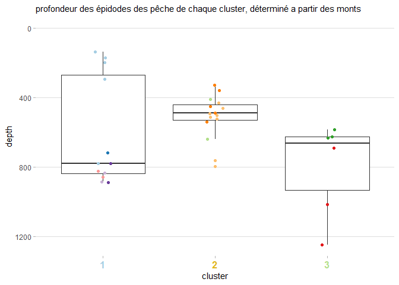
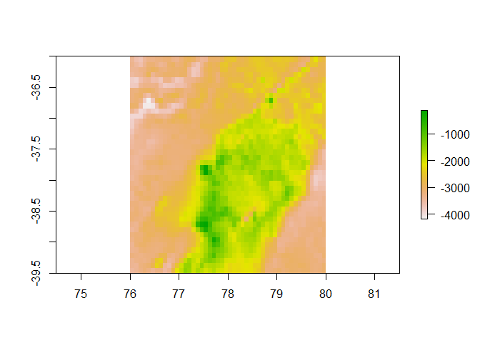
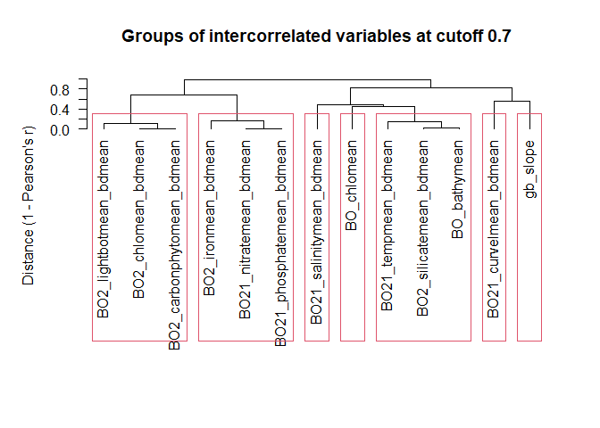
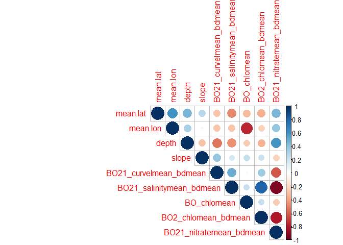
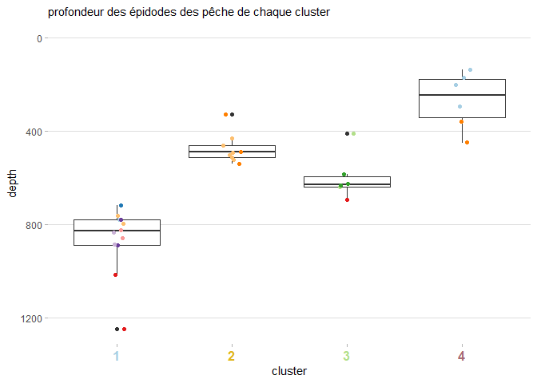
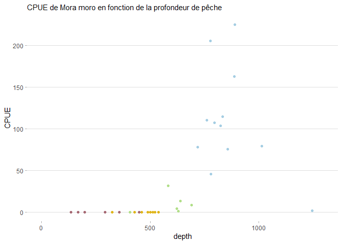
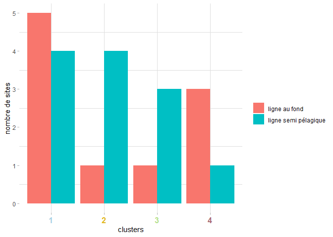

correl\_rmark
================

-   [Initialisation](#initialisation)
-   [Données aggrégées par monts
    sous-marins](#données-aggrégées-par-monts-sous-marins)
    -   [Acquisition des données](#acquisition-des-données)
    -   [Représentation des données de
        profondeur](#représentation-des-données-de-profondeur)
-   [Données par op de peche](#données-par-op-de-peche)
    -   [extraction des données
        environnementales](#extraction-des-données-environnementales)
    -   [Représentation des données
        environnementales](#représentation-des-données-environnementales)
    -   [corrélation des données environnementales,
        prédiction](#corrélation-des-données-environnementales-prédiction)

Ce script part des clusters créés sur les op de peche par les analyses
de réseau, des variables prises lors de ces op de peche (profondeur,
position,…) et de données envrionnementales. Le but est de sélectionner
les variables environnementales corrélées aux clusters, et à partir des
ces variables, de prédire la répartition de nos clusters sur la zone de
SPA.

Les analyses résalisées se déroulent selon ces étapes:  
- Mise en forme des données, - Sélection des données environnementales
parmis les variables colinéaires,  
- Visualisation des corrélations, - Sélection du modèle multinomial, -
Prédiction des clusters.

Les analyses se déroulent en 2 parties, avec les clusters issus des
analyses par monts sous-marine, et par opérations de pêche. Le première
partie ne vise que la visualisation de la corrélation avec la
profondeur, cette corrélation nous montrant que réaliser les analyses
directement sur les opérations de pêche a plus de sens.

# Initialisation

On va avoir besoin de plusieurs packages:  
- *tidyverse* pour la manipulation de données (tidyr, dplyr, …),  
- *ggplot2* et *RColorBrewer* pour la représentation graphique,  
- *raster* et *ncdf4* pour la manipulation des données environnementales
raster,  
- *corrplot* pour représenter la colinéarité entre variables
environnementales,  
- *nnet* pour faire des analyses multinomiales, et *car* pour leur
significativité

``` r
library(tidyverse)
library(ggplot2)
library(RColorBrewer)
library(raster)
library(ncdf4)
library(corrplot)
library(nnet)
library(car)

initialwd = ("C:/travail/analyses_spa/analyses_croixdusud")
setwd(initialwd)
```

<br/> <br/> <br/>

# Données aggrégées par monts sous-marins

## Acquisition des données

Il nous faut un tableau de données donnant pour chaque opération de
pêche sa localisation,le mont sous-marin auquel il appartient, le
cluster auquel il est assimilé, et des données environnementales
susceptibles d’avoir un impact sur les clusters. Des données de clusters
des monts sous-marins (*banc\_color*), on récupère les clusters. De
*catch\_op\_peche*, on peut récupérer la profondeur moyenne des op de
peche, ainsi que leurs coordonnées.  
Enfin, on utilise ces coordonnées pour récupérer les données
environnementales issues de différents clusters:

``` r
banc_color = readRDS('./modified_data/banc_color.rds')
catch_op_peche = readRDS('./modified_data/catch_op_peche.rds')

#récupération des données environnementales:
mean_pos = data.frame()
for (i in unique(catch_op_peche$area)) { #pour chaque mont, 
  tempcoord = unique(catch_op_peche[ #trouver les différentes coordonnées
    which(catch_op_peche$area == i),
    which(colnames(catch_op_peche) %in% c("mean.lat", "mean.lon"))])
  mean_pos = rbind(
    mean_pos,
    data.frame(
      site = rep(i,), #le mont
      long = tempcoord[,1], #longitude
      lat = tempcoord[,2], #latitude
      clus = rep(banc_color$cluster[which(banc_color$local_name == i)], nrow(tempcoord)), #le cluster
      depth = unique(catch_op_peche$mean.sonde[which(catch_op_peche$area == i)]) #les profondeurs
    )
  )
}
head(mean_pos)
```

    ##               site  mean.lat mean.lon clus     depth
    ## 1 Nordet.Amsterdam -37.70097 77.82061    3  691.6667
    ## 2 Nordet.Amsterdam -37.62982 77.92185    3 1013.8125
    ## 3 Nordet.Amsterdam -37.59286 78.02901    3 1246.1667
    ## 4  Nordet.StPaul.1 -38.55506 77.66526    2  501.2500
    ## 5  Nordet.StPaul.1 -38.57117 77.64914    2  460.4062
    ## 6  Nordet.StPaul.1 -38.56259 77.66454    2  489.5000

<br/>

Maintenant, on extrait des données environnémentales issues de raster,
en utilisant les poisitions GPS des différentes op de peche pour les
fusionner avec notre tableau de données *mean\_pos*. Pour ça, on
transforme les coordonnées de mean\_pos en objet spatial, et on extrait
les informations des raster-layers à partir des ces objets spatiaux.

``` r
#transformer les coordonnées en objet spatial, pour extraire les rasters plus tard:
spat_mean_pos  = mean_pos
coordinates(spat_mean_pos) = ~ mean.lon + mean.lat

#### extraction des données de pente: ####
gmed_slope = raster("C:/travail/analyses_spa/envir/slope/gb_slope.asc") #chargement du raster
mean_pos$slope = as.vector(raster :: extract(gmed_slope, spat_mean_pos)) #extraction des données
tail(mean_pos)
```

    ##         site  mean.lat mean.lon clus    depth    slope
    ## 28      Tmp4 -38.00266 77.74752    1 832.2500 1.585888
    ## 29 Amsterdam -37.87872 77.60490    2 407.9583       NA
    ## 30 Amsterdam -37.80858 77.60858    2 640.1429       NA
    ## 31  Cap.Horn -36.70011 78.88523    3 630.9643 3.652280
    ## 32  Cap.Horn -36.68267 78.87968    3 583.5000 3.359943
    ## 33  Cap.Horn -36.69306 78.87308    3 623.9583 3.359943

<br/>

On voit qu’a la fin de notre jeu de données il y a des NA en valeurs de
pente. Ils correspondent aux zones qui sont considérées comme hors de
l’eau par le raster (dont la résolution est trop faible), et n ’ont donc
pas de données. Pour y remédier, on cherche les données les plus proches
des coordonnées n’ayant pas de NA comme suit:  
- On fixe une limite GPS dans laquelle chercher, avec la résolution du
raster,  
- On crée un tableau avec toutes les combinaisons de longitude et
latitude possibles,  
- On calcule la distance euclidienne de ces coordonnées aux coordonnées
NA dont on cherche la valeur,  
- on extrait les données de pente corrsepondant a ces coordonnées,  
- on supprime les coordonnées NA,  
- On classe ces données par distance et on prend la distance la moins
élevée.  
Enfin, on remplace la donnée manquante par cette valeur. Ici les
coordonnées GPS NA sont très proches l’une de l’autre, elles
correspondent donc a la meme valeur de pente du raster, je n’ai donc
fait l’opération qu’une fois.

``` r
limitesy_Ams = seq(-38, -37.6, 0.083) #gamme de latitude dans laquelle chercher
limitesx_Ams = seq(77.3, 77.6, 0.083) #gamme de longitude dans laquelle chercher
coor_proxi_Ams = data.frame( #tableau avec toutes les combinaisons long / lat
  long = as.vector(sapply(limitesx_Ams, function(x) rep(x, length(limitesy_Ams)))),
  lat = rep(limitesy_Ams, length(limitesx_Ams))
)
#calculer les distances entre les coordonnees et le point initial:
coor_proxi_Ams$dist = sqrt( (coor_proxi_Ams$long - 77.51667)^2 + (coor_proxi_Ams$lat - -37.83333)^2 )
#transformer le tableau en objet spatial:
coor_proxi_Ams_pos = coor_proxi_Ams
coordinates(coor_proxi_Ams_pos) = ~ long + lat
coor_proxi_Ams$slope = as.vector(raster :: extract(gmed_slope, coor_proxi_Ams_pos)) #extraire les donnes de pente
coor_proxi_Ams = coor_proxi_Ams[-which(is.na(coor_proxi_Ams$slope)),] #enlever les lignes NA
coor_proxi_Ams = coor_proxi_Ams[order(coor_proxi_Ams$dist),] #mettre les donnees dans l'ordre de distance
mean_pos$slope[which(mean_pos$site == "Amsterdam")] = coor_proxi_Ams$slope[1] #prendre la donnee la plus proche
```

<br/>

## Représentation des données de profondeur

Représentation en boite a moustache, avec la visualisation de chaque
donnée ponctuelle (le jitter plot place les points aléatoirement sur un
axe gauche droite).

``` r
mean_pos$clus = as.character(mean_pos$clus)
ggplot() +
  geom_boxplot(data = mean_pos, aes(x=clus, y=depth)) +
  geom_jitter(data = mean_pos, 
              aes(x=clus, y=depth, color=site), 
              size=1.4, width = 0.08) +
  scale_color_brewer(palette = "Paired") + #pour les couleurs des points
  scale_y_reverse(limits=c(1250,0)) + #echelle des profondeurs vers le bas
  theme_light() +
  xlab("cluster") +
  theme(
    legend.position="none",
    panel.grid.minor.y = element_blank(),
    panel.grid.major.x = element_blank(),
    panel.grid.minor.x = element_blank(),
    panel.border = element_blank(),
    plot.title = element_text(size=11),
    axis.text.x = element_text(face = 'bold', size=12, color=c("#A6CEE3", "#E0B61D", "#B2DF8A"))
  ) +
  ggtitle("profondeur des épidodes des pêche de chaque cluster, déterminé a partir des monts")
```

    ## Warning: Vectorized input to `element_text()` is not officially supported.
    ## Results may be unexpected or may change in future versions of ggplot2.

<!-- --> <br/>
On voit une tendance se dégager, la profondeur est clairement corrélée
avec l’organisation des clusters, mais on n’observe plusieurs modes au
sein de certains clusters. De plus, certaines opérations de pêche ont
des valeurs très différentes du reste du cluster. Cela s’explique par le
fait que Les mont-sous marins ont des patterns de profondeur assez
différents. Les clusters révèlent en partie ces différences, mais
peuvent mieux la révéler si les analyses sont faites à la résolution de
l’opération de pêche. Les points sur notre graphique seraient alors plus
homogène. C’est ce qu’on fait dans la partie suivante.  
<br/> <br/> <br/>

# Données par op de peche

Pour la préparation des données, on va charger les résultats des
analyses de cluster par op, et ajouter ces résultats au tableau créé
dans ce script, *mean\_pos*:

``` r
catch_cluster_byop = readRDS('./modified_data/catch_cluster_op.rds')
#trouver a quelles lignes de catch_cluster_byop correspondent les lignes de mean_pos:
thematch = match(mean_pos$mean.lon, catch_cluster_byop$lon)
#ajouter:
mean_pos$nom = catch_cluster_byop$num[thematch] #le nom des op
mean_pos$type = catch_cluster_byop$type[thematch] #le type de peche
mean_pos$clus_op = as.character(catch_cluster_byop$clus[thematch]) #les clusters
mean_pos$color_clus_op = catch_cluster_byop$color[thematch] #et les couleurs correspondantes
```

<br/>

## extraction des données environnementales

D’abord, on charge les données environnementales. C’est un rasterstack,
dont les noms sont spécifiés dans un autres fichier. Ces données sont
issues de Bio-oracle, elles sont téléchargées depuis un autre script.

``` r
yessai = stack("C:/travail/analyses_spa/envir/BO_bottom_layers/multilayer.tif") #les donnees environnementales
lay_names = as.vector(readRDS("C:/travail/analyses_spa/envir/BO_bottom_layers/lay_names.rds")) #les noms des variables
names(yessai) = lay_names
```

<br/>

Les données issues de bio oracle sont a une résolution très grossière
(environ 0.1 degrés), il est donc possible que plusieurs sites puissent
se trouver dans le meme pixel. Cela poserait problème si ces sites sont
assimilés au meme cluster, car cela dupliquerait sans raison les
données, et donc donnerait artificiellement plus d’importance aux
données environnementales du pixel. <br/> On va donc détecter les sites
dans le même pixel et appartenant a des clusters différents, et
supprimer les sites redondants:

``` r
#on extrait les ID (= le nom des pixels) d'un layer au choix parmis le stack, pour la position GPS de chaque site:
mean_pos$ID = extract(yessai$BO21_curvelmean_bdmean, spat_mean_pos, cellnumbers = T)[,1]
#et on sélectionne les op de meme cluster dans le meme pixel:
repet = which(duplicated(paste(mean_pos$clus_op, mean_pos$ID)))
length(repet) #on a 11 sites qui sont de meme cluster et dans les memes pixels des rasters
```

    ## [1] 11

``` r
mean_pos.tot = mean_pos
if (length(repet) > 0){ #s'il y a plus d'un site,
  mean_pos = mean_pos[-repet,] #on les retire
} #(on crée cette condition car s'il n'y a pas de site et qu'on réalise cette action, un bug supprime tout le contenu de mean_pos)

#actualiser spat_mean_pos:
spat_mean_pos  = mean_pos
coordinates(spat_mean_pos) = ~ mean.lon + mean.lat
```

<br/>

Crop des données environnementales à la zone d’étude:

``` r
e <- as(extent(76, 80, -39.5, -36), 'SpatialPolygons')
crs(e) <- "+proj=longlat +datum=WGS84 +no_defs"
yessai = crop(yessai, e)
#visualisation de la zone sélectionnée:
plot(yessai$BO_bathymean)
```

<!-- --> <br/>

A présent, on supprime les variables environnementales colinéaires. On
réalise cette opération directement sur les rasters cropés sur notre
zone d’étude, en utilisant une fonction créée par Boris Leroy (package
virtualspicies). Les données de pente sont issues d’un raster différent.
Pour les inclure, il faut donc recréer le raster de pente, avec les
memes limites et la meme résolution que les autres:

``` r
gmed_adapt = raster(nrow=42, ncol=48) #on créée un raster vide,
gmed_adapt@extent = extent(76, 80, -39.5, -36) #on lui donne des limites,
gmed_adapt <- resample(gmed_slope, gmed_adapt, method='bilinear') #et on remplit les cases du raster par le raster de pente
yessai = addLayer(yessai, gmed_adapt) #on  ajoute le nouveau raster au rasterstack
virtualspecies::removeCollinearity(yessai, plot = T, multicollinearity.cutoff = 0.7)
```

<!-- --> <br/>

Les variables sont très liées entre elles, ce n’est pas vraiment une
surprise. On a choisi un seuil de 0.7 pour sélectionner les variables
représentatives du lot de variables colinéaires, c’est un choix
subjectif et discutable. Mais il n’est pas très influant sur la suite
des analyses. On choisit donc maintenant une seule variable par lot de
variables colinéaires: (On supprime la pente parce qu’on l’a déjà dans
notre jeu de données initial. Pareil pour la profondeur).

``` r
yessai = dropLayer(yessai, which(names(yessai) %in% c("BO21_phosphatemean_bdmean", "BO2_ironmean_bdmean", 
  "BO2_carbonphytomean_bdmean", "BO2_lightbotmean_bdmean", "BO21_tempmean_bdmean",
  "BO2_silicatemean_bdmean", "BO_bathymean", "gb_slope")))
```

<br/>

On extrait les données des variables environnementales choisies:

``` r
biomod2 = NULL
for (i in 1:length(names(yessai))) {
  biomod2 = cbind( biomod2, as.vector(raster :: extract(yessai[[i]], spat_mean_pos)) )
}
colnames(biomod2) = names(yessai)
mean_pos = cbind(mean_pos, biomod2)
```

<br/>

On peut visualiser les colinéarités entre les variables sélectionnées,
au sein de notre jeu de données (Juste avant pour rappel, on la
visualisait sur tte la zone autour de SPA). Cela nous montre que, a
l’échelle de nos données, certaines variables se retrouvent bien plus
corrélées qu’elles ne l’étaient à l’échelle de toute la zone du raster
cropé:

``` r
#visualiser les corrélations entre les sites dans les variables restantes:
corframe = cor(mean_pos[,-which(
  colnames(mean_pos) %in% c('site', 'clus', 'nom', 'type', 'clus_op', 'color_clus_op', 'ID'))])
corrplot(corframe, method="circle", type = "upper")
```

<!-- --> <br/>
<br/>

## Représentation des données environnementales

On ne va pas représenter graphiquement l’impact de chaque variable
environnementale une à une ici, ce serait un peu long. On représente
seulement la profondeur et les opérations de pêche.  
On commence par la profondeur: (c’est la même représentation qu’avant,
un boxplot et un jitter plot)

``` r
ggplot() +
  geom_boxplot(data = mean_pos.tot, aes(x=clus_op, y=depth)) +
  geom_jitter(data = mean_pos.tot, 
              aes(x=clus_op, y=depth, color=site), 
              size=1.4, width = 0.08) +
  scale_color_brewer(palette = "Paired") +
  scale_y_reverse(limits=c(1250,0)) + #echelle des profondeurs vers le bas
  theme_light() +
  xlab("cluster") +
  theme(
    legend.position="none",
    panel.grid.minor.y = element_blank(),
    panel.grid.major.x = element_blank(),
    panel.grid.minor.x = element_blank(),
    panel.border = element_blank(),
    plot.title = element_text(size=11),
    axis.text.x = element_text(face = 'bold', size=12, color=c("#A6CEE3", "#E0B61D", "#B2DF8A", "#A76A75"))
  ) +
  ggtitle("profondeur des épidodes des pêche de chaque cluster")
```

<!-- -->

On voit clairement la corrélation entre la profondeur et les clusters.

Il est intéressant de représenter l’influence de la profondeur pour des
espèces en particulier, en complément de ce graphe: la CPUE de ces
espèces pour chaque op de peche, en fonction de la profondeur de ces op
de peche. Pour ce faire, il faut extraire ces cpue, et lorsque l’espèce
n’est pas présente, donner à la CPUE la valeur 0.  
Les espèces choisies sont les espèces a l’indval importante (cf analyses
de réseau):

``` r
#tableau qui stockera les cpue pour chaque op de peche:
camora = data.frame(nom = mean_pos.tot$nom, depth = mean_pos.tot$depth, 
                    clus = mean_pos.tot$clus, clus_op = mean_pos.tot$clus_op)

#pour chaque espèce choisie,
#on sélectionne pour toutes les occurences de cette espèce le site et la cpue,
#puis on note la cpue dans le tableau, et on remplace les sites sans données par 0
amoramor = catch_cluster_byop[which(catch_cluster_byop$espece == "Mora moro"),c(1,5)]
camora$mora = amoramor$cpue[match(camora$nom, amoramor$num)]
camora$mora[which(is.na(camora$mora))] = 0

amoramor = catch_cluster_byop[which(catch_cluster_byop$espece == "Helicolenus mouchezi"),c(1,5)]
camora$Helico = amoramor$cpue[match(camora$nom, amoramor$num)]
camora$Helico[which(is.na(camora$Helico))] = 0

amoramor = catch_cluster_byop[which(catch_cluster_byop$espece == "Hyperoglyphe antarctica"),c(1,5)]
camora$hypero = amoramor$cpue[match(camora$nom, amoramor$num)]
camora$hypero[which(is.na(camora$hypero))] = 0

amoramor = catch_cluster_byop[which(catch_cluster_byop$espece == "Cirrhigaleus asper"),c(1,5)]
camora$Cirri = amoramor$cpue[match(camora$nom, amoramor$num)]
camora$Cirri[which(is.na(camora$Cirri))] = 0

amoramor = catch_cluster_byop[which(catch_cluster_byop$espece == "Polyprion oxygeneios"),c(1,5)]
camora$poly = amoramor$cpue[match(camora$nom, amoramor$num)]
camora$poly[which(is.na(camora$poly))] = 0

amoramor = catch_cluster_byop[which(catch_cluster_byop$espece == "Latris lineata"),c(1,5)]
camora$latris = amoramor$cpue[match(camora$nom, amoramor$num)]
camora$latris[which(is.na(camora$latris))] = 0

amoramor = catch_cluster_byop[which(catch_cluster_byop$espece == "Etmopterus granulosus"),c(1,5)]
camora$granul = amoramor$cpue[match(camora$nom, amoramor$num)]
camora$granul[which(is.na(camora$granul))] = 0


ggplot() +
  geom_point(data = camora, aes(x=depth, y=mora, color = clus_op)) +
  scale_colour_manual(values = c("#A6CEE3", "#E0B61D", "#B2DF8A", "#A76A75")) +  theme_light() +
  theme(
    legend.position="none",
    panel.grid.minor.y = element_blank(),
    panel.grid.major.x = element_blank(),
    panel.grid.minor.x = element_blank(),
    panel.border = element_blank(),
    plot.title = element_text(size=11)
  ) +
  ggtitle("CPUE de Mora moro en fonction de la profondeur de pêche") +
  xlim(c(0,1300))+
  xlab("depth") +
  ylab("CPUE")
```

<!-- -->

L’exemple de graphe pour Mora moro est assez parlant, on voit bien que
la cpue de cette espèce est importante à une profondeur assez localisée,
et que ça correspond au cluster bleu, dont elle est l’espèce la plus
représentative. Ce n’est pas aussi flagrant pour toutes les espèces.

Enfin, il est important de regarder l’influence du type de pêche sur la
formation des clusters, nos données venant de 2 type de pêche à la
palangre différents (profonde et semi-pélagique). Pour ça, on représente
le nombre de sites étant pêchés à la ligne de fond, et à la ligne
semi-pélagique, pour chaque cluster:

``` r
#on regroupe nos données par type de pêche pour chaque cluster, en calculant le nombre d'occurences pour chaque type:
mean_pos_type <- mean_pos %>% group_by(clus_op, type) %>%
  dplyr::summarize(nb =length(type))

ggplot(mean_pos_type, aes(x=clus_op, y=nb, fill=type) ) +
  geom_bar(stat="identity", position = 'dodge') +
  theme_light() +
  theme(
    panel.grid.major.y = element_blank(),
    panel.grid.minor.x = element_blank(),
    panel.border = element_blank(),
    axis.text.x = element_text(face = 'bold', size=12, color=c("#A6CEE3", "#E0B61D", "#B2DF8A", "#A76A75"))
  ) +
  labs(fill = "") +
  xlab("clusters") +
  ylab("nombre de sites")
```

<!-- -->

S’il y a des différences de proportions entre sites, elles ne semblent
pas être vraiment notables, relativement à une distribution au hasard de
ces proportions. Il serait possible de quantifier cette différence au
hasard par un test statistique, ça pourrait être bien.

## corrélation des données environnementales, prédiction

On réalise une analyse multinomiale, dont le but est d’expliquer une
variable qualitative (nos clusters) pour des variables quantitatives
(l’environnement). C’est l’inverse de l’anova. Pour ça, on utilise le
package *nnet*.  
On règle maxit, le nombre d’itération avant que le modèle s’arrête s’il
n’a pas convergé, à un grand nombre d’itérations car il en a besoin de
beaucoup.  
On commence par un grand modèle initial sur toutes les variables
sélectionnées, puis on utilise la fonction step, qui va petit a petit
supprimer et rajouter les variables du modèle initiale. A chaque rajout
/ supression, l’AIC est calculée, qui rend compte de à quel point le
modèle prédit bien les clusters, sachant le nombre de variables qu’il
a.  
La fonction step trouve donc un modèle optimal en terme d’AIC, dont on
va tester la significativité des variables, et supprimer une à une les
variables les moins significatives.  
Le modèle sélectionné est ensuite implémenté à partir d’une partie du
jeu de données, puis est utilisé pour prédire la présence des clusters
sur la zone de SPA, puis est testé sur l’autre partie du jeu de données,
pour déterminer sa qualité de prédiction. On répète cette opération 100
fois en séparant le jeu de données à 100 endroits différents, afin de
minimiser l’impact de cette séparation.

Pour réaliser la prédiction,  
avant la boucle de créations des modèles,  
- On crée un tableau qui sera notre futur raster, avec toutes les
coordonnées GPS dont on veut les prédictions.  
- On récupère les données environnementales de ces points dont le modèle
sélectionné à besoin.  
Pendant la boucle de prédiction des modèles,  
- On réalise les prédictions.  
Après la boucle,  
- On sélectionne pour chaque pixel le cluster prédit le plus de fois.

On commence donc par créer le tableau de prédiction:  
(Ici on extrait que la variable de profondeur, car c’est finalement la
seule qui sera retenue dans la modèle. Mais on peut en théorie extraire
d’autres variables, j’ai donc laissé en commentaire l’exemple de la
variable de concentration en chlorophylle)

``` r
#chargement des données de profondeur:
setwd("./original_data/bathym/bathym_gebco")
gebco = stack("gebco_2019_n-34.0_s-43.0_w73.0_e82.0.nc")
setwd(initialwd)

#limites et résolution de la zone de prediction:
limitesy_Ams = seq(-39.5, -36, 0.00417) #gamme de latitude dans laquelle chercher
limitesx_Ams = seq(76, 79, 0.00417) #gamme de longitude dans laquelle chercher
predict_bioreg = data.frame( #tableau avec toutes les combinaisons long / lat
  mean.lon = as.vector(sapply(limitesx_Ams, function(x) rep(x, length(limitesy_Ams)))),
  mean.lat = rep(limitesy_Ams, length(limitesx_Ams))
)
#extraction des données environnementales correspondant aux lat / long:
spat_predict_bioreg  = predict_bioreg
coordinates(spat_predict_bioreg) = ~ mean.lon + mean.lat
predict_bioreg$depth = -as.vector(raster :: extract(gebco, spat_predict_bioreg))
# predict_bioreg$BO_chlomean = as.vector(raster :: extract(yessai$BO_chlomean, spat_predict_bioreg))
head(predict_bioreg)
```

Le qqplot suggère un écart à la normalité par le fait d’avoir quelques
résidus extrêmes. Je pense que cela n’infirme pas le modèle global.

``` r
restot_1 = multinom(as.factor(clus_op) ~ mean.lat + mean.lon + depth +
                      slope + type + BO21_curvelmean_bdmean + BO_chlomean +
                      BO21_salinitymean_bdmean + 
                      BO2_chlomean_bdmean + BO21_nitratemean_bdmean, data = mean_pos, maxit = 10000)

st_restot1 = step(restot_1, direction = c('both'))

restot_2 = eval(st_restot1$call)
```

``` r
car::Anova(restot_2) #test de significativité
```

    ## Analysis of Deviance Table (Type II tests)
    ## 
    ## Response: as.factor(clus_op)
    ##                          LR Chisq Df Pr(>Chisq)    
    ## mean.lat                   14.999  3   0.001817 ** 
    ## depth                      39.463  3  1.385e-08 ***
    ## BO21_salinitymean_bdmean    6.577  3   0.086675 .  
    ## ---
    ## Signif. codes:  0 '***' 0.001 '**' 0.01 '*' 0.05 '.' 0.1 ' ' 1

La fonction *step* a gardé 3 variables, dont seulement la latitude et la
profondeur sont significatives. Le nouveau modèle inclue donc ces 2
variables. On utilise ce modèle 100 fois sur sur des jeux de données
séparés aléatoirement. Le jeu de données utilisé est *mean\_pos.tot* et
non *mean\_pos*, qui avait été créé à cause du peu de précision des
données environnementales. Cela n’est plus un problème, étant donné que
la profondeur et la latitude ont été déterminés directement lors de la
campagne.

``` r
accus = NULL #stock précision

for (i in 1:100) {
  #prendre 80% aleatoirement
  #tirage aléatoire entre 1 et le nb de sites, iterations 85% du nb de sites:
  choix = sample(1:nrow(mean_pos.tot), round(0.8*nrow(mean_pos.tot))) 
  train = mean_pos.tot[choix,]
  
  #exécution du modèle:
  restot_3 = multinom(as.factor(clus_op) ~ mean.lat + depth, data = train, maxit = 10000)
  #prédictions du modèle sur la partie non utilisée des données:
  accuracy_train = predict(restot_3, newdata = mean_pos.tot[-choix,])
  # on crée un table de classification des données non utilisée pour créer le modèle, 
  #avec en abscisse leur cluster d'appartenance, et en ordonnée le cluster prédit.
  tab = table(mean_pos.tot[-choix,]$clus_op, accuracy_train %>% droplevels() )
  #La diagonale de cette table nous donne le nombre de données justement prédites, 
  #et la somme de la table le nombre total de données. On calcule et stocke la proportion de données justes:
  accus = c(accus, round((sum(diag(tab))/sum(tab))*100,2))
  
  #enfin, on réalise la prédiction sur SPA grace au tableau créé avant la boucle:
  pred_clus = data.frame(as.character(predict(restot_3, newdata = predict_bioreg)))
  colnames(pred_clus) = paste0("pred_clus_", i) #nom de la colonne de stockage
  predict_bioreg = cbind(predict_bioreg, pred_clus)
  
}
```

``` r
mean(accus) #précision moyenne des modèles
```

    ## [1] 77.4274

Ensuite, on trouve pour chaque pixel Le cluster qui a été le plus
prédit.  
pour ça on utilise la fonction sapply, qui va appliquer une tache a
chaque ligne du tableau de prédiction. Cette tache est d’afficher le
nombre d’itérations de chaque biorégion, et de choisir celle qui est la
plus représentée.  
L’écriture est compliquée: on utilise *table* pour avoir toutes les
itérations, puis *sort* en *decreasing* pour sélectionner seulement la
première *\[1\]*, qu’on transforme en tableau dont on prend le nom de la
ligne, qui correspond au nom de la biorégion. Il existe d’autres manière
plus simples de l’écrire, mais elles ne fonctionnent parfois pas quand
il y a plusieurs biorégions recensées dans une ligne, ou au contraire
quand il y en a qu’une.

``` r
ouaich = unlist(sapply(1:nrow(predict_bioreg), 
                       function(x){row.names(as.data.frame(sort(table(as.factor(predict_bioreg[x, -(1:3)])), decreasing = T)[1]))
                       } ), use.names = FALSE)
```

Enfin, on inclue ces résultats dans le tableau final:

``` r
#ajouter la prédiction au tableau
prediction_cds = cbind(predict_bioreg[,1:3], bioreg = ouaich)

#mettre les résultats en correspondance couleurs:
prediction_cds$color = as.character(prediction_cds$bioreg)
prediction_cds$color[which(prediction_cds$color == 1)] = "blue"
prediction_cds$color[which(prediction_cds$color == 2)] = 'orange'
prediction_cds$color[which(prediction_cds$color == 3)] = 'green'
prediction_cds$color[which(prediction_cds$color == 4)] = 'red'
#résultats sur des profondeurs trop importantes = NA:
prediction_cds$color[which(prediction_cds$depth > 1400)] = NA

#Enregistrer les résultats:
saveRDS(prediction_cds, file='./modified_data/prediction_cds.rds')
```
