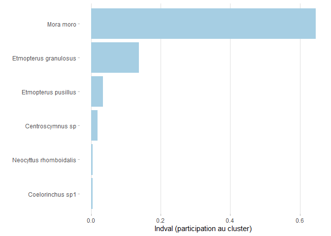
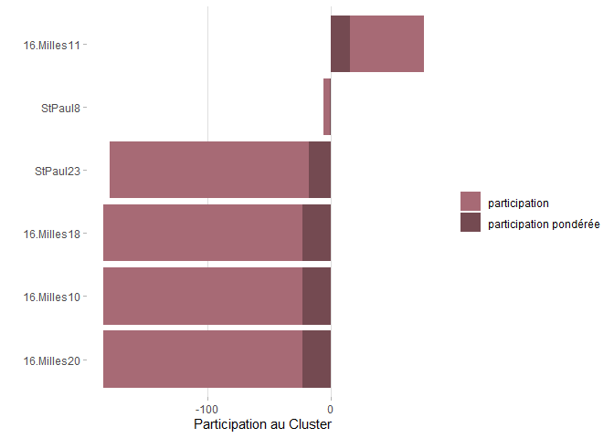

reseaux\_rmark
================

-   [Initialisation](#initialisation)
-   [Analyses aggrégées aux monts
    sous-marins](#analyses-aggrégées-aux-monts-sous-marins)
    -   [Preparation des données / algorithme
        Infomap](#preparation-des-données--algorithme-infomap)
    -   [Visualisation sommaire](#visualisation-sommaire)
    -   [export pour représentation
        graphique](#export-pour-représentation-graphique)
-   [Analyses par op de peche](#analyses-par-op-de-peche)
    -   [Preparation des données / algorithme
        Infomap](#preparation-des-données--algorithme-infomap-1)
    -   [Visualisation sommaire](#visualisation-sommaire-1)
    -   [export pour représentation
        graphique](#export-pour-représentation-graphique-1)
    -   [Participation des sites et des espèces aux clusters / export
        des
        données:](#participation-des-sites-et-des-espèces-aux-clusters--export-des-données)

Ce script part des données d’opération de pêche (*catch\_op\_peche*)
pour déterminer des clusters, en utilisant les analyses de réseau,  
- Aggrégées par monts sous marins, en prenant en compte ou non la
cpue.  
- Par opération de pêche en prenant en compte la cpue.

Les analyses résalisées se déroulent selon ces étapes:  
- Transformer les données en format pajek.  
- Faire tourner l’algorithme infomap (chargé de détecter les
clusters).  
- Lire les résultats et attribuer des couleurs aux clusters.  
- Extraire les participations des sites et des espèces aux clusters
(IndVal).  
- Représenter graphiquement le réseau sur gephi.

# Initialisation

On va avoir besoin de plusieurs packages:  
- *tidyverse* pour la manipulation de données (tidyr, dplyr, …),  
- *ggplot2* et *RColorBrewer* pour la représentation graphique,  
-*biogeonetworks* pour réaliser des analyses de réseau, qui n’est pas
dans le cran pour le moment, et doit donc être installé depuis github.
Le tuto pour biogeonetworks [est
ici.](https://github.com/Farewe/biogeonetworks#requirements), il
explique très pédagogiquement comment réaliser des analyses de réseau.

Il est aussi nécessaire d’avoir dans son directory le code source de
l’algorithme infomap de Map Equation, depuis le site de Map Equation ou
téléchargeable depuis ce
[lien](https://borisleroy.com/permanent/Infomap.exe) (c’est expliqué
plus clairement dans le tuto). C’est cet algorithme à qui on va donner
nos données au format pajek, et qui va réaliser l’analyse de
clusterisation.

``` r
library(sf)
#SF n'est pas sensé être utile, mon script classique fonctionne sans, mais ici j'ai un message d'erreur
#si je ne le load pas.
library(tidyverse)
library(ggplot2)
library(RColorBrewer)

#installer et charger biogeonetworks:
devtools::install_github("Farewe/biogeonetworks")
library(biogeonetworks)

initialwd = ("C:/travail/analyses_spa/analyses_croixdusud/scripts/reseaux")
setwd(initialwd)

catch_op_peche = readRDS("C:/travail/analyses_spa/analyses_croixdusud/modified_data/catch_op_peche.rds")
head(catch_op_peche)
```

    ## # A tibble: 6 x 19
    ## # Groups:   espece, numero, type, area, mean.sonde [6]
    ##   type    numero espece       nb kg.brut kg.net mean.sonde sonde.range max.sonde
    ##   <chr>    <int> <fct>     <int>   <dbl>  <dbl>      <dbl> <fct>           <dbl>
    ## 1 ligne ~      1 Bassanag~    28    15.9    0         692. (650,700]        796.
    ## 2 ligne ~      1 Hydrolag~     1     5      0         692. (650,700]        796.
    ## 3 ligne ~      1 Helicole~    87    85.3   24.4       692. (650,700]        796.
    ## 4 ligne ~      1 Hyperogl~     4    47.7   25.9       692. (650,700]        796.
    ## 5 ligne ~      1 Mora moro    22    37.1   14.9       692. (650,700]        796.
    ## 6 ligne ~      1 Pseudotr~     1    15      0         692. (650,700]        796.
    ## # ... with 10 more variables: min.sonde <dbl>, mean.lat <dbl>, mean.lon <dbl>,
    ## #   time.filage <dttm>, time.virage <dttm>, H.virage <dbl>, area <chr>,
    ## #   geometry <POINT>, CPUE.hooks <dbl>, CPUE.nb.hooks <dbl>

<br/>

# Analyses aggrégées aux monts sous-marins

## Preparation des données / algorithme Infomap

Il s’agit de charger le tableau, et de le transformer en format pajek,
pour le faire lire par l’algorithme infomap. Pour ca, on récupère les
variables qui peuvent nous être utiles (les noms d’espèces, types de
lignes, monts sous-marins, et le nombre d’individus ammeçonnés et le
temps de pêche, pour pouvoir calculer la cpue). Ensuite on somme ces
données par mont sous-marin, et on transforme au format pajek (fonction
biogeonetworks):

``` r
#sélection des variables et somme par mont sous-marin:
catch_area = catch_op_peche %>%
  dplyr::select(espece, nb, H.virage, area, type) %>%
  group_by(area,espece) %>% 
  summarise(nbtot=sum(nb),
            Htot=sum(H.virage)) %>%
  mutate(cpue = nbtot/Htot)

#verif que les sites et sps sont des facteurs (sans quoi writePajek ne fonctionne pas):
catch_area = as.data.frame(catch_area)
catch_area$area = as.factor(catch_area$area)
catch_area$espece = as.factor(catch_area$espece)
head(catch_area)
```

    ##        area                  espece nbtot  Htot         cpue
    ## 1 16.Milles      Bassanago nielseni     1  4200 0.0002380952
    ## 2 16.Milles      Cirrhigaleus asper   102 16800 0.0060714286
    ## 3 16.Milles        Coelorinchus sp1     3  4200 0.0007142857
    ## 4 16.Milles    Helicolenus mouchezi    27 16800 0.0016071429
    ## 5 16.Milles Hyperoglyphe antarctica    82 16800 0.0048809524
    ## 6 16.Milles          Latris lineata   319 16800 0.0189880952

``` r
#transformation en format pajek:
writePajek(catch_area, 
           site.field = "area", # Nom de la colonne des sites
           species.field = "espece", # Name of your species column
           filename = "catch.net", # Name of the output file
           abundance.field = NULL) # (FACULTATIVE) Name of abundance column
```

un fichier catch.net a été créé dans mon dossier. <br/>

On execute ensuite l’algorithme infomap a partir du fichier pajek créé.
L’algorithme demande plusieurs arguments, dont seul le nombre de run est
important ici:  
- undirected : les liens du reseau n’ont pas de direction (certain
réseau ont des liens allant seulement dans une direction, ce n’est pas
le cas dans notre type d’analyses).  
- tree : output file format .tree.  
- map : output file format .map.  
- N xxx : nombre de runs de l’algorithme. Cet algorithme doit partir de
positions aléatoires plusieurs fois pour trouver un solution de
clustering optimale. On a fixé ce nombre à 1000, pour notre cas choisir
plus de run ne change pas la solution optimale. Mais il est possible que
ce ne soit pas le cas sur d’autres jeux de données.  
- catch.net : le fichier pajek a traiter.

``` r
system("infomap --undirected --tree --map -N 1000 catch.net ./")
```

    ## [1] 0

L’algorithme exécuté sort plein d’informations. Seul le dernier tableau
donne des informations utiles:  
Best end modular solution in 2 levels: Il a créé un réseau à 2 niveaux
hiérarchiques (visualiser comme une CAH). number of modules: nombre de
clusters trouvés pour chaque niveau. <br/>

Ici on voit qu’un cluster a été trouvé pour le niveau 1, et 0 pour le
niveau 2. Cela signifie que l’algortihme n’a pas réussi à différencier
des groupes au sein du réseau. On peut l’expliquer par le fait que les
monts sous-marins présentent quasiment les mêmes espèces, leur
similarité est trop forte. Pour aider à la différencier, on peut inclure
dans l’analyse la cpue, pour ne différencier les sites non plus par la
présence / absence d’espèces, mais par la présence plus ou moins
importante de ces espèces:

``` r
#export format pajek en prenant en compte la cpue:
writePajek(catch_area, 
           site.field = "area", # Nom de la colonne des sites
           species.field = "espece", # Name of your species column
           filename = "catch_ab.net", # Name of the output file
           abundance.field = "cpue") # (FACULTATIVE) Name of abundance column

#programme Infomap:
system("infomap --undirected --tree --map -N 1000 catch_ab.net ./")
```

    ## [1] 0

3 clusters ont été trouvés. <br/> <br/>

## Visualisation sommaire

La sortie de cet algorithme est un tableau qui peut être lu avec la
fonction readInfomapTree. Ce tableau comporte plusieurs colonnes:  
- Chaque ligne est un noeud, donc une espèce ou un site.  
- Groups = Cluster auquel le noeud appartient, au premier et au 2eme
niveau (car on en a que 2 ici).  
- Codelength (pas important) = information quantitative utilisée par
l’algorithme (on s’en fiche).  
- Name = nom du cluster.  
- Lvl1, lvl2, … donne l’identifiant pour chaque niveau hiérarchique
(c’est la meme chose que *Groups*, mais séparé par colonnes).

``` r
catch_ab.clusters <- readInfomapTree("catch_ab.tree",
                                  network.summary = TRUE, # Prints a summary of the clustering results
                                  replace.leaf.names = TRUE) # Changes node numbers to actual names for terminal nodes
head(catch_ab.clusters)
```

    ##   Groups Codelength      Name id lvl1      lvl2
    ## 1    1:1  0.2265630 Mora moro 16    1 Mora moro
    ## 2    1:2  0.0900918      Tmp5 37    1      Tmp5
    ## 3    1:3  0.0621436      Tmp4 36    1      Tmp4
    ## 4    1:4  0.0437817  Jean.Luc 32    1  Jean.Luc
    ## 5    1:5  0.0343849 16.Milles 28    1 16.Milles
    ## 6    1:6  0.0262177 45.milles 29    1 45.milles

``` r
#Nombre de noeuds pour chaque cluster.
plyr::count(catch_ab.clusters$lvl1)
```

    ##   x freq
    ## 1 1   15
    ## 2 3   13
    ## 3 2    9

<br/>

Il y a une fonction pour récupérer uniquement les lignes des sites, ou
des espèces, du tableau ci-dessus:

``` r
catch.sites <- getSiteTable(catch_area, #le tableau initial
                            site.field = "area", #nom dans ce tableau de la colonne des sites
                            network = catch_ab.clusters)
head(catch.sites) #c'est le meme tableau, mais contenant seulement les sites
```

    ##    Groups Codelength            Name id lvl1            lvl2
    ## 2     1:2  0.0900918            Tmp5 37    1            Tmp5
    ## 3     1:3  0.0621436            Tmp4 36    1            Tmp4
    ## 4     1:4  0.0437817        Jean.Luc 32    1        Jean.Luc
    ## 5     1:5  0.0343849       16.Milles 28    1       16.Milles
    ## 6     1:6  0.0262177       45.milles 29    1       45.milles
    ## 17    2:2  0.0758355 Nordet.StPaul.1 34    2 Nordet.StPaul.1

``` r
plyr::count(catch.sites$lvl1)
```

    ##   x freq
    ## 1 1    5
    ## 2 3    2
    ## 3 2    3

``` r
catch.sp <- getSpeciesTable(catch_area, #le tableau initial
                            species.field = "espece", #nom dans ce tableau de la colonne des sites
                            network = catch_ab.clusters) # Output table from Map Equation
plyr::count(catch.sp$lvl1)
```

    ##   x freq
    ## 1 1   10
    ## 2 3   11
    ## 3 2    6

Les sites et les espèces semblent être représentées assez homogènement
dans les clusters.

<br/> <br/>

## export pour représentation graphique

Afin de pouvoir représenter graphiquement les cluster créés, on attribue
des couleurs aux différents noeuds, en fonction du cluster auquel ils
appartiennent, avec la fonction attributeColors:  
- On pourrait choisir d’attribuer des couleurs a partir des cluster
créés a un niveau hiérarchique plus élevé, si on en avait (chez nous les
2eme niveau crée un cluster par noeud).  
- Si quelques clusters ne concernent qu’un site et très peu d’espèces,
qu’on les considère comme peu intéressants à représenter, on peut les
mettre tous d’une même couleur. C’est l’utilité des argument
*nb.max.colors*, *other.color*, et *cluster.order* (renseigne si
l’importance des cluster est donnée par le nombre de sites, d’espèces,
ou autres).

``` r
catch_ab.clusters <- attributeColors(network = catch_ab.clusters, # meme tableau en input & output
                                  lvl = "lvl1", # quel level hiérarchique utiliser
                                  nb.max.colors = 4, # We chose 4 clusters as significant for level 1
                                  colname = "colors.lvl1", # Name to give to the colour column
                                  other.color = grey(0.5), # Minor clusters will be grey
                                  cluster.order = "sites", # Cluster order for colours
                                  db = catch_area, # Database of step 1
                                  site.field = "area", # Name of site column in your database
                                  species.field = "espece") # Name of species column in your database

#Ici 2 couleurs bleues on été choisiée, c'est pas ouf, on va mettre du orange a la place d'un bleu:
bleues = which(catch_ab.clusters$colors.lvl1 == "#1F78B4")
catch_ab.clusters$colors.lvl1[bleues] = rep("#E0B61D", length(bleues))

head(catch_ab.clusters)
```

    ##   Groups Codelength      Name id lvl1      lvl2 colors.lvl1
    ## 1    1:1  0.2265630 Mora moro 16    1 Mora moro     #A6CEE3
    ## 2    1:2  0.0900918      Tmp5 37    1      Tmp5     #A6CEE3
    ## 3    1:3  0.0621436      Tmp4 36    1      Tmp4     #A6CEE3
    ## 4    1:4  0.0437817  Jean.Luc 32    1  Jean.Luc     #A6CEE3
    ## 5    1:5  0.0343849 16.Milles 28    1 16.Milles     #A6CEE3
    ## 6    1:6  0.0262177 45.milles 29    1 45.milles     #A6CEE3

<br/>

Enfin, on exporte notre tableau pour le faire lire par Gephi, logiciel
qui pourra représenter graphiquement le réseau créé. Gephi peut lire
directement le format pajek, mais en exportant le tableau qu’on vient de
créer, gephi pourra aussi représenter les couleurs choisies:

``` r
writeGDF(db = catch_area, # Database of step 1
         site.field = "area", # Name of site column in your database
         species.field = "espece", # Name of species column in your database
         network = catch_ab.clusters, 
         filename = "catch_ab.gdf",
         color.field = "colors.lvl1",
         abundance.field = "cpue") # Name of the color field in the network
```

<br/>

Pour représenter les monts sous-marins par clusters, colorés sur une
carte, on peut aussi créer un tableau dédié (les représentations
graphiques sont faites dans un script dédié, rpz\_graphique):

``` r
banc = read.table("C:/travail/analyses_spa/analyses_croixdusud/original_data/banc_id.txt", h=T)
banc$lat = -banc$lat #on passe la lattitude en Sud
banc = banc[-c(1,2,7,9),] #on enleve les bancs proches les uns des autres
banc$local_name[which(banc$local_name == "Nordet.Amsterdam.2")] = "Nordet.Amsterdam"

#on recupere les clusters et couleurs associees aux differents sites:
banc$cluster = catch_ab.clusters$lvl1[
  match(banc$local_name, catch_ab.clusters$Name)]

banc$color = catch_ab.clusters$colors.lvl1[
  match(banc$local_name, catch_ab.clusters$Name)]
banc
```

    ##         lon       lat               name       local_name cluster   color
    ## 3  77.88333 -37.65000  banc_temporaire_3 Nordet.Amsterdam       3 #B2DF8A
    ## 4  77.73333 -38.00000  banc_temporaire_4             Tmp4       1 #A6CEE3
    ## 5  77.71667 -38.25000  banc_temporaire_5             Tmp5       1 #A6CEE3
    ## 6  77.65000 -38.55000  banc_temporaire_6  Nordet.StPaul.1       2 #E0B61D
    ## 8  77.70000 -39.20000  banc_temporaire_8         Jean.Luc       1 #A6CEE3
    ## 10 77.73333 -38.96667 banc_temporaire_10        16.Milles       1 #A6CEE3
    ## 11 78.86667 -36.68333 banc_temporaire_11         Cap.Horn       3 #B2DF8A
    ## 12 78.51667 -38.58333 banc_temporaire_12        45.milles       1 #A6CEE3
    ## 13 77.51667 -38.71667             StPaul           StPaul       2 #E0B61D
    ## 14 77.51667 -37.83333          Amsterdam        Amsterdam       2 #E0B61D

``` r
#et on exporte pour la rpz graphique:
saveRDS(banc, file='C:/travail/analyses_spa/analyses_croixdusud/modified_data/banc_color.rds')
```

<br/>

Bien que 3 cluster aient été dégagés, aggréger par monts ne semble pas
une bonne idée puisqu’au sein d’un site, certaines données semblent
appartenir a différents clusters. Les clusters sélectionnés ne seraient
alors pas révélateurs de différences entre monts, mais bien plus de
différences entre opérations pêches, parfois au sein d’un même mont.
Cela se voit lorsqu’on représente les clusters auxquels appartiennent
chaque op de peche à la variable profondeur (ces analyses sont faites
dans un autre script, dans la partie *Analyses de corrélation*, cf
sommaire).  
On va donc réaliser les mêmes analyses, mais par opération de peche.
<br/> <br/> <br/>

# Analyses par op de peche

## Preparation des données / algorithme Infomap

Pour la préparation des données, on repart de catch\_op\_peche mais
cette fois-ci on groupe par coordonnées GPS,  
car 1 opération de pêche = 1 coordonnée GPS:

``` r
catch_res = data.frame()
#on récupère les différentes coordonnées GPS:
tempcoord = unique(catch_op_peche[,which(colnames(catch_op_peche) %in% c("mean.lat", "mean.lon"))])
for (i in 1:nrow(tempcoord)) { #pour chaque op, 
    donnees_site = catch_op_peche[which( #on prend les lignes concernées par cette op
      catch_op_peche$mean.lat == tempcoord$mean.lat[i] &
      catch_op_peche$mean.lon == tempcoord$mean.lon[i]),]
    catch_res = rbind( #on ajoute les données au tableau:
      catch_res,
      data.frame(
        num = rep(paste0(donnees_site$area[1],i), nrow(donnees_site)), #num = nom du mont - i
        site = rep(donnees_site$area[1],nrow(donnees_site)), #nom du mont
        espece = donnees_site$espece,
        nb = donnees_site$nb, #nb d'individus
        cpue = donnees_site$CPUE.nb.hooks,
        lon = rep(donnees_site$mean.lon[1], nrow(donnees_site)),
        lat = rep(donnees_site$mean.lat[1], nrow(donnees_site)),
        depth = rep(donnees_site$mean.sonde[1], nrow(donnees_site)),
        min_depth = rep(donnees_site$min.sonde[1], nrow(donnees_site)),
        max_depth = rep(donnees_site$max.sonde[1], nrow(donnees_site)),
        type = rep(donnees_site$type[1], nrow(donnees_site)) #type d'engin de peche
        ))
  }
```

<br/>

On réalise les mêmes analyses que précédemment:

``` r
#verif que les sites et sps sont des facteurs:
catch_res = as.data.frame(catch_res)
catch_res$site = as.factor(catch_res$site)
catch_res$espece = as.factor(catch_res$espece)

#export pajek avec les donnees d'abondance:
writePajek(catch_res, 
           site.field = "num", # Nom de la colonne des sites
           species.field = "espece", # Name of your species column
           filename = "catch_site.net", # Name of the output file
           abundance.field = "cpue") # (FACULTATIVE) Name of abundance column

#programme Infomap:
system("infomap --undirected --tree --map -N 1000 catch_site.net ./")
```

    ## [1] 0

L’algorithme a trouvé 4 clusters <br/> <br/>

## Visualisation sommaire

``` r
catch_op.clusters <- readInfomapTree("catch_site.tree",
                                     network.summary = TRUE, # Prints a summary of the clustering results
                                     replace.leaf.names = TRUE) # Changes node numbers to actual names for terminal nodes

#pour avoir le nb d'sp, et le nb de sites par cluster:
catch.sites <- getSiteTable(catch_res,
                            site.field = "num", #la colonne des sites
                            network = catch_op.clusters)
plyr::count(catch.sites$lvl1)
```

    ##   x freq
    ## 1 1   12
    ## 2 3    6
    ## 3 4    6
    ## 4 2    9

``` r
#On n'a pas de mini clusters en termes de sites

catch.sp <- getSpeciesTable(catch_res,
                            species.field = "espece", #la colonne des espèces
                            network = catch_op.clusters)
plyr::count(catch.sp$lvl1)
```

    ##   x freq
    ## 1 1   14
    ## 2 3    7
    ## 3 4    5
    ## 4 2    1

Ici on voit que le cluster 2 ne comporte qu’une seule espèce.

<br/> <br/>

## export pour représentation graphique

``` r
#attribution des couleurs aux clusters choisis de lvl1:
catch_op.clusters <- attributeColors(network = catch_op.clusters,# meme tableau en input & output
                                     lvl = "lvl1", ## quel level hiérarchique utiliser
                                     nb.max.colors = 4, # We chose 4 clusters as significant for level 1
                                     colname = "colors.lvl1", # Name to give to the colour column
                                     other.color = grey(0.5), # Minor clusters will be black
                                     cluster.order = "sites", # Cluster order for colours (see below)
                                     db = catch_res, # Database of step 1
                                     site.field = "num", # Name of site column in your database
                                     species.field = "espece") # Name of species column in your database

#il y a 2 couleursqui ne ressortent pas bien, on les change:
catch_op.clusters$colors.lvl1[which(catch_op.clusters$colors.lvl1 == "#1F78B4")] ="#E0B61D"
catch_op.clusters$colors.lvl1[which(catch_op.clusters$colors.lvl1 == "#33A02C")] ="#A76A75"


#export Gephi:
writeGDF(db = catch_res,
         site.field = "num",
         species.field = "espece",
         network = catch_op.clusters, 
         filename = "catch_op.gdf",
         color.field = "colors.lvl1",
         abundance.field = "cpue")
```

<br/> <br/>

## Participation des sites et des espèces aux clusters / export des données:

La prochaine étape est d’extraire la participation de chaque site et
espèce au cluster qu’il représente. Pour ça, une fonction existe avec
biogeonetworks, mais elle ne prend pas en compte le paramètres
d’abondance (ici la cpue). J’ai donc modifié cette fonction, et c’est
cette fonction modifiée qu’on appelle ici (il faudrait aussi que je
détaille ce script un de ces 4):

``` r
source('metrique_reseaux.R')
catch_op_metrics <- NewclusterMetrics(db = catch_res, # Tableau initial
                                      network = catch_op.clusters, # Clustering results
                                      site.field = "num", # Name of site column in your database
                                      species.field = "espece", # Name of species column in your database
                                      species.richness = "cpue",
                                      level = "lvl1") # Clustering level at which we calculate metrics
head(catch_op_metrics$species.stats)
```

    ##                               species cluster Occ.Ri Occ.Di     Occ.Ai
    ## Antimora rostrata   Antimora rostrata       1      1      1 0.08333333
    ## Bassanago nielseni Bassanago nielseni       3      6     24 1.00000000
    ## Beryx decadactylus Beryx decadactylus       3      4     11 0.66666667
    ## Beryx splendens       Beryx splendens       1      3      7 0.25000000
    ## Hydrolagus sp2         Hydrolagus sp2       1      2      2 0.16666667
    ## Hydrolagus sp1         Hydrolagus sp1       1      2      3 0.16666667
    ##                       Occ.Fi Occ.IndVal Occ.DilVal    Rich.Ri    Rich.Di
    ## Antimora rostrata  1.0000000 0.08333333 0.00000000  0.7936508  0.7936508
    ## Bassanago nielseni 0.2500000 0.25000000 0.75000000 20.3406593 41.3801807
    ## Beryx decadactylus 0.3636364 0.24242424 0.42424242 13.8974359 19.6271112
    ## Beryx splendens    0.4285714 0.10714286 0.14285714  7.1710579  9.0648308
    ## Hydrolagus sp2     1.0000000 0.16666667 0.00000000  0.9523810  0.9523810
    ## Hydrolagus sp1     0.6666667 0.11111111 0.05555556  0.5555556  0.9365079
    ##                         Rich.Ai   Rich.Fi  Rich.IndVal  Rich.DilVal
    ## Antimora rostrata  0.0004086674 1.0000000 0.0004086674 0.0000000000
    ## Bassanago nielseni 0.0309421388 0.4915556 0.0152097814 0.0157323574
    ## Beryx decadactylus 0.0211407302 0.7080734 0.0149691893 0.0061715409
    ## Beryx splendens    0.0036925282 0.7910857 0.0029211062 0.0007714220
    ## Hydrolagus sp2     0.0004904009 1.0000000 0.0004904009 0.0000000000
    ## Hydrolagus sp1     0.0002860672 0.5932203 0.0001697009 0.0001163663

``` r
head(catch_op_metrics$site.stats)
```

    ##                    site cluster     Occ.Rg     Occ.RRg    Rich.Rg  Rich.RRg
    ## 16.Milles10 16.Milles10       4 -0.3121511 -0.04459301 -161.49120 -23.07017
    ## 16.Milles11 16.Milles11       4  0.5000000  0.12500000   60.35238  15.08810
    ## 16.Milles18 16.Milles18       4 -0.3121511 -0.04459301 -161.49120 -23.07017
    ## 16.Milles19 16.Milles19       1  0.6775746  0.07528607  631.18325  70.13147
    ## 16.Milles20 16.Milles20       4 -1.1805721 -0.16865316 -161.85573 -23.12225
    ## 45.milles13 45.milles13       1 -0.0225387 -0.00450774  842.16948 168.43390

pour les espèces: .Ai = affinité: proportion de richesse amenée dans le
cluster vs richesse dans le cluster.  
.Fi = fidélité: proportion de richesse amenée au sein du cluster vs dans
tous les sites.  
.Inval = metrique inval: a quel point l’sp participe au cluster.  
.Dival = metrique de dilution: a quel point l’sp est présente partout.

Pour les sites: .Rg = participation du site: Participation des sps
caractéristiques - dilution des espèces non caractéristiques.  
.RRg = participation pondérée du site: participation / nb d’especes dans
ce site.  
<br/> ATTENTION : Les calculs de participation pour les suites ont je
pense une petite erreur de logique qu’il faut que je fixe. Je ne les
considère pas comme fiables. Je les représente tout de même dans ce
script pour montrer l’idée.  
<br/>

On représente graphiquement la participation des espèces et des sites.
Pour les espèces, avec l’indicative value:

``` r
num_cluster = 1 #choisir ici quel cluster on veut représenter graphiquement
#saisir les espèces et l'indval pour le cluster sélectionné:
sp_metrics_clus_num = catch_op_metrics$species.stats[which(catch_op_metrics$species.stats$cluster == num_cluster),c(1,13)]
#prendre que les 6 espèces qui participent le plus:
sp_metrics_clus_num = sp_metrics_clus_num[order(sp_metrics_clus_num$Rich.IndVal, decreasing = T)[c(1:6)],]
#ordonner les levels:
sp_metrics_clus_num$species = as.factor(sp_metrics_clus_num$species)
sp_metrics_clus_num$species = fct_reorder(sp_metrics_clus_num$species, sp_metrics_clus_num$Rich.IndVal)

#représentation graphique:
ggplot(sp_metrics_clus_num, aes(x=species, y=Rich.IndVal) ) +
  geom_bar(stat="identity", fill="#A6CEE3") +
  coord_flip() +
  theme_light() +
  theme(
    panel.grid.major.y = element_blank(),
    panel.grid.minor.x = element_blank(),
    panel.border = element_blank(),
    legend.position="none"
  ) +
  xlab("") +
  ylab("Indval (participation au cluster)")
```

<!-- -->

Et pour les sites, la participation absolue et relative du site:

``` r
num_cluster = 4 #choisir ici quel cluster on veut représenter graphiquement
#saisir les sites et les participations relative et absolue pour le cluster sélectionné:
site_metrics_clus = catch_op_metrics$site.stats[which(catch_op_metrics$site.stats$cluster == num_cluster),c(1,5,6)]

#ordonner les levels:
site_metrics_clus$site = as.factor(site_metrics_clus$site)
site_metrics_clus$site = fct_reorder(site_metrics_clus$site, site_metrics_clus$Rich.RRg)

#rearranger les donnees pour les lire avec ggplot:
site_metrics_clus_op_ar = data.frame(
  site = rep(site_metrics_clus$site, 2),
  rich = c(site_metrics_clus$Rich.Rg, site_metrics_clus$Rich.RRg),
  type = c(rep("participation", nrow(site_metrics_clus)), rep("participation pondérée", nrow(site_metrics_clus)))
)


ggplot(site_metrics_clus_op_ar, aes(x=site, y=rich, fill=type) ) +
  geom_bar(stat="identity") +
  scale_fill_manual(values = c("participation" = "#A76A75", "participation pondérée" = "#744A51")) +
  coord_flip() +
  theme_light() +
  theme(
    panel.grid.major.y = element_blank(),
    panel.grid.minor.x = element_blank(),
    panel.border = element_blank()
  ) +
  labs(fill = "") +
  xlab("") +
  ylab("Participation au Cluster")
```

<!-- --> <br/>

Enfin, on sauvegarde le jeu de données par site (dont on se resservira
beaucoup), en incluant les clusters et les couleurs équivalentes:

``` r
catch_res$clus = catch_op.clusters$lvl1[
  match(catch_res$num, catch_op.clusters$Name)]
catch_res$color = catch_op.clusters$colors.lvl1[
  match(catch_res$num, catch_op.clusters$Name)]

saveRDS(catch_res, file='C:/travail/analyses_spa/analyses_croixdusud/modified_data/catch_cluster_op.rds')
```
