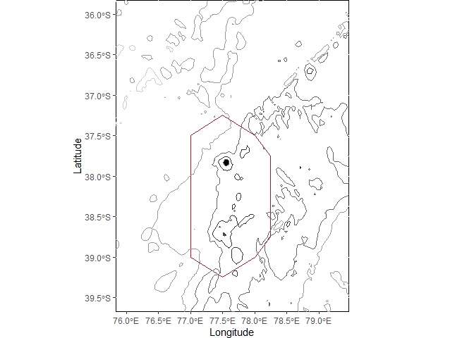
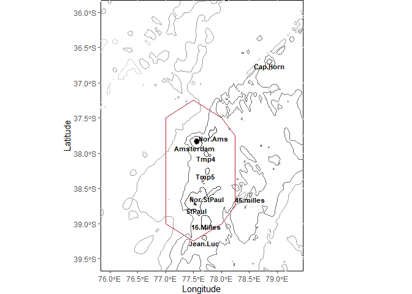
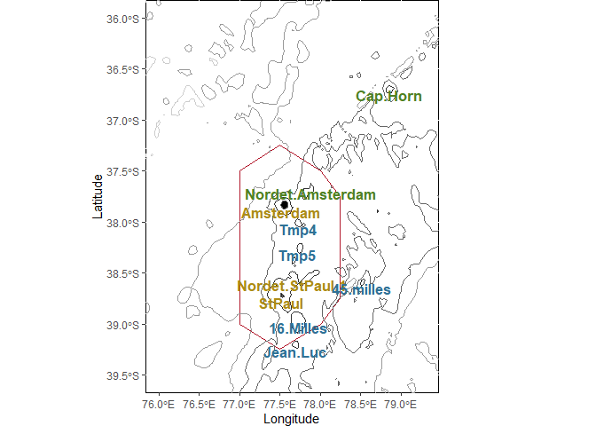
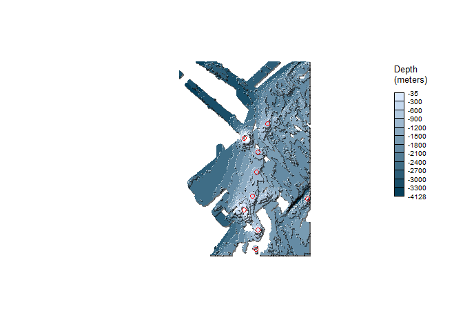
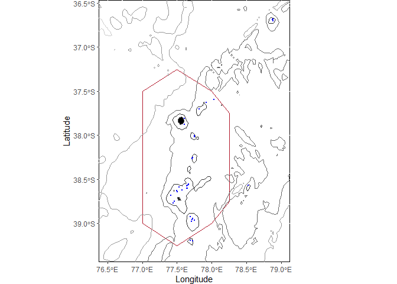
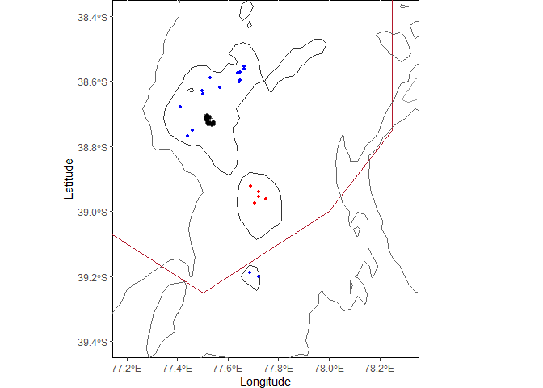
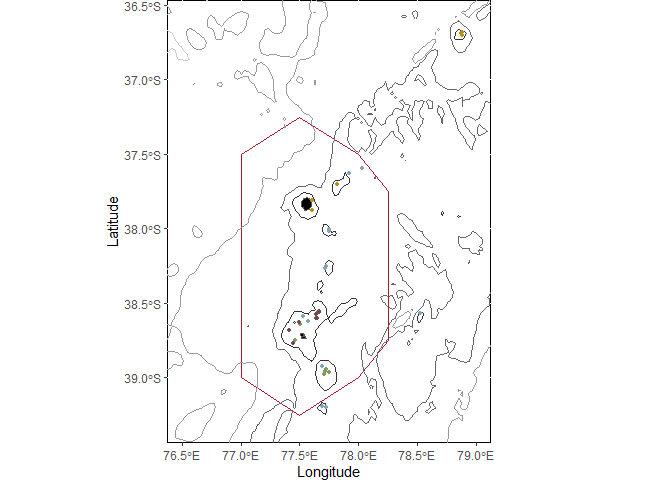

rpz\_rmark
================

-   [Initialisation](#initialisation)
-   [Importation des données](#importation-des-données)
-   [SPA dans le monde](#spa-dans-le-monde)
-   [Cartes de base](#cartes-de-base)
-   [Carte bathymétrique de la ZEE](#carte-bathymétrique-de-la-zee)
-   [Carte des clusters par monts
    sous-marins](#carte-des-clusters-par-monts-sous-marins)
-   [Cartes en relief](#cartes-en-relief)
-   [Cartes des clusters par opérations de
    pêche](#cartes-des-clusters-par-opérations-de-pêche)
-   [Cartes des prédictions des
    clusters:](#cartes-des-prédictions-des-clusters)

Ce script vient en dernier. Il permet la réalisation des cartes sur la
zone. Il part de différentes données spatialisées initiales, ainsi que
des données de clusterisation réalisées.  
Il part de cartes de bases pour les utiliser afin de représenter
géographiquement les différents résultats des analyses.

# Initialisation

On va avoir besoin de plusieurs packages:  
- *dplyr* pour la manipulation de données,  
- *ggplot2*, *RColorBrewer* et *ggspatial* (rose des vents) pour la
représentation graphique,  
- *sf*, *raster* et *ncdf4* pour la manipulation des données
environnementales raster.  
- D’autres packages sont utilisés plus tard, mais très spécifiques, ils
seront donc décrits au moment de les utiliser.

``` r
library(dplyr)
library(ggplot2)
library(RColorBrewer)
library(ggspatial)
library(raster)
library(ncdf4)
library(sf)


initialwd = ("C:/travail/analyses_spa/analyses_croixdusud")
setwd(initialwd)
```

<br/> <br/> <br/>

# Importation des données

Ici sont importées les données spatiales de base. Cela n’inclue pas les
données de cluster, pour que les premières analyses puissent être faites
sans avoir fait les analyses de cluster.

``` r
#limites des RNN des TAAF:
spa = st_read("./original_data/rnn/TAF_RNN-marine-2016_points_WGS84/TAF_RNN-marine-2016_WGS84.shp")

#Isobath_SPA_large_sf, les isobaths par echelle de 500m:
load("./original_data/bathym/Isobath_SPA_large_sf.rda")

#EEZ_sf, les ZEE de l'océan Indien:
load("./original_data/zee/EEZ1_sf.rda")

#FR_island_sf, les iles des TAAF:
load("./original_data/zee/FR_island_sf.rda")
#on ne va pas l'utiliser finalement, parce que nos cartes sont trop zoomées, mais si ça vous tente les données sont dispo.

#les polygones des monts sous-marins:
polygons_mounts = readRDS("./original_data/Yesson_seamounts/polygons_mounts.rds")

#les localisations des bancs echantillones:
banc = read.table("./original_data/banc_id.txt", h=T)
banc$lat = -banc$lat #on passe la lattitude en Sud
banc = banc[-c(1,2,7,9),] #on enleve les bancs proches les uns des autres
banc$txt.lon = banc$lon
banc$txt.lat = banc$lat
banc$txt.lat = banc$txt.lat - 0.079 #et on décale un peu la latitude pour mieux voir

#Nordet Ams:
banc$local_name[1] = "Nor.Ams"
banc$txt.lon[1] = 77.86
banc$txt.lat[1] = -37.79

#Ams:
#banc$txt.lon[10] = 77.7
banc$txt.lat[10] = -37.93

#Nordet Saint Paul:
banc$local_name[4] = "Nor.StPaul"
banc$txt.lon[4] = 77.74
banc$txt.lat[4] = -38.65

#Saint Paul:
banc$txt.lon[9] = 77.55
banc$txt.lat[9] = -38.82

#les données d'opérations de peche:
catch_op_peche = readRDS('./modified_data/catch_op_peche.rds')
```

<br/> <br/>

# SPA dans le monde

Cette première carte représente la position de la ZEE de SPA dans le
monde. Pour charger ue carte du monde simple, on utilise ici le package
*maps*.

``` r
library(maps)
```

    ## Warning: package 'maps' was built under R version 4.0.5

``` r
world_map <- map_data("world")

#les continents:
ggplot(world_map, aes(x = long, y = lat, group = group)) +
  geom_polygon(fill="lightgray") + 
  xlim(0, 130)+ ylim(-69, 32) +
#la ZEE:
  geom_sf(
       data = EEZ_sf[which(EEZ_sf$Country == 'Amsterdam Island and Saint Paul Island'),],
       fill = "transparent",
       inherit.aes = F,
       size = 0.5,
       color = '#ff8c00'
     ) +
#les iles: 
  geom_sf(data = FR_island_sf ,
          color = "gray",
          inherit.aes = F) +
  
  theme_void()
```

<!-- --> <br/>

# Cartes de base

Les cartes sont réalisées en les empilant couche par couche. La carte de
base est une double couche qui servira à beaucoup d’autres cartes du
script.  
La première couche, *standard.map*, donne les limites classiques des
cartes qu’on va réaliser, et donne des éléments graphiques:

``` r
standard.map <- ggplot() +
  xlim(76, 79.3)+ ylim(-39.5, -36) +
  xlab("Longitude") + ylab("Latitude") +
  theme(plot.title = element_text(hjust = 0.5),
        plot.margin = margin(0, 3, 0, 1, "cm"),
        panel.background = element_rect(fill = "transparent", colour = "black"))
```

<br/>

La deuxième couche, *classic.map*, représente:  
- Les limites de la réserve naturelle,  
- Les isobaths,  
- Les 2 îles,  
- La rose des vents (facultatif):

``` r
classic.map <- standard.map +
  
  #limite de la RNN:
  geom_sf(
    data = spa %>% dplyr::filter(district %in% c("SPA")),
    colour = "#b2182b",
    inherit.aes = F,
    size = 0.5,
    fill = "transparent"
  ) +

  # Gebco bathymetry, avec des couleurs plus ou moins foncees:
  geom_sf(
    data = Isobath_SPA_large_sf  %>% dplyr::filter(level %in% c("-1000")),
    colour = "grey20",
    inherit.aes = F,
    size = 0.5
  ) +
  geom_sf(
    data = Isobath_SPA_large_sf  %>% dplyr::filter(level %in% c("-2000")),
    colour = "grey40",
    inherit.aes = F,
    size = 0.5
  ) +
  geom_sf(
    data = Isobath_SPA_large_sf  %>% dplyr::filter(level %in% c("-3000")),
    colour = "grey60",
    inherit.aes = F,
    size = 0.5
  ) +
  geom_sf(
    data = Isobath_SPA_large_sf  %>% dplyr::filter(level %in% c("-4000")),
    colour = "grey80",
    inherit.aes = F,
    size = 0.5
  ) +
  
  # limite des iles:
  geom_sf(data = FR_island_sf ,
          fill = "black",
          inherit.aes = F)
  
  # Fleche d'orientation:
  # + annotation_north_arrow(
  #   location = "tl", #top left
  #     #longueur, largeur:
  #   height = unit(0.5, "in"),
  #   width = unit(0.5, "in"),
  #     #décalage par rapport a la bordure:
  #   pad_x = unit(0.1, "in"),
  #   pad_y = unit(0.1, "in"),
  #   style = north_arrow_fancy_orienteering
  #) 

classic.map
```

<!-- --> <br/>

Cette carte classique peut être aggrémentée du nom des monts légendés.
C’est une carte que je n’ai pas vraiment utilisée, pour la faire au
mieux,, il faudrait un peu déplacer les noms des monts pour que ce soit
plus clair, chose que j’ai fait pour les cartes avec les clusters.

``` r
classic.map +
  geom_text(data = banc, 
            aes(txt.lon, txt.lat, label = local_name), 
            fontface = "bold", 
            size = 3)
```

<!-- --> <br/>
<br/>

# Carte bathymétrique de la ZEE

Avant de vraiment utiliser ces couches, on réalise une carte
bathymétrique de la zone de spa dézoomée pour montrer la ZEE. On le fait
maintenant car cela demande un dézoom, il faut donc reprendre *standard
map* et le modifier un peu:

``` r
ggplot() + 
  #reprise de standard map:
  xlim(73, 82)+ ylim(-42, -34.4) + #limite plus large pour avoir la ZEE
  xlab("Longitude") + ylab("Latitude") +
  theme(plot.title = element_text(hjust = 0.5),
        plot.margin = margin(0, 3, 0, 1, "cm")) +
  theme(panel.background = element_rect(fill = "transparent", colour = "black")) +
  
  #puis reprise de classic map:
  geom_sf(
    data = spa %>% dplyr::filter(district %in% c("SPA")),
    colour = "#b2182b",
    inherit.aes = F,
    size = 0.5,
    fill = "transparent"
  ) +
  geom_sf(
    data = Isobath_SPA_large_sf  %>% dplyr::filter(level %in% c("-1000")),
    colour = "grey20",
    inherit.aes = F,
    size = 0.5
  ) +
  geom_sf(
    data = Isobath_SPA_large_sf  %>% dplyr::filter(level %in% c("-2000")),
    colour = "grey40",
    inherit.aes = F,
    size = 0.5
  ) +
  geom_sf(
    data = Isobath_SPA_large_sf  %>% dplyr::filter(level %in% c("-3000")),
    colour = "grey60",
    inherit.aes = F,
    size = 0.5
  ) +
  geom_sf(
    data = Isobath_SPA_large_sf  %>% dplyr::filter(level %in% c("-4000")),
    colour = "grey80",
    inherit.aes = F,
    size = 0.5
  ) +
  geom_sf(data = FR_island_sf ,
          fill = "black",
          inherit.aes = F) +
  
  #Enfin, ajout de la ZEE:
  geom_sf(
    data = EEZ_sf,
    color = '#ff8c00',
    fill = "transparent",
    inherit.aes = F,
    size = 0.5
  )
```

<!-- --> <br/>
<br/> <br/>

# Carte des clusters par monts sous-marins

C’est une partie rapide car elle ne nous intéresse pas trop, puisque les
analyses aggrégées par monts sous-marins ne sont pas celles qui ont été
retenues.  
Il s’agit simplement de:  
- Charger les données concernant les clusters par monts,  
- Changer les couleurs des clusters pour des tons plus visibles sur la
carte,  
- Représenter la carte.

``` r
col_banc = readRDS('./modified_data/banc_color.rds') #charger les clusters par monts

#les couleurs de base sont pas très voyantes, on va les foncer:
col_banc$color[which(col_banc$color == "#B2DF8A" )] = "#508123" #vert
col_banc$color[which(col_banc$color == "#A6CEE3" )] = "#2f7296" #bleu
col_banc$color[which(col_banc$color == "#E0B61D" )] = "#ac8c16" #orange

#carte:
classic.map +
  geom_text (data = col_banc,
              aes(lon, lat,
                  label = local_name),
             color = col_banc$color,
             fontface = "bold",
             size = 4.5)+
  theme(legend.position="none")
```

<!-- --> La carte
est un peu moche, mais quand on la grandit, les noms des monts
rapeticent relativement a la carte, elle est donc plus harmonieuse…  
<br/> <br/>

# Cartes en relief

Il est souvent un peu difficile de comprendre visuellement les patterns
de reliefs sous-marins. Une manière de les rendres plus visibles est la
représentation de tanaka:  
On représente les profondeurs en tranches bathymétriques, puis on
projecte une lumière et une ombre, qui vont donner l’apparence que ces
tranches sont posées l’une sur l’autre. Cela donne une impression de
relief.  
Pour réaliser cette projection, il y a 2 solutions possibles:  
- Le package [tanaka](https://rgeomatic.hypotheses.org/1758). Il est
très simple d’utilisation, et permet donc de réaliser rapidement ces
cartes. Cependant, il s’avère limité, notammment parce qu’il ne
s’utilise pas (ou pas simplement) avec ggplot.  
- La fonction
[geom\_contour\_tanaka](https://eliocamp.github.io/metR/reference/geom_contour_tanaka.html)
du package MetR. Elle est plus compliquée à utiliser que l’autre
package, mais plus complète, et donc préférable.

Ici on utilisera les 2 fonction, selon la complexité de la carte
réalisée.

La première carte est la carte des données du SHOM. C’est la plus
précise, mais elle ne couvre pas toute la zone étudiée. Elle n’est donc
pas vraiment utilisable dans notre contexte. On veut seulement
représenter les données du SHOM, on peut donc utiliser le package
*tanaka*. Il fonctionne comme suit:  
- On part d’un raster donnant la profondeur pour chaque pixel.  
- D’abord on donne la palette de couleurs qu’on veut utiliser pour créer
un dégradé en fonction de la profondeur. - Ensuite on donne les strates
bathymétriques qu’on veut réaliser. Ici on représente des strates de 300
mètres. Je trouve que c’est un bon compromis entre une carte trop
grossière, et une carte illisible.  
- Enfin, on utilise la fonction *tanaka*, en appelant le raster, la
palette de couleurs et les strates:

``` r
library(tanaka) #le package pour tanaka

shom <- raster("./original_data/bathym/St_Paul_180820.grd")
values(shom) = -values(shom) #on rend les valeurs de profondeur négatives

pal <- colorRampPalette(colors = c("#063f5a","#d8e8fd")) #palette de couleurs
couches = seq(0,-3500,-300) #les couches bathymétriques
tanaka(x = shom, #le raster
       breaks = couches, #les couches bathymétriques
       col = pal(length(couches)), #la palette de couleurs
       legend.pos = "topright",
       legend.title = "Depth\n(meters)")

#On peut représenter graphiquement l'emplacement des monts sous marins:
points(x = banc$lon,
       y = banc$lat,
       col = "red")
```

<!-- --> Deux
remarques:  
Tout d’abord, on voit que la carte comporte de nombreux trous, il manque
de nombreuses données. Les limites au Nord-Est s’arrêtent avant Cap-Hotn
bank, ce mont n’est donc pas représenté.  
On remarque aussi que n’ayant pas la fonction ggplot, la grille des
latitudes et longitudes n’est pas représentée. Il est certainement
possible de le faire, mais de manière plus complexe qu’avec le package
*MetR*, qui s’intègre directement dans les ggplots.

Nous allons maintenant représenter les données de profondeur du Gebco.
Elles sont légèrement plus grossières, mais complètes. On va utiliser le
package *MetR* pour réaliser une projection de tanaka comme suit:  
- On part d’un raster donnant la profondeur pour chaque pixel (Ici on le
crop a notre zone d’étude, pour qu’il soit moins lourd a manipuler).  
- D’abord, comme avec le package précédent, on donne la palette de
couleurs et les strates bathymétriques.  
- Puis, contrairement au package précédent, c’est nous qui devons
appliquer les strates bathymétriques à nos deonnées de profondeurs. On
transforme donc le raster en tableau, puis on utiliser la fonction cut
pour appliquer les strates de *couches*. Notez qu’on inclue aussi le
nombre *1000*, car les données du *gebco* sont aussi des données
d’altitude lorsque l’altidude est positive. Or on veut que toutes les
données d’altitude positive, donc les îles, soient en une seule strate,
c’est la strate de 0 à 1000 m de profondeur. On doit spécifier que les
levels de la variable créée correspondent à la variable créée, je ne
sais pas pourquoi ça ne fonctionne pas tout seul.  
- Enfin, la représentation tanaka se fait en 2 temps. Tout d’abord, on
représente rempli les strates avec le dégradé de couleurs (les couleurs
sont données via la fonction *scale\_fill\_manual*. On rajoute une
couleur en plus, qui détone des autres, pour les îles) ; ensuite on crée
l’effet tanaka sur autour des colorées. On peut alors changer le rapport
entre la pente et l’épaisseur des traits, l’angle de la lumière
projetée,…

``` r
library(metR) #le package pour tanaka

#ouverture du fichier de bathym:
gebco = stack("./original_data/bathym/bathym_gebco/gebco_2019_n-34.0_s-43.0_w73.0_e82.0.nc")
#croper a notre zone:
e = as(extent(76.5, 79.5, -39.5, -36.5), 'SpatialPolygons')
crs(e) = "+proj=longlat +datum=WGS84 +no_defs" #coordinate reference system
gebco_crop = crop(gebco, e)

#palette et couches:
pal <- colorRampPalette(colors = c("#021722","#B9CDD7"))
couches = seq(0,-4500,-300)

#transformation raster en tableau avec les couches:
gebco_frame = as.data.frame(gebco_crop, xy=TRUE)
gebco_frame$laps = cut(gebco_frame$layer, c(1000, couches))
levels(gebco_frame$laps) = c(rev(couches),1000)


tancarte = ggplot() +
  #remplissage des strates:
  geom_contour_fill(
    data = gebco_frame,
    aes(x = x, y = y, z = laps, fill = laps),
    breaks = c(1000, couches)) +
  scale_fill_manual(values = c(pal(length(couches)-2), '#ffc4c4')) +
  #effet tanaka:
  geom_contour_tanaka(
    data = gebco_frame,
    aes(x = x, y = y, z = layer),
    range = c(0.008, 0.4), #gamme d'épaisseur des traits selon la pente
    sun.angle = 40,
    breaks = c(1000, couches)) +
  geom_text (data = banc,
             aes(x = txt.lon,
                 y = txt.lat,
                 label = local_name,
                 fontface = "bold"),
             size = 3.5)+
  theme_void() +
  labs(fill = "Depth (m)")

tancarte
```

<!-- --> Cette
carte pourra être utilisée comme foncd pour représenter la localisation
des opérations de pêche par exemple.  
<br/> <br/>

# Cartes des clusters par opérations de pêche

Cela concerne plusieurs cartes: On représente d’abord simplement
l’emplacement des opérations de pêche, avec des zooms à différents
endroits. Puis on représente les clusters correspondant a ces opérations
de pêche.  
Pour la carte très zoomée, j’ai représenté en différentes couleurs les
points appartenant à 16 miles):

``` r
#carte simple
classic.map +
  geom_point(
    data = catch_op_peche,
    aes(x = mean.lon,
        y = mean.lat),
    colour = "blue",
    size = 0.5) +
  xlim(76.5, 79)+ ylim(-39.3, -36.6) #zoom léger par rapport à la carte classique
```

<!-- -->

``` r
#zoom vers 16 miles:
classic.map +
  geom_point(
    data = catch_op_peche,
    aes(x = mean.lon,
        y = mean.lat),
    colour = "blue",
    size = 1) +
  geom_point( #pour les points qui appartiennent à 16.Miles:
    data = catch_op_peche[which(catch_op_peche$area == "16.Milles"),],
    aes(x = mean.lon,
        y = mean.lat),
    colour = "red",
    size = 1) +
  xlim(77.2, 78.3)+ylim(-39.4, -38.4)
```

<!-- --> On peut
voir sur la carte zoomée qu’il est parfois difficile d’assimiler une
opération de pêche à un mont sous-marin. On voit notamment au-dessus du
mont 16.Miles qu’entre Saint-Paul et Nordet Saint-Paul il y a des
points, qui pourraient être assimilés à un banc comme à l’autre.

Les opérations de pêche colorées par clusters:

``` r
op_cluster_simple = readRDS('./modified_data/catch_cluster_op.rds')

classic.map +
  geom_point(
    data = op_cluster_simple,
    aes(x = lon,
        y = lat,
        color = clus),
    size = 1) +
  theme(legend.position="none") +
  scale_color_manual(values = c("#84a4b5", "#b39117", "#7c9c60", "#744a51")) + #attribution des couleurs aux clusters
  xlim(76.5, 79)+ ylim(-39.3, -36.6) #zoom léger par rapport à la carte classique
```

<!-- -->

Enfin, la même carte sur un fond tanaka réalisé précédemment:

``` r
tancarte +
  geom_point(
    data = op_cluster_simple,
    aes(x = lon,
        y = lat,
        color = clus),
    inherit.aes = F,
    size = 1,
    show.legend = F) +
  scale_color_manual(values = c("#0c70a4", "#5d9d25", "#744a51", "#b39117"))
```

<!-- --> <br/>
<br/>

# Cartes des prédictions des clusters:

Ces cartes sont faites à partir du cluster de prédiction des biorégions,
créé dans la partie *analyses de corrélation*. Après avoir chargé les
données, on supprime toutes celles qui sont d’un profondeur à partir de
1400m, car elles sont hors de notre zone de prédiction.  
Les clusters prédits sont représentés sur une carte classique, ainsi que
sur une carte tanaka (un peu compliquée à lire car bcp de couleurs):

``` r
#données:
predict_bioreg = readRDS('./modified_data/prediction_cds.rds')
predict_bioreg = predict_bioreg[which(predict_bioreg$depth < 1400),]

#rpz classique:
classic.map +
  geom_raster(
    data = predict_bioreg,
    aes(x = mean.lon,
        y = mean.lat,
        fill = bioreg,
        alpha = 0.1)) +
  theme(legend.position="none") +
  scale_fill_manual(values = c("#84a4b5", "#b39117", "#7c9c60", "#744a51")) +
  #ajouter un contour noir à -1500m:
  geom_sf(
    data = Isobath_SPA_large_sf  %>% dplyr::filter(level %in% c("-1500")),
    colour = "black",
    inherit.aes = F,
    size = 0.5) +
  xlim(76, 79)+ ylim(-39.5, -36.3)
```

<!-- -->

``` r
#rpz tanaka:
tancarte +
  geom_raster(
    data = predict_bioreg,
    aes(x = mean.lon,
        y = mean.lat,
        fill = bioreg,
        alpha = 0.1)) +
  theme(legend.position="none") +
  scale_fill_manual(values = c( '#f1f2e3', rev(pal(length(couches)-1)[-(length(couches)-1)]),
                               "#84a4b5", "#b39117", "#7c9c60", "#744a51"))
```

<!-- --> Bon il y
a encore quelques modifs a faire pour la représentation tanaka…  
Autre commentaire: selon le cahngement des limites géographiques, la
carte est déformée. Il y a une fonction pour éviter ça, faut que je la
retrouve.
