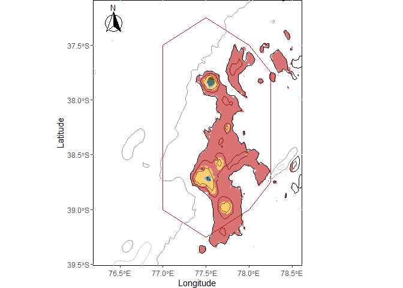
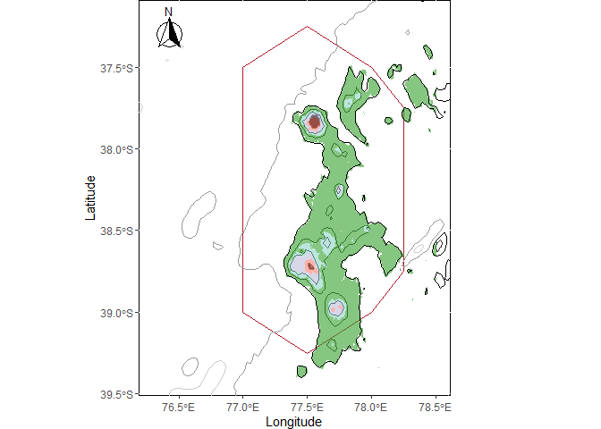

carto\_md50
================

-   [Initialisation](#initialisation)
-   [Importation des données](#importation-des-données)
-   [Carte de base](#carte-de-base)
-   [Cartes des opérations de pêche](#cartes-des-opérations-de-pêche)
-   [Cartes des opérations de pêche aggrégées en
    clusters:](#cartes-des-opérations-de-pêche-aggrégées-en-clusters)
-   [Carte des la limite des 700 mètres de
    profondeur:](#carte-des-la-limite-des-700-mètres-de-profondeur)
-   [Cartes prédictives:](#cartes-prédictives)

<br/> Ce script permet la réalisation des cartes de la zone. Il utilise
différentes données spatialisées , ainsi que les résultats des analyses
de réseau <br/>

# Initialisation

On va avoir besoin de plusieurs packages:  
- *dplyr* pour la manipulation de données,  
- *ggplot2*, *RColorBrewer* et *ggspatial* (rose des vents) pour la
représentation graphique,  
- *sf*, *raster* et *ncdf4* pour la manipulation des données
environnementales raster,  
- *metR* pour réaliser des cartes en effet de relief.

``` r
library(dplyr)
library(ggplot2)
library(RColorBrewer)
library(ggspatial)
library(raster)
library(ncdf4)
library(sf)
library(metR)


initialwd = ("C:/travail/analyses_spa/md50")
setwd(initialwd)
```

<br/> <br/> <br/>

# Importation des données

Ici sont importées les données spatiales de base. Cela n’inclue pas les
données de cluster, pour que les premières analyses puissent être faites
sans avoir fait les analyses de cluster.  
On crée à côté de la variable positionnant les monts sous-marins une
variable où placer les textes, pour qu’ils soient assez à côté pour être
assimilés au monts, sans gêner la vue sur ces derniers.

``` r
#limites des RNN des TAAF:
spa = st_read("./original_data/rnn/TAF_RNN-marine-2016_points_WGS84/TAF_RNN-marine-2016_WGS84.shp")

#Isobath_SPA_large_sf, les isobaths par echelle de 500m:
load("./original_data/bathym/Isobath_SPA_large_sf.rda")

#FR_island_sf, les iles des TAAF:
load("./original_data/FR_island_sf.rda")

#les données d'opérations de peche:
md_gps = readRDS("./modified_data/md_gps.rds")

#les localisations des monts sous-marins:
banc = read.table("C:/travail/analyses_spa/analyses_croixdusud/original_data/banc_id.txt", h=T)
banc$lat = -banc$lat #on passe la lattitude en Sud
banc = banc[-c(1,2,7,9),] #on enleve les bancs proches les uns des autres
banc$txt.lon = banc$lon
banc$txt.lat = banc$lat - 0.079 #et on décale un peu la latitude pour mieux voir

#Nordet Ams:
banc$local_name[1] = "Nor.Ams"
banc$txt.lon[1] = 77.86
banc$txt.lat[1] = -37.79

#Ams:
#banc$txt.lon[10] = 77.7
banc$txt.lat[10] = -37.93

#Nordet Saint Paul:
banc$local_name[4] = "Nor.StPaul"
banc$txt.lon[4] = 77.74
banc$txt.lat[4] = -38.65

#Saint Paul:
banc$txt.lon[9] = 77.55
banc$txt.lat[9] = -38.82
```

<br/> <br/>

# Carte de base

Les cartes sont réalisées en les empilant couche par couche. La carte de
base est une double couche qui servira à beaucoup d’autres cartes du
script.  
La première couche, *standard.map*, donne les limites classiques des
cartes qu’on va réaliser, et donne des éléments graphiques:

``` r
standard.map <- ggplot() + xlim(76.3, 79)+ ylim(-39.2, -37.3) +  xlab("Longitude") + ylab("Latitude") +
  theme(plot.title = element_text(hjust = 0.5),
        plot.margin = margin(0, 3, 0, 1, "cm")) +
  theme(panel.background = element_rect(fill = "transparent", colour = "black")) 
```

<br/>

La deuxième couche représente:  
- Les limites de la réserve naturelle,  
- Les isobaths,  
- Les 2 îles,  
- La rose des vents:

``` r
classic.map <- standard.map +
  
  #limite de la RNN:
  geom_sf(
    data = spa %>% dplyr::filter(district %in% c("SPA")),
    colour = "#b2182b",
    inherit.aes = F,
    size = 0.5,
    fill = "transparent"
  ) +
  
  # Gebco bathymetry, avec des couleurs plus ou moins foncees:
  geom_sf(
    data = Isobath_SPA_large_sf  %>% dplyr::filter(level %in% c("-500")),
    colour = "black",
    inherit.aes = F,
    size = 0.5
  ) +
  geom_sf(
    data = Isobath_SPA_large_sf  %>% dplyr::filter(level %in% c("-1000")),
    colour = "grey20",
    inherit.aes = F,
    size = 0.5
  ) +
  geom_sf(
    data = Isobath_SPA_large_sf  %>% dplyr::filter(level %in% c("-1500")),
    colour = "grey40",
    inherit.aes = F,
    size = 0.5
  ) +
  geom_sf(
    data = Isobath_SPA_large_sf  %>% dplyr::filter(level %in% c("-2500")),
    colour = "grey60",
    inherit.aes = F,
    size = 0.5
  ) +
  geom_sf(
    data = Isobath_SPA_large_sf  %>% dplyr::filter(level %in% c("-3500")),
    colour = "grey80",
    inherit.aes = F,
    size = 0.5
  ) +
  
  
  # limite des iles:
  geom_sf(data = FR_island_sf ,
          fill = "black",
          inherit.aes = F) +
  
  # Fleche d'orientation:
  annotation_north_arrow(
    location = "tl", #top left
    #longueur, largeur:
    height = unit(0.5, "in"),
    width = unit(0.5, "in"),
    #décalage par rapport a la bordure:
    pad_x = unit(0.1, "in"),
    pad_y = unit(0.1, "in"),
    style = north_arrow_fancy_orienteering
  ) 

classic.map
```

<!-- --> <br/>
<br/> <br/>

# Cartes des opérations de pêche

Cette carte montre tout simplement où sont situés les différents sites.

``` r
classic.map +
  geom_point(
    data = md_gps,
    aes(x = mean_lon,
        y = mean_lat),
    colour = "blue",
    inherit.aes = F,
    size = 1)
```

<!-- --> <br/>

Les sites peuvent être différenciés selon la campagne à laquelle ils
appartiennent:

``` r
classic.map +
  geom_point(
    data = md_gps,
    aes(x = mean_lon,
        y = mean_lat,
        color = CAMPAGNE.ACRONYME),
    inherit.aes = F,
    size = 1)
```

<!-- --> <br/>

Vue la densité autour des points, il est intéressant de zoomer sur les
îles. Voici Saint-Paul:

``` r
classic.map +
  geom_point(
    data = md_gps,
    aes(x = mean_lon,
        y = mean_lat,
        color = CAMPAGNE.ACRONYME),
    inherit.aes = F,
    size = 1.5) +
  xlim(77.3, 77.6)+ylim(-38.83, -38.62)
```

    ## Warning: Removed 945 rows containing missing values (geom_point).

<!-- --> <br/>

Et Amsterdam:

``` r
classic.map +
  geom_point(
    data = md_gps,
    aes(x = mean_lon,
        y = mean_lat,
        color = CAMPAGNE.ACRONYME),
    inherit.aes = F,
    size = 1.5) +
  xlim(77.25, 77.7)+ylim(-37.95, -37.65)
```

    ## Warning: Removed 1118 rows containing missing values (geom_point).

<!-- --> <br/>

Enfin, on peut différencier les ops de pêche en fonction de leur
stratégie d’échantillonnage:

``` r
classic.map +
  geom_point(
    data = md_gps,
    aes(x = mean_lon,
        y = mean_lat,
        colour = echant),
    inherit.aes = F,
    size = 1) +
  scale_color_brewer(palette = "Paired") +
  xlim(76.5, 78.8)+ ylim(-39.3, -37.3)
```

<!-- --> <br/>
<br/> <br/>

# Cartes des opérations de pêche aggrégées en clusters:

Je ne met ici qu’un bloc de code, qui est changeable selon l’analyse
dont on veut voir les résultats. Ici on regarde l’analyse de genre des
echinodermes:  
- On charge les résultats de cette analyse,  
- Et au niveau du choix des couleurs, on choisit echinoderme au niveau
Genre.

``` r
md_cluster_taxo = readRDS("./modified_data/md_cluster_ge_echi.rds")

rpz_clus_taxo = classic.map +
  geom_point(
    data = md_cluster_taxo,
    aes(x = long,
        y = lat,
        color = color),
    inherit.aes = F,
    size = 1,
    alpha = 0.5) +
  #niveau sp:
  #scale_color_manual(values = c("#1F78B4", "#808080", "#8dd3c7", "#fb8072"))             #total lvl 1
  #scale_color_manual(values = c("#1F78B4", "#808080", "#8dd3c7", "#bb0000", "#ffa500"))  #total lvl 2
  #scale_color_manual(values = c("#808080", "#B2DF8A", "#fb8072"))                        #arthropodes
  #scale_color_manual(values = c("#33A02C", "#808080", "#8dd3c7", "#bebada", "#fb8072"))  #mollusques
  #scale_color_manual(values = c("#766db1", "#808080", "#fb8072"))                        #cnidaires
  #scale_color_manual(values = c("#808080", "#B2DF8A", "#fb8072"))                        #echinodermes
  #niveau Genre:
  #scale_color_manual(values = c("#1F78B4", "#644989", "#808080", "#B2DF8A", "#b6a5cf", "#ffb6c1")) #total
  #scale_color_manual(values = c("#0000bc", "#808080", "#808080", "#B2DF8A", "#fb8072"))   #arthropodes
  #scale_color_manual(values = c("#0000bc", "#33A02C", "#808080", "#bebada", "#fb8072"))   #mollusques
  #scale_color_manual(values = c("#766db1", "#808080", "#B2DF8A", "#fb8072"))              #cnidaires
  scale_color_manual(values = c("#0000bc", "#33A02C", "#808080", "#B2DF8A", "#fb8072"))   #echinodermes

rpz_clus_taxo
```

<!-- --> <br/>

On zoom ensuite sur les 2 iles:

``` r
#zoom Saint-Paul:
rpz_clus_taxo +
  xlim(77.3, 77.7)+ylim(-38.82, -38.57)
```

    ## Warning: Removed 62 rows containing missing values (geom_point).

<!-- -->

``` r
#zoom Ams:
rpz_clus_taxo +
  xlim(77.29, 77.72)+ylim(-37.98, -37.72)
```

    ## Warning: Removed 75 rows containing missing values (geom_point).

<!-- --> <br/>
<br/> <br/>

# Carte des la limite des 700 mètres de profondeur:

Tout d’abord on ouvre le fichier de bathymétrie et on le crop à notre
zone d’étude:

``` r
gebco = stack("./original_data/bathym/bathym_gebco/gebco_2019_n-34.0_s-43.0_w73.0_e82.0.nc")

#crop:
e <- as(extent(76.5, 79.5, -39.5, -36.5), 'SpatialPolygons')
crs(e) <- "+proj=longlat +datum=WGS84 +no_defs"
gebco_crop = crop(gebco, e)
```

<br/>

Ensuite, on transforme le fichier en tableau, et on crée une varaible
*laps*, qui donne pour chaque ligne un arrondi à 300m de la profondeur.
Pour ça, on utilise la fonction *cut*, mais celle-ci écrivant les gamme
de chiffres dans une écriture qui ne nous correspond pas, on change les
levels qu’elle a créé en tranches de 300m:

``` r
couches = seq(0,-4500,-300)
gebco_frame = as.data.frame(gebco_crop, xy=TRUE)
gebco_frame$laps = cut(gebco_frame$layer, c(1000, couches))
levels(gebco_frame$laps) = c(rev(couches),1000)
head(gebco_frame)
```

    ##          x         y     layer  laps
    ## 1 76.50208 -36.50208 -3233.342 -3300
    ## 2 76.50625 -36.50208 -3235.405 -3300
    ## 3 76.51042 -36.50208 -3237.948 -3300
    ## 4 76.51458 -36.50208 -3241.029 -3300
    ## 5 76.51875 -36.50208 -3243.790 -3300
    ## 6 76.52292 -36.50208 -3246.284 -3300

<br/>

On crée ensuite une carte de représentation tanaka classique:

``` r
pal <- colorRampPalette(colors = c("#021722","#B9CDD7"))

tancarte = ggplot() +
  geom_contour_fill(
    data = gebco_frame,
    aes(x = x, y = y, z = laps, fill = laps),
    breaks = c(1000, couches)) +
  scale_fill_manual(values = c(pal(length(couches)-2), '#ffc4c4')) +
  geom_contour_tanaka(
    data = gebco_frame,
    aes(x = x, y = y, z = layer),
    range = c(0.008, 0.4),
    sun.angle = 40,
    breaks = c(1000, couches)) +
  theme_void() +
  labs(fill = "Depth (m)")
tancarte
```

<!-- --> <br/>

Puis on récupère les points des clusters séparés à 700 mètres, et on
sélectionne la gamme des 700 mètres dans le tableau créé précédemment:

``` r
md500 = readRDS("./modified_data/md_cluster_sp.rds")
md500 = md500[which(md500$clus2 %in% c(1.1, 1.2)),]

gebco_700 = gebco_frame[which(round(gebco_frame$layer/100) == -7 ),]
gebco_700$whyyy = 'hmm'

tancarte +
  geom_point(
    data = gebco_700,
    aes(x = x,
        y = y,
        colour = whyyy),
    inherit.aes = F,
    size = 0.2, shape=".") +
  #scale_color_manual(values = c("green")) +
  geom_point(
    data = md500,
    aes(x = long,
        y = lat,
        color = color2),
    inherit.aes = F,
    size = 0.2) +
  scale_color_manual(values = c("#bb0000", "#ffa500", 'green'))     
```

<!-- --> <br/>
<br/> <br/>

# Cartes prédictives:

On importe les données de prédiction, on sélectionne seulement les
profondeurs supérieures à 1500 mètres, et on représente graphiquement.  
On commence par le carte générale:

``` r
predict_bioreg = readRDS('./modified_data/predict_bioreg_md50.rds')
predict_bioreg = predict_bioreg[which(predict_bioreg$prof < 1500),]
predict_bioreg$bioreg = as.factor(predict_bioreg$bioreg)

classic.map +
  geom_raster(
    data = predict_bioreg,
    aes(x = long,
        y = lat,
        fill = bioreg,
        alpha = 0.1)) +
  theme(legend.position="none") +
  scale_fill_manual(values = c("#ffa500", "#bb0000", "#1F78B4", "#8dd3c7")) +
  #contours a -1500m en noir:
  geom_sf(
    data = Isobath_SPA_large_sf  %>% dplyr::filter(level %in% c("-1500")),
    colour = "black",
    inherit.aes = F,
    size = 0.5) +
  #zoom sur la zone de prédiction:
  xlim(76.3, 78.5)+ ylim(-39.4, -37.2)
```

    ## Warning: Raster pixels are placed at uneven vertical intervals and will be
    ## shifted. Consider using geom_tile() instead.

    ## Warning: Removed 5294 rows containing missing values (geom_raster).

<!-- --> <br/>

On peut exporter cette carte:

``` r
raster_poissons_demersaux = predict_bioreg[,c(1,2,4)] #on ne prend pas la profondeur
coordinates(raster_poissons_demersaux) = ~ long + lat
gridded(raster_poissons_demersaux) = T
```

    ## Warning in points2grid(points, tolerance, round): grid has empty column/rows in
    ## dimension 2

``` r
raster_poissons_demersaux = raster(raster_poissons_demersaux)
writeRaster(raster_poissons_demersaux, filename="./results/raster_poissons_demersaux.tif", overwrite = T)
```

    ## Warning in .gd_SetProject(object, ...): NOT UPDATED FOR PROJ >= 6

<br/>

Et enfin, la même carte pour les mollusques:

``` r
predict_bioreg_mol = readRDS('./modified_data/predict_bioreg_mol_md50.rds')
predict_bioreg_mol = predict_bioreg_mol[which(predict_bioreg_mol$prof < 1500),]
predict_bioreg_mol$bioreg = as.factor(predict_bioreg_mol$bioreg)

classic.map +
  geom_raster(
    data = predict_bioreg_mol,
    aes(x = long,
        y = lat,
        fill = bioreg), alpha = 0.6) +
  theme(legend.position="none") +
  scale_fill_manual(values = c("#fb8072", "#8dd3c7", "#33A02C", "#bebada")) +
  #contours a -1500m en noir:
  geom_sf(
    data = Isobath_SPA_large_sf  %>% dplyr::filter(level %in% c("-1500")),
    colour = "black",
    inherit.aes = F,
    size = 0.5) +
  #zoom sur la zone de prédiction:
  xlim(76.3, 78.5)+ ylim(-39.4, -37.2)
```

    ## Warning: Raster pixels are placed at uneven vertical intervals and will be
    ## shifted. Consider using geom_tile() instead.

    ## Warning: Removed 5294 rows containing missing values (geom_raster).

<!-- --> <br/>
