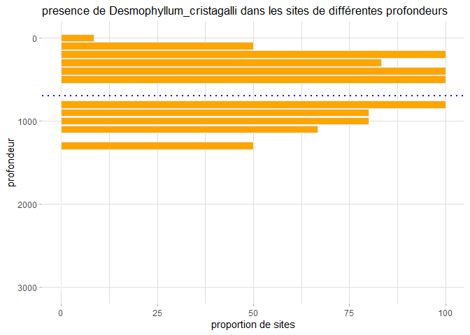
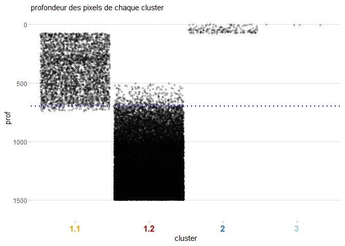

correl\_md50
================

-   [Initialisation](#initialisation)
-   [Analyses tous taxons confondus](#analyses-tous-taxons-confondus)
    -   [Impact de la profondeur](#impact-de-la-profondeur)
    -   [Modèle global](#modèle-global)
    -   [Impact de la profondeur sur les
        prédictions](#impact-de-la-profondeur-sur-les-prédictions)

<br/> Ce scripts part des résultats des analyses de réseau, et a pour
but de les corréler avec les données environnementales. Il se concentre
sur les 3 réseau ayant présentés des résultats intéressants: le réseau
tous taxons confondus, le réseau des mollusques et celui des
echinodermes. Pour chacun de ces réseaux il est question de:  
- Se focaliser sur l’impact de la profondeur (modèle + représentation
graphique par espèce),  
- Créer et sélectionner un modèle multinomial optimal,  
- Prédire la présence des clusters à partir du modèle sélectionné,  
- Représenter l’impact de la profondeur dans ces prédictions.  
<br/>

# Initialisation

On va avoir besoin de plusieurs packages:  
- *dplyr* pour la manipulation de données,  
- *nnet* pour faire des analyses multinomiales, et *car* pour leur
significativité,  
- *raster* pour la manipulation des données environnementales raster,  
- *ggplot2* pour les graphiques.

``` r
library(dplyr)
library(ggplot2)
library(nnet)
library(car)
library(raster)

initialwd = ("C:/travail/analyses_spa/md50")
```

<br/> <br/> <br/> <br/>

# Analyses tous taxons confondus

<br/>

## Impact de la profondeur

L’analyse de l’impact de la profondeur sur la détermination des clusterd
se fait en deux étapes:  
Il s’agit d’abord de quantifier cet impact. Pour ça on réalise une
analyse multinomiale, dont le but est d’expliquer une variable
qualitative (nos clusters) pour des variables quantitatives (la
profondeur). C’est l’inverse de l’anova. On les réalise via le pakage
*nnet*.  
Ensuite, on représente pour une espèce sélectionnée (qui a une IndVal
importante pour le cluster qu’on regarde) la répartition en profondeur
des sites où elle a été trouvée.  
<br/> Voyons la première étape, l’analyse multinomiale. Au sein de la
fonction, on règle maxit, le nombre d’itération avant que le modèle
s’arrête s’il n’a pas convergé, à un grand nombre d’itérations car il en
a besoin de beaucoup.  
On teste graphiquement la normalité des résidus de ce modèle (anisi que
leur homogénéité en temps normal, mais je n’arrive pas a comprendre la
représentation graphique, qui est étrange. Il faudrait que je me penche
sur la validation spécifique des analyses multinomiales).

``` r
#lecture résultats réseau:
md_cluster_sp = readRDS("C:/travail/analyses_spa/md50/modified_data/md_cluster_sp.rds")

resdepth_general <- multinom(as.factor(md_cluster_sp$clus2) ~ md_cluster_sp$prof, , maxit = 1000)
```

<br/>

Par une anova sur les résultats on obtient la significativité de notre
modèle, ici très importante:

``` r
car::Anova(resdepth_general)
```

    ## # weights:  44 (21 variable)
    ## initial  value 2228.641609 
    ## iter  10 value 1628.411776
    ## iter  20 value 1589.161251
    ## final  value 1588.921831 
    ## converged

    ## Analysis of Deviance Table (Type II tests)
    ## 
    ## Response: as.factor(md_cluster_sp$clus2)
    ##                    LR Chisq Df Pr(>Chisq)    
    ## md_cluster_sp$prof   1637.9 21  < 2.2e-16 ***
    ## ---
    ## Signif. codes:  0 '***' 0.001 '**' 0.01 '*' 0.05 '.' 0.1 ' ' 1

<br/>

VOyons maintenant la représentation graphique par espèce. Il s’agit de
choisir une espèce parmi celles étant les plus représentatives de chaque
cluster (les espèces les pus intéressantes pour chaque cluster sont en
commentaires dans le code ci-dessous), puis de trouver dans combien de
sites elle est présente à différentes gammes de profondeur.  
On regarde donc pour chaque strate de 100m de profondeur quels sites
sont dans cette tranche (donc quels sites ont une profondeur arrondi à
100m près qui correspond), et parmi ces sites lesquels ont l’espèce
ciblée dans leurs données. On garde un proportion de sites présentant à
cette profondeur l’espèce ciblée, car le nombre absolu de sites est
biaisé: si l’on a plus de sites à une profondeur précise, on a plus de
chance d’avoir des observations.

``` r
nom = "Desmophyllum_cristagalli"
#Solenosmilia_variabilis, rouge, #bb0000
#Ophiactis_abyssicola
#Caryophyllia_profunda, orange, #ffa500
#Desmophyllum_cristagalli

#strates de profondeur:
repart_nom = data.frame(
  prof = seq(0, 3000, 100))
repart_nom$prop = 0


for (i in 1:nrow(repart_nom)) { #pour chaque tranche de profondeur:
  datalaprof = md_cluster_sp[which(floor(md_cluster_sp$prof/100)*100 == repart_nom$prof[i]),] #quel site est a la bonne prof
  repart_nom$prop[i] = length(datalaprof$TAXON.TAXON_LIBRE[which(datalaprof$TAXON.TAXON_LIBRE == nom)]) / 
    length(unique(datalaprof$site_loc))*100 #parmi ces sites, quelle proportion présnte l'espèce?
}
repart_nom$prop[which(is.na(repart_nom$prop))] = 0 #les profondeurs n'ayant pas ces espèces sont à 0
head(repart_nom)
```

    ##   prof       prop
    ## 1    0   8.510638
    ## 2  100  50.000000
    ## 3  200 100.000000
    ## 4  300  83.333333
    ## 5  400 100.000000
    ## 6  500 100.000000

<br/>

On représente graphiquement ce tableau en barplot retourné, pour que la
profondeur soit verticale et aille ver le bas. On ajoute aussi une barre
horizontale a 700m de profondeur, car c’est dans cette zone qu’on
observe une transition entre les sites appartenant aux 2 clusters du
large.

``` r
ggplot() +
  geom_bar(stat = "identity", data = repart_nom, aes(x = prof, y = prop), fill="#ffa500", color="#e9ecef") +
  geom_vline(xintercept = 700, linetype="dotted", color = "blue", size=1) +
  coord_flip() +
  scale_x_reverse()+
  ggtitle("presence de Desmophyllum_cristagalli dans les sites de différentes profondeurs") +
  ylab('proportion de sites') +
  xlab('profondeur') +
  theme_light() +
  theme(
    plot.title = element_text(size=13),
    panel.grid.minor.y = element_blank(),
    panel.border = element_blank()
  )
```

<!-- --> <br/>
<br/> <br/>

## Modèle global

Les modèles et prédictions sont réalisés de la même manière que pour les
analyses de *Croix du Sud*:  
- On crée un modèle multinomial avec toutes les variables explicatives
qu’on souhaite tester (ici latitude, longitude et profondeur).  
- On sélectionne par la fonction *Step* la combinaison optimale de
variables en terme d’AIC.  
- En parallèle, on crée un tableau contenant les longitudes, latitudes
et profondeur de tous les pixels qu’on souhaite prédire sur la zone.  
- Dans une boucle à 100 itérations, on sépare le jeu de données en deux,
on applique le modèle optimal sur une partie des données, on le teste
sur l’autre pour calculer sa précision, et on prédit les résultats du
modèle à partir du tableau de prédictions.  
- Pour chaque pixel du tableau de prédiction, on note quel est la
biorégion prédite la plus souvent.  
- On exporte le tableau de prédiction.  
On commence donc par créer le tableau de prédiction:

``` r
#sélection des données: 
md_cluster_sp_select = md_cluster_sp[which(md_cluster_sp$clus2 %in% c(1.1, 1.2, 2, 3)),] #que les clusters qui nous intéressent
md_cluster_nprof = md_cluster_sp_select[-which(is.na(md_cluster_sp_select$prof)),] #que les clusters ayant des données de prof

#donées de profondeur:
gebco = stack("./original_data/bathym/bathym_gebco/gebco_2019_n-34.0_s-43.0_w73.0_e82.0.nc")

#limites et résolution de la zone de prediction:
limitesy_Ams = seq(-39.5, -36, 0.00417) #gamme de latitude dans laquelle chercher
limitesx_Ams = seq(76, 79, 0.00417) #gamme de longitude dans laquelle chercher
predict_bioreg = data.frame( #tableau avec toutes les combinaisons long / lat
  long = as.vector(sapply(limitesx_Ams, function(x) rep(x, length(limitesy_Ams)))),
  lat = rep(limitesy_Ams, length(limitesx_Ams))
)
spat_predict_bioreg  = predict_bioreg
coordinates(spat_predict_bioreg) = ~ long + lat
predict_bioreg$prof = -as.vector(raster :: extract(gebco, spat_predict_bioreg))
head(predict_bioreg)
```

    ##   long       lat     prof
    ## 1   76 -39.50000 3456.637
    ## 2   76 -39.49583 3461.623
    ## 3   76 -39.49166 3463.289
    ## 4   76 -39.48749 3464.131
    ## 5   76 -39.48332 3464.496
    ## 6   76 -39.47915 3464.499

<br/>

On créée ensuite le modèle, on tourve la combinaison variables optimale
(fonction *step*), et on teste leur significativité (*anova*):

``` r
restot_1 = multinom(as.factor(clus2) ~ lat + long + prof, data = md_cluster_nprof, maxit = 10000)
st_restot1 = step(restot_1, direction = c('both'))
restot_2 = eval(st_restot1$call)
```

<br/>

``` r
car::Anova(restot_2) #test de significativité
```

    ## Analysis of Deviance Table (Type II tests)
    ## 
    ## Response: as.factor(clus2)
    ##      LR Chisq Df Pr(>Chisq)    
    ## lat     79.95  3  < 2.2e-16 ***
    ## prof   926.83  3  < 2.2e-16 ***
    ## ---
    ## Signif. codes:  0 '***' 0.001 '**' 0.01 '*' 0.05 '.' 0.1 ' ' 1

La latitude et la profondeur sont sélectionnées, toutes deux très
significatives. Il s’agit maintenant de tester le modèle, et de
l’utiliser pour la prédiction:

``` r
accus = NULL

for (i in 1:100) {
  #prendre 85% aleatoirement
  #tirage aléatoire entre 1 et le nb de sites, iterations 85% du nb de sites:
  choix = sample(1:nrow(md_cluster_nprof), round(0.8*nrow(md_cluster_nprof))) 
  train = md_cluster_nprof[choix,]
  
  #selection du modele
  restot_3 = multinom(as.factor(clus2) ~ lat + prof, data = train, maxit = 10000)
  
  # Predicting the values for train dataset
  accuracy_train = predict(restot_3, newdata = md_cluster_nprof[-choix,])
  # Building classification table
  tab = table(md_cluster_nprof[-choix,]$clus2, accuracy_train %>% droplevels() )
  # Calculating accuracy - sum of diagonal elements divided by total obs
  accus = c(accus, round((sum(diag(tab))/sum(tab))*100,2))
  
  #prediction:
  pred_clus = data.frame(as.character(predict(restot_3, newdata = predict_bioreg)))
  colnames(pred_clus) = paste0("pred_clus_", i)
  predict_bioreg = cbind(predict_bioreg, pred_clus)
}
```

``` r
mean(accus) #précision moyenne des modèles
```

    ## [1] 85.5095

<br/>

Ensuite, on trouve pour chaque pixel le cluster qui a été prédit le plus
de fois. On utilise exactement la même formule que pour *Crois du Sud*:
on utilise la fonction sapply, qui va appliquer une tache a chaque ligne
du tableau de prédiction. Cette tache est d’afficher le nombre
d’itérations de chaque biorégion, et de choisir celle qui est la plus
représentée.  
L’écriture est compliquée: on utilise *table* pour avoir toutes les
itérations, puis *sort* en *decreasing* pour sélectionner seulement la
première *\[1\]*, qu’on transforme en tableau dont on prend le nom de la
ligne, qui correspond au nom de la biorégion. Il existe d’autres manière
plus simples de l’écrire, mais elles ne fonctionnent parfois pas quand
il y a plusieurs biorégions recensées dans une ligne, ou au contraire
quand il y en a qu’une.

``` r
ouaich = unlist(sapply(1:nrow(predict_bioreg), 
                       function(x){rownames(as.data.frame(sort(table(as.factor(predict_bioreg[x, -(1:3)])), decreasing = T)[1]))
                       } ), use.names = FALSE)
head(ouaich)
```

    ## [1] "1.2" "1.2" "1.2" "1.2" "1.2" "1.2"

<br/>

Enfin, on inclue ces résultats dans le tableau final:

``` r
predict_bioreg_md50 = cbind(predict_bioreg[,1:3], bioreg = ouaich)
saveRDS(predict_bioreg_md50, file='./modified_data/predict_bioreg_md50.rds')
head(predict_bioreg_md50)
```

    ##   long       lat     prof bioreg
    ## 1   76 -39.50000 3456.637    1.2
    ## 2   76 -39.49583 3461.623    1.2
    ## 3   76 -39.49166 3463.289    1.2
    ## 4   76 -39.48749 3464.131    1.2
    ## 5   76 -39.48332 3464.496    1.2
    ## 6   76 -39.47915 3464.499    1.2

<br/> <br/> <br/>

## Impact de la profondeur sur les prédictions

Il s’agit simplement de montrer la profondeur des pixels correspondant
aux divers clusters, dans une zone de profondeur ne dépassant pas les
1500m, les données originales les plus profondes parmi les clusters
sélectionnés. On représente aussi la barre des 700m qui semble délimiter
les 2 clusters profonds:

``` r
predict_bioreg_md50 = predict_bioreg_md50[which(predict_bioreg_md50$prof < 1500),]

ggplot() +
  geom_jitter(data = predict_bioreg_md50, 
              aes(x=bioreg, y=prof), 
              size=1, width = 0.47, alpha = 0.2) +
  geom_hline(yintercept = 700, linetype="dotted", color = "blue", size=1) +
  scale_y_reverse(limits=c(1600,0)) + #echelle des profondeurs vers le bas
  theme_light() +
  xlab("cluster") +
  theme(
    #legend.position="none",
    panel.grid.minor.y = element_blank(),
    panel.grid.major.x = element_blank(),
    panel.grid.minor.x = element_blank(),
    panel.border = element_blank(),
    plot.title = element_text(size=11),
    axis.text.x = element_text(face = 'bold', size=12, color=c("#ffa500", "#bb0000", "#1F78B4", "#8dd3c7"))
  ) +
  ggtitle("profondeur des pixels de chaque cluster")
```

    ## Warning: Vectorized input to `element_text()` is not officially supported.
    ## Results may be unexpected or may change in future versions of ggplot2.

    ## Warning: Removed 306 rows containing missing values (geom_point).

<!-- --> <br/>

L’exploitation des 2 autres analyses de réseau sont très similaires, il
faudra que je prenne le temps de les décrire à un moment…
