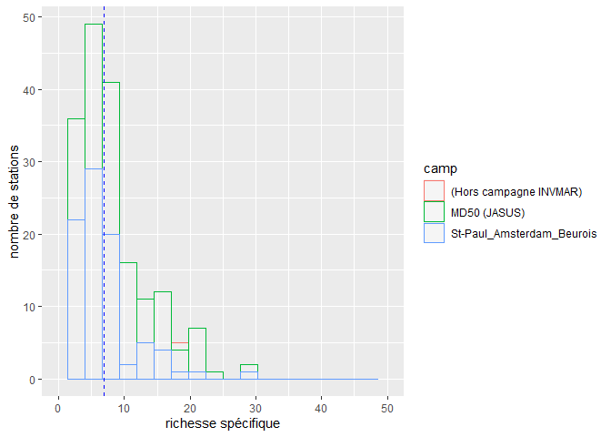
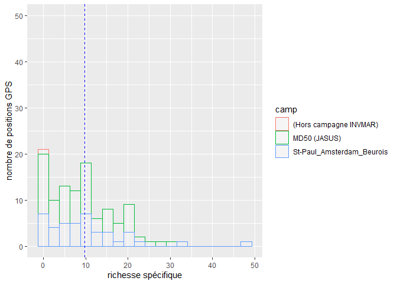
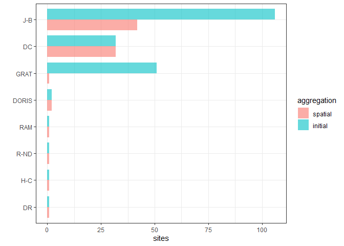
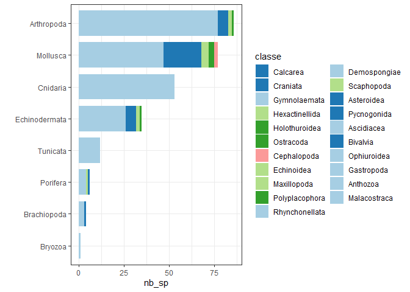

graphiques\_md50
================

-   [Initialisation](#initialisation)
-   [Nombre d’espèces par site](#nombre-despèces-par-site)
-   [Composition des sites en stratégies
    d’échantillonnage](#composition-des-sites-en-stratégies-déchantillonnage)
-   [Nombre d’espèces de chaque
    embranchement](#nombre-despèces-de-chaque-embranchement)

<br/> Ce script réalise quelques représentations graphiques du jeu de
données:  
- Le nombre d’espèces recensées par site spatio-temporel, et par site
temporel,  
- Le nombre de sites (spatio-temp et temp) utilisant les différentes
méthodes d’échantillonnages,  
- Le nombre d’espèces des différents embranchements.  
<br/>

# Initialisation

On va avoir besoin de plusieurs packages:  
- *tidyverse* pour la manipulation de données,  
- *ggplot2* pour les graphiques,  
- *RColorBrewer* afin d’obtenir des palettes de couleurs pour les
graphiques.

On charge le jeu de données *md\_gps*, qui n’a pas fusionné les sites
temporels, parce qu’on en auura besoin justement pour voir la différence
entre sites spatio-temporels, et site spatiaux (aggrégés
temporellement).

``` r
library(tidyverse)
library(ggplot2)
library(RColorBrewer)

initialwd = ("C:/travail/analyses_spa/md50")
setwd(initialwd)

md_gps = readRDS("./modified_data/md_gps.rds")
```

<br/> <br/> <br/>

# Nombre d’espèces par site

On veut un histogramme montrant la distribution du nombre d’espèces par
site, en différenciant par la couleur les sites issus de la campagne
*MD50* de ceux de *Jean Beurois*, avec et sans aggrégation temporelle.  
On commence par l’histogramme sans aggrégation temporelle, puis on
aggrègera nos données.  
On part donc de *md\_gps*, qu’on aggrège par site, en demandant pour
chaque site le nombre d’espèces diférentes *(
length(unique(TAXON.TAXON\_LIBRE)) )*, et la campagne qui a
échantillonné ce site (ainsi que la méthode d’échantillonnage, qu’on
utilisera plus tard):

``` r
md_gps_rich = md_gps %>%
  group_by(STATION.NUM_STATION) %>%
  dplyr::summarize(rich_sp = length(unique(TAXON.TAXON_LIBRE)),
                   camp = unique(CAMPAGNE.ACRONYME), 
                   echant = unique(echant))
head(md_gps_rich)
```

    ## # A tibble: 6 x 4
    ## # Groups:   STATION.NUM_STATION [6]
    ##   STATION.NUM_STATION rich_sp camp                      echant
    ##   <chr>                 <int> <chr>                     <chr> 
    ## 1 AMS-10                    4 St-Paul_Amsterdam_Beurois J-B   
    ## 2 AMS-101                   2 St-Paul_Amsterdam_Beurois J-B   
    ## 3 AMS-103                   1 St-Paul_Amsterdam_Beurois J-B   
    ## 4 AMS-111                   2 St-Paul_Amsterdam_Beurois J-B   
    ## 5 AMS-119                   5 St-Paul_Amsterdam_Beurois J-B   
    ## 6 AMS-12                    1 St-Paul_Amsterdam_Beurois J-B

<br/>

Maintenant on crée l’histogramme, en ajoutant en pointillé une barre
verticalle représentant le nombre moyen d’espèces par site:

``` r
ggplot(md_gps_rich, aes(x=rich_sp, color=camp)) +
  geom_histogram(bins = 20, #largeur des barres 
                 fill="white", 
                 alpha=0.2) + #transparence
  geom_vline(aes(xintercept=mean(rich_sp)),
             color="blue", linetype="dashed", size=0.5) +
  xlim(0, 50) + #force à avoir la même taille d'abscisse que le graphique suivant, pour les comparer
  xlab("richesse spécifique") +
  ylab("nombre de stations")
```

    ## Warning: Removed 6 rows containing missing values (geom_bar).

<!-- -->
<br/>

On groupe ensuite nos données par position afin qu’elles soient
aggrégées temporellement:

``` r
md_gps_pos = md_gps %>%
  group_by(loc) %>%
  dplyr::summarize(rich_sp = length(unique(TAXON.TAXON_LIBRE)),
                   camp = unique(CAMPAGNE.ACRONYME), 
                   echant = unique(echant))
head(md_gps_pos)
```

    ## # A tibble: 6 x 4
    ##   loc                        rich_sp camp         echant
    ##   <chr>                        <int> <chr>        <chr> 
    ## 1 -37.310165 77.514168 DORIS       1 MD50 (JASUS) DORIS 
    ## 2 -37.63208 77.248665 CP           1 MD50 (JASUS) CP    
    ## 3 -37.66075 77.310415 CP           5 MD50 (JASUS) CP    
    ## 4 -37.6725 77.5045 DC              9 MD50 (JASUS) DC    
    ## 5 -37.68883 77.49675 CP            1 MD50 (JASUS) CP    
    ## 6 -37.74175 77.45517 CP            2 MD50 (JASUS) CP

<br/>

Et on représente graphiquement les nouvelles données:

``` r
ggplot(md_gps_pos, aes(x=rich_sp, color=camp)) +
  geom_histogram(fill="white", alpha=0.2, bins = 20) +
  geom_vline(aes(xintercept=mean(rich_sp)),
             color="blue", linetype="dashed", size=0.5) +
  ylim(0, 50) +
  xlab("richesse spécifique") +
  ylab("nombre de positions GPS")
```

<!-- -->
<br/>

Le gain en nombre d’espèces par site après l’aggrégation temporelle
n’est pas très élevé, il reste toujours bas, ce qui complique la
comparaison dde sites (et donc l’analyse de réseau).  
<br/> <br/> <br/>

# Composition des sites en stratégies d’échantillonnage

On veut créer un barplot présentant la récurrence des différentes
méthodes d’échantillonnage, avec les données aggrégées ou non sur le
même graphe. On va donc d’abord avoir besoin de calculer à partir des 2
jeux de données précédents le nombre de site présentant chaque méthode
d’échantillonnage (on utilise pour ça la fonction *table*), puis on
arrangera toutes nos données en un tableau, dans lequel l’aggrégation
est un facteur (est-ce que pour cette ligne les données sont aggrégées
ou non ?), pour que les données soient compatibles avec ggplot.

``` r
#nombre de sites pour chaque méthode d'échantillonnage:
echants = as.data.frame(table(md_gps_rich$echant))[-1,]
echants_spat = as.data.frame(table(md_gps_pos$echant))[-1,]

#jeu de données unique:
echants = data.frame(
  type = rep(echants$Var1, 2),
  sites = c(echants$Freq, echants_spat$Freq),
  #pour représenter graphiquement les variables par ordre de quantité de sites:
  sites_order = rep(echants$Freq + echants_spat$Freq, 2), 
  aggregation = c(rep("initial", nrow(echants)), rep("spatial", nrow(echants)))
)
head(echants)
```

    ##    type sites sites_order aggregation
    ## 1    DC    32          64     initial
    ## 2 DORIS     2           4     initial
    ## 3    DR     1           2     initial
    ## 4  GRAT    51          52     initial
    ## 5   H-C     1           2     initial
    ## 6   J-B   106         148     initial

<br/>

Afin d’avoir un graphique bien rangé, on va utiliser pour les graphiques
la fonction *fct\_reorder*, qui donne l’ordre des variables dans un jeu
de données.  
On l’utilise 2 fois:  
- Pour que les stratégies d’échantillonnage soient classés de la plus à
la moyen fréquente, en moyenne entre les 2 types d’aggrégation. C’est
pour cette raison qu’on a créé juste avant la variable *sites\_order*.  
- Pour qu’au sein d’une stratégie d’échantillonnage, les données sans
aggrégation soient toujours présentées en premier. C’est un peu du
détail mais je trouve que ça facilite la compréhension.

``` r
echants %>%
  mutate(type = fct_reorder(type, sites_order)) %>% #classement des strats d'échant.
  mutate(aggregation = fct_reorder(aggregation, sites)) %>% #classement au sein de chaque strat.
  ggplot( aes(x=type, y=sites, fill = aggregation)) +
  geom_bar(position = position_dodge() , #pour que les barres agrégées / on agrégées soient cote a cote
           stat="identity", #pour que taille des bars = valeurs données en y (et non ps nb de cases présentant x)
           alpha=.6, width=.8) +
  coord_flip() + #représentation verticale
  xlab("") +
  theme_bw()
```

<!-- -->
<br/> <br/> <br/>

# Nombre d’espèces de chaque embranchement

Ce graphique est le plus compliqué à réaliser. On veut, comme le
graphique précédent, réaliser un barplot vertical.  
Celui-ci présentera pour chaque embranchement le nombre d’espèces des
différentes classes, les classes étant en couleurs. Comme précédemment,
les embranchements sont rangés par nombre d’espèces de haut en bas, mais
aussi au sein d’un embranchement, les classes sont rangées par nb
d’espèces de gauche à droite. Enfin, les couleurs présentant au sein
d’un embranchement les différentes classes sont les mêmes d’un
embranchement à l’autre, pour que le graphique soit plus harmonieux et
donc plus facile à lire.  
Tout d’abord, on crée un jeu de données stipulant le nombre d’espèces
différentes au sein de chaque classe de cahque embranchement. Afin de ne
pas avoir des noms d’espèces de genre différents (typiquement *lineaus*,
le genre de personne qui a mis son nom partout), on crée la variable
*fam\_gen\_sp*, qui fusionne les 3 taxons. Puis on groupe les données,
et on enlève un NA qu’on ne veut pas représenter graphiquement:

``` r
md_gps$fam_gen_sp = paste(md_gps$TAXON.FAMILLE, md_gps$TAXON.TAXON_LIBRE, sep='_')

branche = md_gps %>%
  group_by(embr=TAXON.EMBRANCHEMENT, classe=TAXON.CLASSE) %>%
  dplyr::summarize(nb_sp = length(unique(fam_gen_sp)))

branche = branche[-which(is.na(branche$classe)),] #on enleve un NA

head(branche)
```

    ## # A tibble: 6 x 3
    ## # Groups:   embr [2]
    ##   embr        classe         nb_sp
    ##   <chr>       <chr>          <int>
    ## 1 Arthropoda  Malacostraca      77
    ## 2 Arthropoda  Maxillopoda        2
    ## 3 Arthropoda  Ostracoda          1
    ## 4 Arthropoda  Pycnogonida        6
    ## 5 Brachiopoda Craniata           1
    ## 6 Brachiopoda Rhynchonellata     3

<br/>

Maintenant, on calcule pour chaque embranchement le nombre d’espèces
total qu’il présente, pour pouvoir l’ordonner dans le graphique. On
calcule d’abord cette variable en créant un jeu de données à part, puis
pour chaque classe, on donne le nombre d’espèces de l’embranchement
auquel elle correspond, grace à la fonction *match*:

``` r
yop = branche %>%
  group_by(embr) %>% #pour chaque embranchement, on calcule
  dplyr::summarize(position_nb = sum(nb_sp), #le nombre d'especes differentes
                   nb_cl = length(classe)) #le nb de classes différentes

#on inclue le nombre d'especes pour chaque embranchement a notre tableau:
branche$position_nb = yop$position_nb[match(branche$embr, yop$embr)]
head(yop)
```

    ## # A tibble: 6 x 3
    ##   embr          position_nb nb_cl
    ##   <chr>               <int> <int>
    ## 1 Arthropoda             86     4
    ## 2 Brachiopoda             4     2
    ## 3 Bryozoa                 1     1
    ## 4 Cnidaria               53     1
    ## 5 Echinodermata          35     4
    ## 6 Mollusca               77     5

<br/>

Ensuite, on veut qu’au sein d’un embranchement, les familles soient
classées par taille décroissante, et que ce classement corresponde à un
code couleur.  
Pour que les positions correspondent à des couleurs, on crée d’abord une
palette a 5 couleurs.  
Puis on attribue pour chaque embranchement les couleurs aux classes, par
ordre décroissant de nb d’sp. Pour ça on utilise doublement la fonction
order. Le premier order donne la position ordonnée par ordre
décroissant: quelle sonnée (par son numéro) devrait être à chaque
position afin que le jeu de données soit dans l’ordre décroissant.
Appliquer un order croissant sur cet order décroissant donne alors
l’ordre dans lequel sont les données. On réalise donc ce double order
pour chaque embranchement à l’aide de la fonction *sapply*. Le résultat
brut de cette fonction est une liste, présentant un jeu de données par
embranchement, constitué du nom de l’embranchement et de l’ordre des
classes. Ici, on veut juste un grand vecteur continu, sans discontinuité
entre les embranchements, on utilise donc la fonction *unlist*, en
précisant par *use.names = FALSE* qu’on ne veut pas garder le nom des
embranchements.

``` r
#création d'une palette à 5 couleurs:
col_def = brewer.pal(n = 5, name = "Paired")

#trouver les positions des classes de chaque cluster:
positions = unlist(sapply(yop$embr, 
                          function(x){order(order(branche$nb_sp[which(branche$embr == x)],
                                            decreasing = T))} ), use.names = FALSE)

#attribuer les couleurs aux classes en fonction de leur position:
branche$couleur = col_def[positions]
head(branche)
```

    ## # A tibble: 6 x 5
    ## # Groups:   embr [2]
    ##   embr        classe         nb_sp position_nb couleur
    ##   <chr>       <chr>          <int>       <int> <chr>  
    ## 1 Arthropoda  Malacostraca      77          86 #A6CEE3
    ## 2 Arthropoda  Maxillopoda        2          86 #B2DF8A
    ## 3 Arthropoda  Ostracoda          1          86 #33A02C
    ## 4 Arthropoda  Pycnogonida        6          86 #1F78B4
    ## 5 Brachiopoda Craniata           1           4 #1F78B4
    ## 6 Brachiopoda Rhynchonellata     3           4 #A6CEE3

<br/>

Maintenant on peut réordonner les données, en utilisant la fonction
*fct\_reorder*, comme précédemment:

``` r
branche = branche %>%
  as.data.frame() %>%
  mutate(embr = fct_reorder(embr, position_nb)) %>%
  mutate(classe = fct_reorder(classe, nb_sp))
```

<br/>

Enfin, on plot le résultat. Coltest va donner l’ordre des couleurs à
ploter, qui correspond à la variable *couleur* créée précédemment, mise
dans l’ordre des levels de la variable *classe*:

``` r
coltest = branche$couleur[match(levels(branche$classe), branche$classe)]

branche %>%
  ggplot( aes(x=embr, y=nb_sp, fill = classe)) +
  geom_bar(position = 'stack' , stat="identity", width=.8) +
  scale_fill_manual(values = coltest) +
  coord_flip() +
  xlab("") +
  theme_bw()
```

<!-- -->
