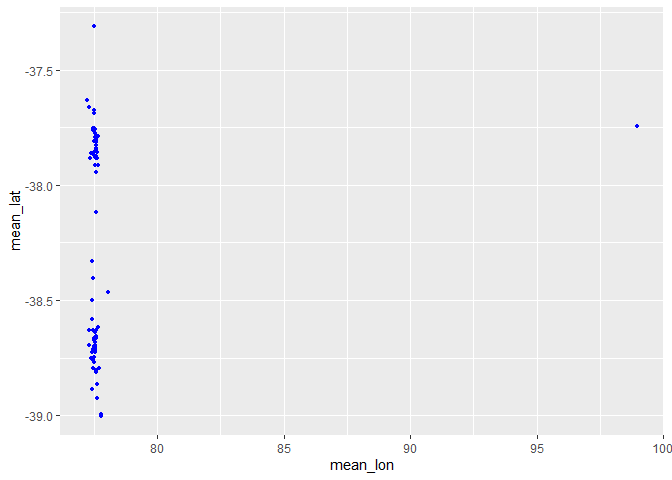

prep\_data\_md50
================

-   [Initialisation](#initialisation)
-   [Petites transformations](#petites-transformations)
-   [Manipulation des coordonnées](#manipulation-des-coordonnées)
-   [Quelques informations](#quelques-informations)
-   [Méthodes d’échantillonnage](#méthodes-déchantillonnage)
-   [lots par localisation / méthodes
    d’échantillonnages](#lots-par-localisation--méthodes-déchantillonnages)
-   [Export des données](#export-des-données)

Ce script part des données taxonomiques initiales, et a pour but de les
mettre en forme: - Supprimer les variables inutiles, gérer les erreurs
de ponctuation et réécrire le nom des espèces,  
- Calculer les coordonnées et profondeurs moyennes, supprimers les
données sans coordonndées, et en détecter les erreurs,  
- Extraire quelques informations sur le jeu de données,  
- Créer une variable présentant les méthodes d’échantillonnages,  
- Créer un nouveau jeu de données fusionnant les lots par localisation /
méthodes d’échantillonnages,  
- Exporter les données.  
<br/>

# Initialisation

On va avoir besoin de plusieurs packages:  
- *dplyr* et *tidyr* pour la manipulation de données,  
- *stringr* pour détecter des chaines de caractères,  
- *ggplot2* pour visualiser les erreurs de coordonnées GPS.

``` r
#library(sf)
#SF n'est pas sensé être utile, mon script classique fonctionne sans, mais ici j'ai un message d'erreur
#si je ne le load pas.
library(dplyr)
library(tidyr)
library(ggplot2)
library(stringr)

initialwd = ("C:/travail/analyses_spa/md50")
setwd(initialwd)

md50 <- read.csv("md50.csv", sep=";", na.strings=c("")) #charger le fichier
head(md50)
```

    ##   ï..LOT.NUM_MNHN_ACCRO LOT.NUM_MNHN_ANNEE LOT.NUM_MNHN_NUM LOT.NB_SPECIMEN
    ## 1                    IM               2020             4657               3
    ## 2                    IM               2020             4658               1
    ## 3                    IM               2020             4659               2
    ## 4                    IM               2020             4660               1
    ## 5                    IM               2000            34172               1
    ## 6                    IM               2000            34173               3
    ##   LOT.CONSERVATION LOT.NUM_ANCIEN LOT.REMARQUES LOT.NOTE_PERSO
    ## 1              SEC           <NA>          <NA>           <NA>
    ## 2              SEC           <NA>          <NA>           <NA>
    ## 3              SEC           <NA>          <NA>           <NA>
    ## 4              SEC           <NA>          <NA>           <NA>
    ## 5              SEC           <NA>          <NA>           <NA>
    ## 6              SEC           <NA>          <NA>           <NA>
    ##                                      MEDIATHEQUE.MEDIA_URL_MEDIA
    ## 1                                                           <NA>
    ## 2                                                           <NA>
    ## 3                                                           <NA>
    ## 4                                                           <NA>
    ## 5 https://mediaphoto.mnhn.fr/media/1544615030992vhRbIdLLK44EKmuT
    ## 6 https://mediaphoto.mnhn.fr/media/1544615032130cPMF5Id16FjoUlFk
    ##   TAXON.EMBRANCHEMENT TAXON.CLASSE TAXON.ORDRE TAXON.FAMILLE   TAXON.GENRE
    ## 1            Mollusca     Bivalvia      Arcida       Arcidae          Arca
    ## 2            Mollusca     Bivalvia      Arcida       Arcidae          Arca
    ## 3            Mollusca     Bivalvia      Arcida       Arcidae          Arca
    ## 4            Mollusca     Bivalvia      Arcida       Arcidae          Arca
    ## 5            Mollusca     Bivalvia      Arcida  Philobryidae Hochstetteria
    ## 6            Mollusca     Bivalvia      Arcida  Philobryidae Hochstetteria
    ##   TAXON.ESPECE                     TAXON.TAXON_LIBRE DETERMIN.DETERMINATEUR
    ## 1        sp. 2                             Arca sp.2             Lozouet P.
    ## 2        sp. 2                             Arca sp.2              Zelaya D.
    ## 3        sp. 2                             Arca sp.2             Lozouet P.
    ## 4        sp. 2                             Arca sp.2             Lozouet P.
    ## 5    modiolina Hochstetteria modiolina Vélain, 1877                   <NA>
    ## 6    modiolina Hochstetteria modiolina Vélain, 1877                   <NA>
    ##   DETERMIN.STATUT DETERMIN.ETATDOC TAXON.ID_WORMS PROVENANCE.NOM
    ## 1            <NA>                a             NA  ILE AMSTERDAM
    ## 2            <NA>                a             NA  ILE AMSTERDAM
    ## 3            <NA>                a             NA  ILE AMSTERDAM
    ## 4            <NA>                a             NA  ILE AMSTERDAM
    ## 5      Syntype(s)                a         539883 ILE SAINT PAUL
    ## 6      Syntype(s)                a         539883 ILE SAINT PAUL
    ##   CAMPAGNE.ACRONYME STATION.NUM_STATION STATION.DATE_TEXTE STATION.LAT_TEXT
    ## 1      MD50 (JASUS)                CP07         09-juil-86         37°47'S
    ## 2      MD50 (JASUS)                DC63         15-juil-86         37°53'S
    ## 3      MD50 (JASUS)               CP178         25-juil-86         37°56'S
    ## 4      MD50 (JASUS)                DC14         09-juil-86         37°45'S
    ## 5              <NA>                <NA>               <NA>             <NA>
    ## 6              <NA>                <NA>               <NA>             <NA>
    ##   STATION.LONG_TEXT STATION.DATE_DEBUT STATION.DATE_FIN STATION.LAT_1
    ## 1          77°39'E               <NA> 09/07/1986 00:00     -37,78667
    ## 2          77°37'E               <NA> 15/07/1986 00:00      -37,8835
    ## 3          77°34'E               <NA> 25/07/1986 00:00       -37,942
    ## 4          77°32'E               <NA> 09/07/1986 00:00          <NA>
    ## 5              <NA>               <NA>             <NA>          <NA>
    ## 6              <NA>               <NA>             <NA>          <NA>
    ##   STATION.LONG_1 STATION.LAT_2 STATION.LONG_2 STATION.PROFONDEUR_1
    ## 1        77,6305     -37,78817        77,6305                  940
    ## 2       77,62083     -37,88467       77,61933                  480
    ## 3        77,5705       -37,941          77,57                  880
    ## 4           <NA>     -37,75617         77,529                  840
    ## 5           <NA>          <NA>           <NA>                   NA
    ## 6           <NA>          <NA>           <NA>                   NA
    ##   STATION.PROFONDEUR_2 STATION.LOCALITE STATION.INFO_LOCALITE
    ## 1                 1680             <NA>                  <NA>
    ## 2                  575             <NA>                  <NA>
    ## 3                 1275             <NA>                  <NA>
    ## 4                 1080             <NA>                  <NA>
    ## 5                   NA             <NA>                  <NA>
    ## 6                   NA             <NA>                  <NA>
    ##   PROVENANCE.PROVENANCE_PK LOT.REMARQUES_GEO
    ## 1                      399              <NA>
    ## 2                      399              <NA>
    ## 3                      399              <NA>
    ## 4                      399              <NA>
    ## 5                      400              <NA>
    ## 6                      400              <NA>

<br/> <br/>

# Petites transformations

Supprimer les variables inutiles:

``` r
md50 <- md50 %>% 
  select(-c(ï..LOT.NUM_MNHN_ACCRO, LOT.NUM_MNHN_ANNEE, LOT.NUM_MNHN_NUM, LOT.REMARQUES, LOT.CONSERVATION, 
            LOT.NUM_ANCIEN, LOT.NOTE_PERSO, MEDIATHEQUE.MEDIA_URL_MEDIA, DETERMIN.DETERMINATEUR, DETERMIN.STATUT, 
            DETERMIN.ETATDOC, TAXON.ID_WORMS, PROVENANCE.PROVENANCE_PK, LOT.REMARQUES_GEO))
```

<br/>

supprimer les erreurs de ponctuation, et changer le statut des variables
numériques en numérique:

``` r
md50 = md50 %>%
  #supprimer erreurs ponctuation:
  mutate_all(.funs=function(.x) str_replace_all(.x, pattern=",", replacement="."))%>% 
  mutate_all(.funs=function(.x) str_replace_all(.x, pattern="°", replacement="°"))%>%
  #mettre vars numériques en numériques:
  mutate(across(contains(c("ANNEE","NB_SPECIMEN","LAT_1","LONG_1","LAT_2","LONG_2","PROF")),
                .fns=function(.x) as.numeric(as.character(.x))))
```

<br/>

La colonne du nom binomial présente est un peu trop lourde actuellement,
ex: *Hochstetteria modiolina Vélain, 1877*. On la remplace par le nom
de genre et le nom d’espèce, avec un underscore entre les 2:

``` r
md50$TAXON.TAXON_LIBRE = paste(md50$TAXON.GENRE, md50$TAXON.ESPECE, sep = "_")
```

<br/> <br/>

# Manipulation des coordonnées

Concernant les coordonnées et les profondeurs, on a 2 colonnes, une
concernant le début, et une concernant la fin de l’opération (parfois,
selon la méthode d’échantillonnage, une seule profondeur est spécifiée).
On crée des colonnes de moyennes:

``` r
md50 = md50 %>%
  rowwise() %>%
  mutate(mean_lat = mean(c(STATION.LAT_1, STATION.LAT_2), na.rm = T),
         mean_lon = mean(c(STATION.LONG_1, STATION.LONG_2), na.rm = T),
         mean_prof = mean(c(STATION.PROFONDEUR_1, STATION.PROFONDEUR_2), na.rm = T))
```

<br/>

Supprimer les données n’ayant pas de coordonnées GPS:

``` r
md_gps = md50 %>%
  filter(!is.na(mean_lat)) %>%
  select(-c(STATION.LOCALITE, STATION.INFO_LOCALITE))
```

<br/>

Repérer et s’occuper des coordonnées GPS erronées:

``` r
ggplot() +
  geom_point(
    data = md_gps,
    aes(x = mean_lon,
        y = mean_lat),
    colour = "blue",
    inherit.aes = F,
    size = 1)
```

<!-- --> <br/>

On voit qu’il y a au moins 1 point en outlier (il est bien plus loin que
la RNN de SPA). En vértité cela concerne plusieurs points, ayant une
longitude similaire. Ce n’est que la colonne *long1* qui présente des
données peu vraisselblables, on garde donc seulement la colonne *long2*:

``` r
md_gps$mean_lon[which(md_gps$mean_lon>80)] = md_gps$STATION.LONG_2[which(md_gps$mean_lon>80)]
```

<br/> <br/>

# Quelques informations

``` r
nrow(md_gps) #nombre de lots
```

    ## [1] 1879

``` r
length(unique(md_gps$STATION.DATE_TEXTE)) #nb de dates différentes
```

    ## [1] 70

``` r
length(unique(md_gps$STATION.NUM_STATION)) #nb de stations aux noms différents (sptaio-temporels + strat d'échant)
```

    ## [1] 222

``` r
length(unique(paste(md_gps$mean_lon, md_gps$mean_lat, 
                    md_gps$STATION.DATE_DEBUT, md_gps$STATION.DATE_FIN))) #nb de stations spatio-temporelles
```

    ## [1] 140

``` r
length(unique(paste(md_gps$mean_lon, md_gps$mean_lat))) #nb de stations spatiales
```

    ## [1] 102

``` r
unique(md_gps$CAMPAGNE.ACRONYME) #le nom des campagnes
```

    ## [1] "MD50 (JASUS)"              "St-Paul_Amsterdam_Beurois"
    ## [3] "(Hors campagne INVMAR)"

<br/> <br/>

# Méthodes d’échantillonnage

On extrait les variables d’échantillonnage en 2 fois:  
Tout d’abord on extrait de la variable *STATION.NUM\_STATION* les codes
donnant les différentes méthodes d’échantillonnages, en utilisant la
fonction *str\_detect*. On extrait alors toutes les données de la
campagne *Jean Beurois* comme étant des données de méthode “Jean
Beurois”:  
Seules certaines de ces données de Jean Beurois ont une méthode
d’échantillonnage identifiable. On copie donc ensuite la variable
nouvellement créée, en y ajoutant les méthodes d’échant identifiable
chez Jean-Beurois.

``` r
#Colonne de type d'échantillonnage:
md_gps$echant = 0
md_gps$echant[which(str_detect(md_gps$STATION.NUM_STATION, 'CP') == T)] = 'CP' #chalut à perche
md_gps$echant[which(str_detect(md_gps$STATION.NUM_STATION, 'DC') == T)] = 'DC' #drague charcot
md_gps$echant[which(str_detect(md_gps$STATION.NUM_STATION, 'SP') == T)] = 'J-B' #Jean Beurois
md_gps$echant[which(str_detect(md_gps$STATION.NUM_STATION, 'AMS') == T)] = 'J-B' #Jean Beurois
md_gps$echant[which(str_detect(md_gps$STATION.NUM_STATION, 'GRAT') == T)] = 'GRAT' #grattages de substrat
md_gps$echant[which(str_detect(md_gps$STATION.NUM_STATION, 'RAM') == T)] = 'RAM' #ramassage littoral
md_gps$echant[which(str_detect(md_gps$STATION.NUM_STATION, 'DORIS') == T)] = 'DORIS'#casiers à langoustes
md_gps$echant[which(str_detect(md_gps$STATION.NUM_STATION, 'hors') == T)] = 'H-C' #Hors campagne, = captures accessoires
md_gps$echant[which(str_detect(md_gps$STATION.NUM_STATION, 'NO DATA') == T)] = 'R-ND' #R = radiale
md_gps$echant[which(str_detect(md_gps$STATION.NUM_STATION, 'DR') == T)] = 'DR' #drague à roche

#vérifions que toutes les méthodes d'échantillonnages ont été trouvées:
md_gps$STATION.NUM_STATION[which(md_gps$echant == 0)] #c'est bon on a tous les types
```

    ## character(0)

<br/>

``` r
#séparer les données JB en différentes stratégies d'échantillonnage:
md_gps$echant_JB = md_gps$echant
md_gps$echant_JB[which(str_detect(md_gps$STATION.NUM_STATION, 'AMS-B') == T)] = 'Benne_JB'
md_gps$echant_JB[which(str_detect(md_gps$STATION.NUM_STATION, 'SP-B') == T)] = 'Benne_JB'
md_gps$echant_JB[which(str_detect(md_gps$STATION.NUM_STATION, 'AMS-D') == T)] = 'Drague_JB'
md_gps$echant_JB[which(str_detect(md_gps$STATION.NUM_STATION, 'SP-D') == T)] = 'Drague_JB'

table(md_gps$echant_JB)
```

    ## 
    ##  Benne_JB        CP        DC     DORIS        DR Drague_JB      GRAT       H-C 
    ##        58       306       514         2         1       159       295         1 
    ##       J-B      R-ND       RAM 
    ##       537         4         2

<br/>

# lots par localisation / méthodes d’échantillonnages

On crée des nouveax noms de sites, qui rassemblent les lots par
localisation et méthode d’échantillonnage (des lots de meme lieux et
méthodes mais de dates différentes se retrouvent donc ensembles). Pour
ce faire, on crée une colonne qui fusionne la latitude, la longitude et
la méthode d’échant. Tous les lots ayant cette varaible similaire
reçoivent alors un nom de site commmun, qui sera:  
le nom de la première station des lots + le nom de la strat d’échant.

``` r
#fuision latitude, longitude et méthode d'échantillonnage:
md_gps$loc = paste(md_gps$mean_lat, md_gps$mean_lon, md_gps$echant_JB)

#nouvelle variable, décrivant les nouveau noms de sites:
md_gps$site_loc = rep(NA, nrow(md_gps))
for (i in unique(md_gps$loc)) {
  md_gps$site_loc[which(md_gps$loc == i)] = paste(md_gps$STATION.NUM_STATION[which(md_gps$loc == i)][1],
                                                  md_gps$echant_JB[which(md_gps$loc == i)][1], sep="_")
}
```

<br/>

On vérifie qu’il y a bien autant de stations que de groupes de longitude
/ latitude / strat d’échant similaires:

``` r
length(unique(md_gps$loc))
```

    ## [1] 109

``` r
length(unique(md_gps$site_loc)) 
```

    ## [1] 108

``` r
#bon c'est chelou on a une diversité de 1 moins élevée pour le nom des sites par loc que
#pour loc, il doit y avoir un endroit où le nom des sites est le même mais la localité ou la strat différente...
#trouvé: c'est AMS-D8_Drague_JB qui a 2 locs un tout petit peu différentes. On les fusionne:
```

<br/> Il y a une station de moins. L’erreur provient de la station
nouvellement appelée *AMS-D8\_Drague\_JB* : Tous les lots de cette
station portent pour ancien nom *AMS-D8*, mais certains lots sont un
tout petit peu décalés en position GPS, ils sont donc considérés
différents par notre variable “long-lat-strat d’echant”. Pour régler le
problème, on moyenne les positions GPS de tous ces lots:

``` r
#pour la longitude:
md_gps$mean_lon[which(md_gps$site_loc == "AMS-D8_Drague_JB")] = mean(
  md_gps$mean_lon[which(md_gps$site_loc == "AMS-D8_Drague_JB")])
#pour la latitude:
md_gps$mean_lat[which(md_gps$site_loc == "AMS-D8_Drague_JB")] = mean(
  md_gps$mean_lat[which(md_gps$site_loc == "AMS-D8_Drague_JB")])
```

<br/>

Enfin, on crée un nouveau jeu de données qui fusionne les lots qui
appartiennet aux mêmes nouveaux sites, et présentent la même espèce:

``` r
md_site_gps = md_gps %>%
  group_by(site_loc, TAXON.CLASSE, TAXON.ORDRE, TAXON.FAMILLE, TAXON.GENRE, TAXON.ESPECE) %>%
  dplyr::summarize(
    embr = unique(TAXON.EMBRANCHEMENT),
    TAXON.TAXON_LIBRE = unique(TAXON.TAXON_LIBRE),
    nb =mean(LOT.NB_SPECIMEN),
    campagne = unique(CAMPAGNE.ACRONYME),
    site_loc = unique(site_loc),
    date = unique(STATION.DATE_FIN)[1],
    long = unique(mean_lon),
    lat = unique(mean_lat),
    prof = mean(mean_prof, na.rm = T), #certains sites de meme coordonnée ont des profs diff, donc mean.
    echant = unique(echant),
    echant_JB = unique(echant_JB)
    )
```

<br/> <br/>

# Export des données

Pas grand chose à dire.

``` r
saveRDS(md_gps, file='./modified_data/md_gps.rds')
saveRDS(md_site_gps, file='./modified_data/md_site_gps.rds')
```
