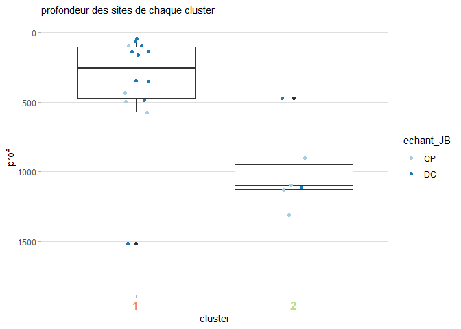

reseaux\_md50
================

-   [Initialisation](#initialisation)
-   [Préparation générale des
    données](#préparation-générale-des-données)
-   [Analyses tous taxons confondus](#analyses-tous-taxons-confondus)
    -   [Preparation des données / algorithme
        Infomap](#preparation-des-données--algorithme-infomap)
    -   [Visualisation sommaire](#visualisation-sommaire)
    -   [export pour représentation du réseau / pour
        cartographie](#export-pour-représentation-du-réseau--pour-cartographie)
    -   [représentations graphiques](#représentations-graphiques)
-   [Analyses tous taxons confondus,
    sous-clusters](#analyses-tous-taxons-confondus-sous-clusters)
    -   [Participation des sites et des espèces aux clusters / export
        des
        données:](#participation-des-sites-et-des-espèces-aux-clusters--export-des-données)
-   [réseaux par groupes taxonomiques :
    Arthropodes](#réseaux-par-groupes-taxonomiques--arthropodes)
    -   [Preparation des données / algorithme
        Infomap](#preparation-des-données--algorithme-infomap-1)
    -   [export pour représentation du réseau / pour
        cartographie](#export-pour-représentation-du-réseau--pour-cartographie-1)
    -   [représentations graphiques](#représentations-graphiques-1)
-   [réseaux par groupes taxonomiques :
    Mollusques](#réseaux-par-groupes-taxonomiques--mollusques)
    -   [Preparation des données / algorithme
        Infomap](#preparation-des-données--algorithme-infomap-2)
    -   [export pour représentation du réseau / pour
        cartographie](#export-pour-représentation-du-réseau--pour-cartographie-2)
    -   [représentations graphiques](#représentations-graphiques-2)
-   [réseaux par groupes taxonomiques :
    cnidaires](#réseaux-par-groupes-taxonomiques--cnidaires)
    -   [Preparation des données / algorithme
        Infomap](#preparation-des-données--algorithme-infomap-3)
    -   [export pour représentation du réseau / pour
        cartographie](#export-pour-représentation-du-réseau--pour-cartographie-3)
    -   [représentations graphiques](#représentations-graphiques-3)
-   [réseaux par groupes taxonomiques :
    Echinodermes](#réseaux-par-groupes-taxonomiques--echinodermes)
    -   [Preparation des données / algorithme
        Infomap](#preparation-des-données--algorithme-infomap-4)
    -   [export pour représentation du réseau / pour
        cartographie](#export-pour-représentation-du-réseau--pour-cartographie-4)
    -   [représentations graphiques](#représentations-graphiques-4)

Ce script part des données d’échantillonnages (*md\_site\_gps*) pour
déterminer des clusters, en utilisant les analyses de réseau, en prenant
en compte tous les taxons, puis pour chaque grand taxon.

Les analyses résalisées se déroulent selon ces étapes:  
- Transformer les données en format pajek.  
- Faire tourner l’algorithme infomap (chargé de détecter les
clusters).  
- Lire les résultats et attribuer des couleurs aux clusters.  
- Représenter graphiquement les corrélations entre clusters et
profondeurs des sites de ces cluster.  
- Extraire les participations des sites et des espèces aux clusters
(IndVal).  
- Représenter graphiquement le réseau sur gephi.  
<br/>

# Initialisation

On va avoir besoin de plusieurs packages:  
- *tidyverse* pour la manipulation de données (tidyr, dplyr, …),  
- *ggplot2* et *RColorBrewer* pour la représentation graphique,  
-*biogeonetworks* pour réaliser des analyses de réseau, qui n’est pas
dans le cran pour le moment, et doit donc être installé depuis github.
Le tuto pour biogeonetworks [est
ici.](https://github.com/Farewe/biogeonetworks#requirements), il
explique très pédagogiquement comment réaliser des analyses de réseau.

Il est aussi nécessaire d’avoir dans son directory le code source de
l’algorithme infomap de Map Equation, depuis le site de Map Equation ou
téléchargeable depuis ce
[lien](https://borisleroy.com/permanent/Infomap.exe) (c’est expliqué
plus clairement dans le tuto). C’est cet algorithme à qui on va donner
nos données au format pajek, et qui va réaliser l’analyse de
clusterisation.

``` r
library(sf)
#SF n'est pas sensé être utile, mon script classique fonctionne sans, mais ici j'ai un message d'erreur
#si je ne le load pas.
library(tidyverse)
library(ggplot2)
library(RColorBrewer)

#installer et charger biogeonetworks:
devtools::install_github("Farewe/biogeonetworks")
library(biogeonetworks)

initialwd = ("C:/travail/analyses_spa/md50")
setwd(initialwd)

md_site_gps = readRDS("C:/travail/analyses_spa/md50/modified_data/md_site_gps.rds")
head(md_site_gps)
```

    ## # A tibble: 6 x 16
    ## # Groups:   site_loc, TAXON.CLASSE, TAXON.ORDRE, TAXON.FAMILLE, TAXON.GENRE [6]
    ##   site_loc TAXON.CLASSE TAXON.ORDRE TAXON.FAMILLE TAXON.GENRE TAXON.ESPECE embr 
    ##   <chr>    <chr>        <chr>       <chr>         <chr>       <chr>        <chr>
    ## 1 AMS-119~ Anthozoa     Scleractin~ Caryophyllii~ Desmophyll~ cristagalli  Cnid~
    ## 2 AMS-119~ Bivalvia     Pectinida   Pectinidae    Chlamys (s~ sp. 1        Moll~
    ## 3 AMS-119~ Demospongiae <NA>        <NA>          Gen.        sp.          Pori~
    ## 4 AMS-119~ Malacostraca Amphipoda   Caprellidae   Pseudaegin~ sanctipauli  Arth~
    ## 5 AMS-119~ Malacostraca Isopoda     Janiridae     Ianiropsis  palpalis     Arth~
    ## 6 AMS-119~ Malacostraca Isopoda     Joeropsididae Joeropsis   beuroisi     Arth~
    ## # ... with 9 more variables: TAXON.TAXON_LIBRE <chr>, nb <dbl>, campagne <chr>,
    ## #   date <chr>, long <dbl>, lat <dbl>, prof <dbl>, echant <chr>,
    ## #   echant_JB <chr>

<br/> <br/>

# Préparation générale des données

Avant de commencer, une rapide préparation des données:  
- Ne sélectionner que les données qui ont été identifiée au niveau de
l’espèce (ou du morphotype, qui auront alors comme nom *sp3* par
exemple),  
- Vérifier que les colonnes *sites* et *sps* sont des facteurs, sans
quoi certaines fonctions ne pourront pas être utilisées, -créer un jeu
de données qui donne les caractéristiques environnementales de chaque
site. Ce tableau sera utilisé pour visualiser les corrélations entre ces
vars. environnementales et les clusters dans lesquels les sites seront
classés.

``` r
#on prend que le nombre de chaque TAXON.ESPECE pour chaque zone:
md_sp = md_site_gps[-which(md_site_gps$TAXON.ESPECE == "spp." | md_site_gps$TAXON.ESPECE == "sp." | 
                        is.na(md_site_gps$TAXON.ESPECE)),]

#verif que les sites et sps sont des facteurs:
md_sp = as.data.frame(md_sp)
md_sp$site_loc = as.factor(md_sp$site_loc)
md_sp$TAXON.ESPECE = as.factor(md_sp$TAXON.ESPECE)

#on cree ensuite un jeu de données agrégé par site, qui servira pour les corrélations:
md_sites = md_sp %>%
  group_by(site_loc) %>%
  dplyr::summarize(
    long = unique(long),
    lat = unique(lat),
    prof = mean(prof, na.rm=T), #certains sites de meme coordonnée ont des profs diff, donc mean.
    echant = unique(echant),
    echant_JB = unique(echant_JB))
```

<br/> <br/> <br/>

# Analyses tous taxons confondus

## Preparation des données / algorithme Infomap

Il s’agit de transformer le jeu de données en format pajek, pour le
faire lire par l’algorithme infomap (fonction biogeonetworks). Dans
notre jeu de données, la colonne des abondances des espèces trouvéesq
dans chaque site n’est pas pondérée par l’effort de capture, donc très
biaisée. On ne peut donc pas l’utiliser.

``` r
writePajek(md_sp, 
           site.field = "site_loc", # Nom de la colonne des sites
           species.field = "TAXON.TAXON_LIBRE", # Name of your species column
           filename = "md_sp.net", # Name of the output file
           abundance.field = NULL) #colonne des abondance (facultative)
```

un fichier catch.net a été créé dans mon dossier. <br/>

On execute ensuite l’algorithme infomap a partir du fichier pajek créé.
L’algorithme demande plusieurs arguments, dont seul le nombre de run est
important ici:  
- undirected : les liens du reseau n’ont pas de direction (certain
réseau ont des liens allant seulement dans une direction, ce n’est pas
le cas dans notre type d’analyses).  
- tree : output file format .tree.  
- map : output file format .map.  
- N xxx : nombre de runs de l’algorithme. Cet algorithme doit partir de
positions aléatoires plusieurs fois pour trouver un solution de
clustering optimale. On a fixé ce nombre à 1000, pour notre cas choisir
plus de run ne change pas la solution optimale. Mais il est possible que
ce ne soit pas le cas sur d’autres jeux de données.  
- catch.net : le fichier pajek a traiter.

``` r
system("infomap --undirected --tree --map -N 1000 md_sp.net ./")
```

    ## [1] 0

L’algorithme exécuté sort plein d’informations. Seul le dernier tableau
donne des informations utiles:  
Best end modular solution in 3 levels: Il a créé un réseau à 3 niveaux
hiérarchiques (visualiser comme une CAH). number of modules: nombre de
clusters trouvés pour chaque niveau. <br/>

Ici on voit que 14 clusters ont été trouvés au niveau 1. C’est un nombre
élevé de clusters, qui s’explique par le fait que certains sites ne sont
liés à aucun autres, ne présentant que peu d’espèces, et qu’on ne
retrouve dans aucun autres sites. Ils forment alors un mini-cluster,
qu’on ne prendra pas en compte au moment d’attribuer une couleur aux
clusters conséquents.  
<br/> <br/>

## Visualisation sommaire

La sortie de cet algorithme est un tableau qui peut être lu avec la
fonction readInfomapTree. Ce tableau comporte plusieurs colonnes:  
- Chaque ligne est un noeud, donc une espèce ou un site.  
- Groups = Cluster auquel le noeud appartient, au premier et au 2eme
niveau (car on en a que 2 ici).  
- Codelength (pas important) = information quantitative utilisée par
l’algorithme (on s’en fiche).  
- Name = nom du cluster.  
- Lvl1, lvl2, … donne l’identifiant pour chaque niveau hiérarchique
(c’est la meme chose que *Groups*, mais séparé par colonnes).

``` r
md_sp.clusters <- readInfomapTree("md_sp.tree",
                                     network.summary = TRUE, # Prints a summary of the clustering results
                                     replace.leaf.names = TRUE) # Changes node numbers to actual names for terminal nodes
head(md_sp.clusters)
```

    ##   Groups Codelength                     Name  id lvl1 lvl2
    ## 1  1:1:1 0.02263370 Desmophyllum_cristagalli  53    1  1.1
    ## 2  1:1:2 0.02126200    Caryophyllia_profunda  29    1  1.1
    ## 3  1:1:3 0.01028810 Stenocyathus_vermiformis 160    1  1.1
    ## 4  1:1:4 0.01028810                 DC146_DC 231    1  1.1
    ## 5  1:1:5 0.00823045                  DC71_DC 244    1  1.1
    ## 6  1:1:6 0.00823045                  DC99_DC 249    1  1.1
    ##                       lvl3
    ## 1 Desmophyllum_cristagalli
    ## 2    Caryophyllia_profunda
    ## 3 Stenocyathus_vermiformis
    ## 4                 DC146_DC
    ## 5                  DC71_DC
    ## 6                  DC99_DC

``` r
#Nombre de noeuds pour chaque cluster.
plyr::count(md_sp.clusters$lvl1)
```

    ##     x freq
    ## 1   1  131
    ## 2   2   65
    ## 3   3   31
    ## 4   4   11
    ## 5   5    8
    ## 6   6    7
    ## 7   7    5
    ## 8   8    4
    ## 9  10    2
    ## 10 11    2
    ## 11 12    2
    ## 12 13    2
    ## 13 14    2
    ## 14  9    2

<br/> Par le dernier tableau qu’on voit, on peut lire le nombre de
noeuds que représente chaque cluster.  
Il y a une fonction pour récupérer uniquement les lignes des sites, ou
des espèces, du tableau ci-dessus:

``` r
md.sites <- getSiteTable(md_sp, # Your bipartite data.frame of STEP 1
                            site.field = "site_loc", # Name of your site column
                            network = md_sp.clusters) # Output table from Map Equation
plyr::count(md.sites$lvl1)
```

    ##     x freq
    ## 1   1   51
    ## 2   2   19
    ## 3   3   10
    ## 4   4    5
    ## 5   5    4
    ## 6   6    1
    ## 7   7    1
    ## 8   8    1
    ## 9  10    1
    ## 10 11    1
    ## 11 12    1
    ## 12 13    1
    ## 13 14    1
    ## 14  9    1

``` r
md.species <- getSpeciesTable(md_sp, # Your bipartite data.frame of STEP 1
                            species.field = "TAXON.TAXON_LIBRE", # Name of your site column
                            network = md_sp.clusters) # Output table from Map Equation
plyr::count(md.species$lvl1)
```

    ##     x freq
    ## 1   1   80
    ## 2   2   46
    ## 3   3   21
    ## 4   4    6
    ## 5   5    4
    ## 6   6    6
    ## 7   7    4
    ## 8   8    3
    ## 9  10    1
    ## 10 11    1
    ## 11 12    1
    ## 12 13    1
    ## 13 14    1
    ## 14  9    1

<br/> On voit bien ici que seuls les 3 premiers clusters sont vraiment
gros, on peut aussi prendre en compte les 2 suivants qui peuvent
potentiellement être intéressants.

<br/> <br/>

## export pour représentation du réseau / pour cartographie

Afin de pouvoir représenter graphiquement les cluster créés, on attribue
des couleurs aux différents noeuds, en fonction du cluster auquel ils
appartiennent, avec la fonction attributeColors:  
- On pourrait choisir d’attribuer des couleurs a partir des cluster
créés a un niveau hiérarchique plus élevé, si on en avait (chez nous les
2eme niveau crée un cluster par noeud).  
- Si quelques clusters ne concernent qu’un site et très peu d’espèces,
qu’on les considère comme peu intéressants à représenter, on peut les
mettre tous d’une même couleur. C’est l’utilité des argument
*nb.max.colors*, *other.color*, et *cluster.order* (renseigne si
l’importance des cluster est donnée par le nombre de sites, d’espèces,
ou autres).

``` r
md_sp.clusters <- attributeColors(network = md_sp.clusters, # Same object as input & output
                                     lvl = "lvl1", # Which hierarchical level are we working on?
                                     nb.max.colors = 5, # We chose 5 clusters as significant for level 1
                                     colname = "colors.lvl1", # Name to give to the colour column
                                     other.color = grey(0.5), # Minor clusters will be black
                                     cluster.order = "sites", # Cluster order for colours
                                     db = md_sp, # Database of step 1
                                     site.field = "site_loc", # Name of site column in your database
                                     species.field = "TAXON.TAXON_LIBRE") # Name of species column in your database

#Ici 2 couleurs bleues on été choisiée, c'est pas ouf, on va mettre du orange a la place d'un bleu:
#couleurs choisies:
unique(md_sp.clusters$colors.lvl1)
```

    ## [1] "#A6CEE3" "#1F78B4" "#B2DF8A" "#33A02C" "#FB9A99" "#808080"

``` r
#bleu clair devient rouge brique:
md_sp.clusters$colors.lvl1[which(md_sp.clusters$colors.lvl1 == "#A6CEE3")] = 
  rep("#fb8072", length(md_sp.clusters$colors.lvl1[which(md_sp.clusters$colors.lvl1 == "#A6CEE3")]))
#vert en vert d'eau:
md_sp.clusters$colors.lvl1[which(md_sp.clusters$colors.lvl1 == "#B2DF8A")] = 
  rep("#8dd3c7", length(md_sp.clusters$colors.lvl1[which(md_sp.clusters$colors.lvl1 == "#B2DF8A")]))


head(md_sp.clusters)
```

    ##   Groups Codelength                     Name  id lvl1 lvl2
    ## 1  1:1:1 0.02263370 Desmophyllum_cristagalli  53    1  1.1
    ## 2  1:1:2 0.02126200    Caryophyllia_profunda  29    1  1.1
    ## 3  1:1:3 0.01028810 Stenocyathus_vermiformis 160    1  1.1
    ## 4  1:1:4 0.01028810                 DC146_DC 231    1  1.1
    ## 5  1:1:5 0.00823045                  DC71_DC 244    1  1.1
    ## 6  1:1:6 0.00823045                  DC99_DC 249    1  1.1
    ##                       lvl3 colors.lvl1
    ## 1 Desmophyllum_cristagalli     #fb8072
    ## 2    Caryophyllia_profunda     #fb8072
    ## 3 Stenocyathus_vermiformis     #fb8072
    ## 4                 DC146_DC     #fb8072
    ## 5                  DC71_DC     #fb8072
    ## 6                  DC99_DC     #fb8072

<br/>

Enfin, on exporte notre tableau pour le faire lire par Gephi, logiciel
qui pourra représenter graphiquement le réseau créé. Gephi peut lire
directement le format pajek, mais en exportant le tableau qu’on vient de
créer, gephi pourra aussi représenter les couleurs choisies:

``` r
writeGDF(db = md_sp, # Database of step 1
         site.field = "site_loc", # Name of site column in your database
         species.field = "TAXON.TAXON_LIBRE", # Name of species column in your database
         network = md_sp.clusters, 
         filename = "md_sp.gdf",
         color.field = "colors.lvl1") # Name of the color field in the network
```

<br/>

Pour représenter les monts sous-marins par clusters, colorés sur une
carte, on peut aussi créer un tableau dédié (les représentations
graphiques sont faites dans un script dédié, rpz\_graphique):

``` r
#on recupere les clusters et couleurs associees aux differents sites:
md_sp$clus = md_sp.clusters$lvl1[
  match(md_sp$site_loc, md_sp.clusters$Name)]

md_sp$color = md_sp.clusters$colors.lvl1[
  match(md_sp$site_loc, md_sp.clusters$Name)]

#et on exporte pour la rpz graphique:
saveRDS(md_sp, file='C:/travail/analyses_spa/md50/modified_data/md_cluster_sp.rds')
```

<br/> <br/>

## représentations graphiques

On représente d’abord ici la stratégie d’échantillonnage des différentes
observations de chaque cluster.  
Pour ce faire on prend notre jeu de données initial auquel on a associé
tous les clusters, on en supprime les clusters gris qui ne nous
intéressent pas. Puis on ne sélectionne que les stratégies
d’échantillonnage de chaque cluster, et on compte dans chacun de ces
cluster combien de fois est mentionnée cette stratégie:

``` r
sp_type <- md_sp[which(md_sp$color != "#808080"),] %>% #on ne prend pas les clusters gris
  group_by(clus, echant_JB) %>% #on sélectionne le cluster et la strat d'échant.
  dplyr::summarize(nb =length(echant_JB)) #on compte combien de fois chacune apparait


ggplot(sp_type, aes(x=clus, y=nb, fill=echant_JB) ) +
  geom_bar(stat="identity", position = 'dodge') +
  theme_light() +
  theme(
    panel.grid.major.y = element_blank(),
    panel.grid.minor.x = element_blank(),
    panel.border = element_blank(),
    axis.text.x = element_text(face = 'bold', size=12, color=c("#fb8072", "#1F78B4", "#8dd3c7", "#33A02C", "#FB9A99"))) +
  scale_fill_brewer(palette = "Paired") +
  labs(fill = "") +
  xlab("clusters") +
  ylab("nombre d'observations")
```

    ## Warning: Vectorized input to `element_text()` is not officially supported.
    ## Results may be unexpected or may change in future versions of ggplot2.

<!-- --> <br/> <br/>

On représente ensuite le nombre d’espèces et de sites présents dans
chaque cluster. Pour ce faire, il faut un tableau lisible par ggplot,
avec  
- Une colonne précisant le numéro du cluster,  
- Une colonne précisant si on parle de sites ou d’espèces,  
- Une colonne donnant le nombre de sites, ou d’espèces.

``` r
tailleclus = data.frame(
  clus = unique(sp_type$clus), #les différents clusters
  type = c(rep("sites", length(unique(sp_type$clus))) ,
           rep("species", length(unique(sp_type$clus)))),
  values = c(plyr::count(md.sites$lvl1)[which(plyr::count(md.sites$lvl1)$x %in% unique(sp_type$clus)),2],
             plyr::count(md.species$lvl1)[which(plyr::count(md.species$lvl1)$x %in% unique(sp_type$clus)),2]))
#values : on prend le compte de sites et d'espèces, pour les clusters qu'on a gardés.

ggplot(tailleclus, aes(x=clus, y=values, fill=type) ) +
  geom_bar(stat="identity", position = 'dodge') +
  theme_light() +
  theme(
    panel.grid.major.y = element_blank(),
    panel.grid.minor.x = element_blank(),
    panel.border = element_blank(),
    axis.text.x = element_text(face = 'bold', size=12, color=c("#fb8072", "#1F78B4", "#8dd3c7", "#33A02C", "#FB9A99"))) +
  scale_fill_brewer(palette = "Accent") +
  labs(fill = "") +
  xlab("clusters") +
  ylab("nombre de sites / d'espèces")
```

    ## Warning: Vectorized input to `element_text()` is not officially supported.
    ## Results may be unexpected or may change in future versions of ggplot2.

<!-- --> <br/> <br/>

Enfin, on représente la profondeur des sites de chaque cluster, par un
boxplot au sein duquel on affiche par un point la profondeur moyenne de
chaque site (ce point se place aléatoirement en position horizontale, au
sein de sa boite). Pour ce faire on utilise le jeu de données
*md\_sites*, créé en début de script, qui donne les variables
environnementales, on y ajoute les clusters correspondants aux sites,
ainsi que les couleurs, afin de supprimer les sites correspondant à des
clusters de couleur grise.

``` r
#impact profondeur:
stat_md_sp = md_sites #on prend tous les sites de notre analyse
stat_md_sp$clus = md_sp.clusters$lvl1[match(stat_md_sp$site_loc, md_sp.clusters$Name)] #on prend les clusters
stat_md_sp$col = md_sp.clusters$colors.lvl1[match(stat_md_sp$site_loc, md_sp.clusters$Name)]
stat_md_sp = stat_md_sp[-which(stat_md_sp$col == "#808080"),] #on supprime les clusters pas intéressants

ggplot() +
  geom_boxplot(data = stat_md_sp, aes(x=clus, y=prof)) +
  geom_jitter(data = stat_md_sp, 
              aes(x=clus, y=prof, color=echant_JB), 
              size=1.4, width = 0.08) +
  scale_color_brewer(palette = "Paired") +
  scale_y_reverse(limits=c(1950,0)) + #echelle des profondeurs vers le bas
  theme_light() +
  xlab("cluster") +
  theme(
    #legend.position="none",
    panel.grid.minor.y = element_blank(),
    panel.grid.major.x = element_blank(),
    panel.grid.minor.x = element_blank(),
    panel.border = element_blank(),
    plot.title = element_text(size=11),
    axis.text.x = element_text(face = 'bold', size=12, color=c("#fb8072", "#1F78B4", "#8dd3c7", "#33A02C", "#FB9A99"))
  ) +
  ggtitle("profondeur des sites de chaque cluster")
```

    ## Warning: Vectorized input to `element_text()` is not officially supported.
    ## Results may be unexpected or may change in future versions of ggplot2.

    ## Warning: Removed 2 rows containing non-finite values (stat_boxplot).

    ## Warning: Removed 2 rows containing missing values (geom_point).

<!-- --> <br/> Les 2
valeurs qui n’ont pas pu être affichées correspondent a des *NA* dans
notre jeu de données. La corrélation avec la profondeur est assez
claire. Seul le cluster 1 regroupe les site au large. On peut en
extraire les sous-clusters.

<br/> <br/> <br/> <br/>

# Analyses tous taxons confondus, sous-clusters

<br/>

D’abord, on regarde combien de sous-cluster du cluster 1 sélectionner:

``` r
plyr::count(md.sites$lvl2) [1:10,]
```

    ##              x freq
    ## 1          1.1   18
    ## 2          1.2   14
    ## 3          1.3    7
    ## 4          1.4    3
    ## 5          1.5    4
    ## 6          1.6    2
    ## 7          1.7    1
    ## 8          1.8    1
    ## 9          1.9    1
    ## 10 AMS-119_J-B    1

``` r
plyr::count(md.species$lvl2) [1:10,]
```

    ##                        x freq
    ## 1                    1.1   21
    ## 2                    1.2   22
    ## 3                    1.3   10
    ## 4                    1.4    9
    ## 5                    1.5    6
    ## 6                    1.6    4
    ## 7                    1.7    3
    ## 8                    1.8    3
    ## 9                    1.9    2
    ## 10 Achelia_quadridentata    1

<br/>

On peut sélectionner 3 sous-clusters de taille conséquente. On va
ensuite manuellement associer des couleurs à ces clusters. Pour ça, on
copie les couleurs de clusters déterminées précédemment, on met en gris
les petits clusters 4 et 5 afin de ne pas analyser trop de clusters à la
fois, on met aussi en gris tous les clusters du lvl 1 et enfin on colore
les clusters qu’on veut étudier:

``` r
md_sp.clusters$colors.lvl2 = md_sp.clusters$colors.lvl1
md_sp.clusters$clu2 = as.character(md_sp.clusters$lvl1)

md_sp.clusters$colors.lvl2[which(md_sp.clusters$lvl1 == 4)] = "#808080"
md_sp.clusters$colors.lvl2[which(md_sp.clusters$lvl1 == 5)] = "#808080"
md_sp.clusters$colors.lvl2[which(md_sp.clusters$lvl1 == 1)] = "#808080"

md_sp.clusters$colors.lvl2[which(md_sp.clusters$lvl2 == 1.1)] = "#ffa500"
md_sp.clusters$colors.lvl2[which(md_sp.clusters$lvl2 == 1.2)] = "#bb0000"
md_sp.clusters$colors.lvl2[which(md_sp.clusters$lvl2 == 1.3)] = "#cebeef"
md_sp.clusters$colors.lvl2[which(md_sp.clusters$lvl2 == 1.4)] = "#ff69b4"

md_sp.clusters$clu2[which(md_sp.clusters$lvl2 == 1.1)] = 1.1
md_sp.clusters$clu2[which(md_sp.clusters$lvl2 == 1.2)] = 1.2
md_sp.clusters$clu2[which(md_sp.clusters$lvl2 == 1.3)] = 1.3
md_sp.clusters$clu2[which(md_sp.clusters$lvl2 == 1.4)] = 1.4
```

<br/>

On exporte ensuite comme précédemment pour la représentation en réseau
et pour la cartographie:

``` r
writeGDF(db = md_sp, # Database of step 1
         site.field = "site_loc", # Name of site column in your database
         species.field = "TAXON.TAXON_LIBRE", # Name of species column in your database
         network = md_sp.clusters, 
         filename = "md_sp_lvl2.gdf",
         color.field = "colors.lvl2") # Name of the color field in the network

#donner les clusters aux données:
md_sp$clus2 = as.character(md_sp$clus)

md_sp$clus2[which(md_sp$clus2 == 1)] = as.character(md_sp.clusters$lvl2[
  match(md_sp$site_loc[which(md_sp$clus == 1)] , md_sp.clusters$Name[which(md_sp.clusters$lvl1 == 1)])])

md_sp$color2 = md_sp.clusters$colors.lvl2[
  match(md_sp$site_loc, md_sp.clusters$Name)]

saveRDS(md_sp, file='C:/travail/analyses_spa/md50/modified_data/md_cluster_sp.rds')
```

<br/>

Ensuite, représentation graphique des stratégies d’échantillonnage:

``` r
sp_type2<- md_sp[which(md_sp$color2 != "#808080"),] %>% group_by(clus2, echant_JB) %>%
  dplyr::summarize(nb =length(echant_JB))


ggplot(sp_type2, aes(x=clus2, y=nb, fill=echant_JB) ) +
  geom_bar(stat="identity", position = 'dodge') +
  theme_light() +
  theme(
    panel.grid.major.y = element_blank(),
    panel.grid.minor.x = element_blank(),
    panel.border = element_blank(),
    axis.text.x = element_text(face = 'bold', size=12, color=c("#ffa500", "#bb0000", "#cebeef", "#ff69b4",  "#1F78B4", "#8dd3c7"))
  ) +
  scale_fill_brewer(palette = "Paired") +
  labs(fill = "") +
  xlab("clusters") +
  ylab("nombre d'observations")
```

    ## Warning: Vectorized input to `element_text()` is not officially supported.
    ## Results may be unexpected or may change in future versions of ggplot2.

<!-- --> <br/> <br/>

Ensuite, représentation graphique du nombre d’espèces et de sites par
cluster:

``` r
tailleclus2 = data.frame(
  clus = unique(sp_type2$clus2),
  type = c(rep("sites", length(unique(sp_type2$clus2))) , rep("species", length(unique(sp_type2$clus2)))),
  values = c(plyr::count(md.sites$lvl2)[which(plyr::count(md.sites$lvl2)$x %in% unique(sp_type2$clus2)),2],
             plyr::count(md.sites$lvl1)[which(plyr::count(md.sites$lvl1)$x %in% unique(sp_type2$clus2)),2],
             plyr::count(md.species$lvl2)[which(plyr::count(md.species$lvl2)$x %in% unique(sp_type2$clus2)),2],
             plyr::count(md.species$lvl1)[which(plyr::count(md.species$lvl1)$x %in% unique(sp_type2$clus2)),2]))
#values : on prend le compte de sites et d'espèces, pour les clusters qu'on a gardés.

ggplot(tailleclus2, aes(x=clus, y=values, fill=type) ) +
  geom_bar(stat="identity", position = 'dodge') +
  theme_light() +
  theme(
    panel.grid.major.y = element_blank(),
    panel.grid.minor.x = element_blank(),
    panel.border = element_blank(),
    axis.text.x = element_text(face = 'bold', size=12, color=c("#ffa500", "#bb0000", "#cebeef", "#ff69b4",  "#1F78B4", "#8dd3c7"))) +
  scale_fill_brewer(palette = "Accent") +
  labs(fill = "") +
  xlab("clusters") +
  ylab("nombre de sites / d'espèces")
```

    ## Warning: Vectorized input to `element_text()` is not officially supported.
    ## Results may be unexpected or may change in future versions of ggplot2.

<!-- -->

<br/>

Ensuite, représentation graphique de la profondeur des sites des
différents clusters:

``` r
stat_md_sp$clus2 = md_sp$clus2[match(stat_md_sp$site_loc, md_sp$site_loc)] #on prend les clusters
stat_md_sp$col2 = md_sp.clusters$colors.lvl2[match(stat_md_sp$site_loc, md_sp.clusters$Name)]
stat_md_sp = stat_md_sp[-which(stat_md_sp$col2 == "#808080"),] #on supprime les clusters pas intéressants

ggplot() +
  geom_boxplot(data = stat_md_sp, aes(x=clus2, y=prof)) +
  geom_jitter(data = stat_md_sp, 
              aes(x=clus2, y=prof, color=echant_JB), 
              size=1.4, width = 0.08) +
  scale_color_brewer(palette = "Paired") +
  scale_y_reverse(limits=c(1950,0)) + #echelle des profondeurs vers le bas
  theme_light() +
  xlab("cluster") +
  theme(
    #legend.position="none",
    panel.grid.minor.y = element_blank(),
    panel.grid.major.x = element_blank(),
    panel.grid.minor.x = element_blank(),
    panel.border = element_blank(),
    plot.title = element_text(size=11),
    axis.text.x = element_text(face = 'bold', size=12, color=c("#ffa500", "#bb0000", "#cebeef", "#ff69b4",  "#1F78B4", "#8dd3c7"))
  ) +
  ggtitle("profondeur des sites de chaque cluster")
```

    ## Warning: Vectorized input to `element_text()` is not officially supported.
    ## Results may be unexpected or may change in future versions of ggplot2.

    ## Warning: Removed 2 rows containing non-finite values (stat_boxplot).

    ## Warning: Removed 3 rows containing missing values (geom_point).

<!-- --> <br/>
Encore plus que les clusters 4 et 5, les clusters 1.2 et 1.3 ne semblent
pas vraiment intéressant par leur petite taille, leur différence en
terme de stratégie d’échantillonnage, et leur non discrimination en
terme de profondeur. On ne les garde donc pas dans le rapport final.

<br/>

Enfin, on représente graphiquement les embranchements qui composent les
différents clusters:

``` r
sp_branche<- md_sp[which(md_sp$color2 != "#808080"),] %>% group_by(clus2, embr) %>%
  dplyr::summarize(nb =length(embr))
props_br = sp_branche %>% group_by(clus2) %>% dplyr::summarize(long =sum(nb))
sp_branche$prop = sp_branche$nb * 100 / props_br$long[match(sp_branche$clus2, props_br$clus2)]


ggplot(sp_branche, aes(x=clus2, y=nb, fill=embr) ) +
  geom_bar(stat="identity", position = 'dodge') +
  theme_light() +
  theme(
    panel.grid.major.y = element_blank(),
    panel.grid.minor.x = element_blank(),
    panel.border = element_blank(),
    axis.text.x = element_text(face = 'bold', size=12, color=c("#ffa500", "#bb0000", "#cebeef", "#ff69b4",  "#1F78B4", "#8dd3c7"))
  ) +
  scale_fill_brewer(palette = "Set2") +
  labs(fill = "") +
  xlab("clusters") +
  ylab("nombre d'observations")
```

    ## Warning: Vectorized input to `element_text()` is not officially supported.
    ## Results may be unexpected or may change in future versions of ggplot2.

<!-- --> <br/> <br/>

## Participation des sites et des espèces aux clusters / export des données:

La prochaine étape est d’extraire la participation de chaque site et
espèce au cluster qu’il représente. Pour ça, une fonction existe avec
biogeonetworks, mais elle ne prend pas en compte le paramètres
d’abondance. Dans notre cas, on s’en fiche puisqu’on ne l’utilise pas,
on utilise donc cette fonction:

``` r
md_sp_metrics = clusterMetrics(
  db = md_sp, # Database of step 1
  network = md_sp.clusters, # Clustering results
  site.field = "site_loc", # Name of site column in your database
  species.field = "TAXON.TAXON_LIBRE", # Name of species column in your database
  level = "clu2") # Clustering level at which we calculate metrics
```

    ## Network data.frame:  md_sp.clusters 
    ## Database data.frame:  md_sp 
    ##   -  0  species and  0  sites in the network
    ##   -  176  species and  98  sites in the database
    ##   -  729  links in the database
    ##   - Maximum hierarchical level:  3 
    ## Cluster level under evaluation:  clu2 
    ##   - Number of endemics:  103  species
    ## Computing species indices...
    ## Computing site indices...

``` r
head(md_sp_metrics$species.stats)
```

    ##                                               species cluster Endemism Occ.Ri
    ## Desmophyllum_cristagalli     Desmophyllum_cristagalli     1.1    FALSE     15
    ## Chlamys (s.l.)_sp. 1             Chlamys (s.l.)_sp. 1     1.4    FALSE      2
    ## Pseudaeginella_sanctipauli Pseudaeginella_sanctipauli       4    FALSE      3
    ## Ianiropsis_palpalis               Ianiropsis_palpalis       4    FALSE      5
    ## Joeropsis_beuroisi                 Joeropsis_beuroisi       3    FALSE      5
    ## Caprella_extensimana             Caprella_extensimana       5    FALSE      3
    ##                            Occ.Di    Occ.Ai    Occ.Fi Occ.IndVal Occ.DilVal
    ## Desmophyllum_cristagalli       33 0.8333333 0.4545455  0.3787879  0.4545455
    ## Chlamys (s.l.)_sp. 1            7 0.6666667 0.2857143  0.1904762  0.4761905
    ## Pseudaeginella_sanctipauli      6 0.6000000 0.5000000  0.3000000  0.3000000
    ## Ianiropsis_palpalis            21 1.0000000 0.2380952  0.2380952  0.7619048
    ## Joeropsis_beuroisi             16 0.5000000 0.3125000  0.1562500  0.3437500
    ## Caprella_extensimana            8 0.7500000 0.3750000  0.2812500  0.4687500

``` r
head(md_sp_metrics$site.stats)
```

    ##                    site cluster richness end.richness char.richness      Occ.Rg
    ## AMS-119_J-B AMS-119_J-B       4        5            0             2 -0.73639069
    ## AMS-133_J-B AMS-133_J-B       4        5            1             3  0.01479978
    ## AMS-35_J-B   AMS-35_J-B     1.1        3            0             2  0.36137876
    ## AMS-44_J-B   AMS-44_J-B       4       16            3             6 -0.71692413
    ## AMS-64a_J-B AMS-64a_J-B       7        9            3             4  1.90125661
    ## AMS-94_J-B   AMS-94_J-B       2        4            0             2 -0.33938071
    ##                  Occ.RRg
    ## AMS-119_J-B -0.147278139
    ## AMS-133_J-B  0.002959957
    ## AMS-35_J-B   0.120459588
    ## AMS-44_J-B  -0.044807758
    ## AMS-64a_J-B  0.211250735
    ## AMS-94_J-B  -0.084845177

pour les espèces: .Ai = affinité: nb d’apparitions dans le cluster vs nb
d’apparitions d’espèces dans le cluster.  
.Fi = fidélité: nb d’apparitions dans le cluster vs dans tous les
sites.  
.Inval = metrique inval: a quel point l’sp participe au cluster.  
.Dival = metrique de dilution: a quel point l’sp est présente partout.

Pour les sites: .Rg = participation du site: Participation des sps
caractéristiques - dilution des espèces non caractéristiques.  
.RRg = participation pondérée du site: participation / nb d’especes dans
ce site.  
<br/>

On représente graphiquement la participation des espèces (L’indicative
value). On pourrait aussi représenter la participation des sites, mais
ce résultat ne nous intéresse pas vriamnet ici:

``` r
num_cluster = 2 #choisir ici quel cluster on veut représenter graphiquement
#saisir les espèces et l'indval pour le cluster sélectionné:
sp_metrics_clus_num = md_sp_metrics$species.stats[which(md_sp_metrics$species.stats$cluster == num_cluster),c(1,8)]
#prendre que les espèces qui participent le plus:
sp_metrics_clus_num = sp_metrics_clus_num[order(sp_metrics_clus_num$Occ.IndVal, decreasing = T)[c(1:4)],]
#ordonner les levels:
sp_metrics_clus_num$species = as.factor(sp_metrics_clus_num$species)
sp_metrics_clus_num$species = fct_reorder(sp_metrics_clus_num$species, sp_metrics_clus_num$Occ.IndVal)

ggplot(sp_metrics_clus_num, aes(x=species, y=Occ.IndVal) ) +
  geom_bar(stat="identity", fill="#1F78B4") +
  coord_flip() +
  theme_light() +
  theme(
    panel.grid.major.y = element_blank(),
    panel.grid.minor.x = element_blank(),
    panel.border = element_blank(),
    legend.position="none",
    axis.text.x = element_text(size=11),
    axis.text.y = element_text(size=13)
  ) +
  xlab("") +
  ylab("Indval (participation au cluster)")
```

<!-- --> <br/> <br/>
<br/> <br/>

# réseaux par groupes taxonomiques : Arthropodes

Il s’agit d’utiliser la même méthodologie que précédemment, en
sélectionnant auparavant les données assimilées aux arthropodes
seulement. Notez que l’analyses de sous-clusters n’est faite que pour le
réseau tous taxons confondus, les autres réseaux n’ayant pas de
sous-clusters assez conséquents pour être analysés.  
<br/> <br/>

## Preparation des données / algorithme Infomap

Même manière que précédemment, en sélectionnant les arthropodes:

``` r
#sélection des données arthropodes:
md_sp_arthro = md_sp[which(md_sp$embr == "Arthropoda"),]

#écriture au format Pajek:
writePajek(md_sp_arthro, 
           site.field = "site_loc", # Nom de la colonne des sites
           species.field = "TAXON.TAXON_LIBRE", # Name of your species column
           filename = "md_sp_arthro.net", # Name of the output file
           abundance.field = NULL) # (FACULTATIVE) Name of abundance column


#run map equation algorithm:
system("infomap --undirected --tree --map -N 1000 md_sp_arthro.net ./")
```

    ## [1] 0

``` r
#lecture des résultats:
md_sp_arthro.clusters <- readInfomapTree("md_sp_arthro.tree",
                                  network.summary = TRUE, # Prints a summary of the clustering results
                                  replace.leaf.names = TRUE) # Changes node numbers to actual names for terminal nodes

md.sites <- getSiteTable(md_sp_arthro, # Your bipartite data.frame of STEP 1
                         site.field = "site_loc", # Name of your site column
                         network = md_sp_arthro.clusters) # Output table from Map Equation
plyr::count(md.sites$lvl1)[1:10,]
```

    ##     x freq
    ## 1   1   20
    ## 2   2   10
    ## 3   4    4
    ## 4   5    3
    ## 5   7    4
    ## 6   8    4
    ## 7   6    3
    ## 8   3    4
    ## 9   9    1
    ## 10 10    1

``` r
md.species <- getSpeciesTable(md_sp_arthro, # Your bipartite data.frame of STEP 1
                              species.field = "TAXON.TAXON_LIBRE", # Name of your site column
                              network = md_sp_arthro.clusters) # Output table from Map Equation
plyr::count(md.species$lvl1)[1:10,]
```

    ##     x freq
    ## 1   1   28
    ## 2   2    2
    ## 3   4    4
    ## 4   5    4
    ## 5   7    3
    ## 6   8    3
    ## 7   6    3
    ## 8   3    1
    ## 9   9    2
    ## 10 10    1

<br/> On garde 2 clusters.  
<br/> <br/>

## export pour représentation du réseau / pour cartographie

``` r
#attribution des couleurs aux clusters choisis:
md_sp_arthro.clusters <- attributeColors(network = md_sp_arthro.clusters, # Same object as input & output
                                  lvl = "lvl1", # Which hierarchical level are we working on?
                                  nb.max.colors = 2, # We chose 5 clusters as significant for level 1
                                  colname = "colors.lvl1", # Name to give to the colour column
                                  other.color = grey(0.5), # Minor clusters will be black
                                  cluster.order = "sites", # Cluster order for colours
                                  db = md_sp_arthro, # Database of step 1
                                  site.field = "site_loc", # Name of site column in your database
                                  species.field = "TAXON.TAXON_LIBRE") # Name of species column in your database

#bleu clair devient rouge brique:
md_sp_arthro.clusters$colors.lvl1[which(md_sp_arthro.clusters$colors.lvl1 == "#A6CEE3")] =
  rep("#fb8072", length(md_sp_arthro.clusters$colors.lvl1[which(md_sp_arthro.clusters$colors.lvl1 == "#A6CEE3")]))
#bleu foncé devient émeraude:
md_sp_arthro.clusters$colors.lvl1[which(md_sp_arthro.clusters$colors.lvl1 == "#1F78B4")] =
  rep("#8dd3c7", length(md_sp_arthro.clusters$colors.lvl1[which(md_sp_arthro.clusters$colors.lvl1 == "#1F78B4")]))


#export Gephi:
writeGDF(db = md_sp_arthro, # Database of step 1
         site.field = "site_loc", # Name of site column in your database
         species.field = "TAXON.TAXON_LIBRE", # Name of species column in your database
         network = md_sp_arthro.clusters, 
         filename = "md_sp_arthro.gdf",
         color.field = "colors.lvl1") # Name of the color field in the network


#donner les clusters aux données:
md_sp_arthro$clus = md_sp_arthro.clusters$lvl1[
  match(md_sp_arthro$site_loc, md_sp_arthro.clusters$Name)]
md_sp_arthro$color = md_sp_arthro.clusters$colors.lvl1[
  match(md_sp_arthro$site_loc, md_sp_arthro.clusters$Name)]

saveRDS(md_sp_arthro, file='C:/travail/analyses_spa/md50/modified_data/md_cluster_arthro.rds')
```

<br/> <br/>

## représentations graphiques

Représentation des méthodes d’échantillonnage de chaque cluster:

``` r
arthro_type = md_sp_arthro[which(md_sp_arthro$color != "#808080"),] %>% group_by(clus, echant_JB) %>%
  dplyr::summarize(nb =length(echant_JB))


ggplot(arthro_type, aes(x=clus, y=nb, fill=echant_JB) ) +
  geom_bar(stat="identity", position = 'dodge') +
  theme_light() +
  theme(
    panel.grid.major.y = element_blank(),
    panel.grid.minor.x = element_blank(),
    panel.border = element_blank(),
    axis.text.x = element_text(face = 'bold', size=12, color=c("#A6CEE3", "#B2DF8A"))
  ) +
  scale_fill_brewer(palette = "Paired") +
  labs(fill = "") +
  xlab("clusters") +
  ylab("nombre d'observations")
```

    ## Warning: Vectorized input to `element_text()` is not officially supported.
    ## Results may be unexpected or may change in future versions of ggplot2.

<!-- --> <br/>

Nombre d’espèces / de sites par cluster:

``` r
tailleclus = data.frame(
  clus = unique(arthro_type$clus),
  type = c(rep("sites", length(unique(arthro_type$clus))) , rep("species", length(unique(arthro_type$clus)))),
  values = c(plyr::count(md.sites$lvl1)[which(plyr::count(md.sites$lvl1)$x %in% unique(arthro_type$clus)),2],
             plyr::count(md.species$lvl1)[which(plyr::count(md.species$lvl1)$x %in% unique(arthro_type$clus)),2]))
#values : on prend le compte de sites et d'espèces, pour les clusters qu'on a gardés.

ggplot(tailleclus, aes(x=clus, y=values, fill=type) ) +
  geom_bar(stat="identity", position = 'dodge') +
  theme_light() +
  theme(
    panel.grid.major.y = element_blank(),
    panel.grid.minor.x = element_blank(),
    panel.border = element_blank(),
    axis.text.x = element_text(face = 'bold', size=12, color=c("#A6CEE3", "#B2DF8A"))) +
  scale_fill_brewer(palette = "Accent") +
  labs(fill = "") +
  xlab("clusters") +
  ylab("nombre de sites / d'espèces")
```

    ## Warning: Vectorized input to `element_text()` is not officially supported.
    ## Results may be unexpected or may change in future versions of ggplot2.

<!-- --> <br/>

Profondeur des sites de chaque cluster:

``` r
stat_md_arthro = md_sites[which(md_sites$site_loc %in% md_sp_arthro$site_loc),] #on prend tous les sites de notre analyse
stat_md_arthro$clus = md_sp_arthro.clusters$lvl1[match(stat_md_arthro$site_loc, md_sp_arthro.clusters$Name)] #on prend les clusters
stat_md_arthro$col = md_sp_arthro.clusters$colors.lvl1[match(stat_md_arthro$site_loc, md_sp_arthro.clusters$Name)]
stat_md_arthro = stat_md_arthro[-which(stat_md_arthro$col == "#808080"),] #on supprime les clusters pas intéressants

ggplot() +
  geom_boxplot(data = stat_md_arthro, aes(x=clus, y=prof)) +
  geom_jitter(data = stat_md_arthro, 
              aes(x=clus, y=prof, color=echant_JB), 
              size=1.4, width = 0.08) +
  scale_color_brewer(palette = "Paired") +
  scale_y_reverse(limits=c(2200,0)) + #echelle des profondeurs vers le bas
  theme_light() +
  xlab("cluster") +
  theme(
    #legend.position="none",
    panel.grid.minor.y = element_blank(),
    panel.grid.major.x = element_blank(),
    panel.grid.minor.x = element_blank(),
    panel.border = element_blank(),
    plot.title = element_text(size=11),
    axis.text.x = element_text(face = 'bold', size=12, color=c("#A6CEE3", "#B2DF8A"))
  ) +
  ggtitle("profondeur des sites de chaque cluster")
```

    ## Warning: Vectorized input to `element_text()` is not officially supported.
    ## Results may be unexpected or may change in future versions of ggplot2.

<!-- --> <br/> On
voit clairement une opposition côte - large, avec un outlier qu’il
serait intéressant d’expliquer. Du reste, cela ne nous apprend pas grand
chose.

<br/> Calcul / représentation des indicative values:

``` r
#fonction pour récupérer les IndVal:
md_sp_arthro_metrics = clusterMetrics(
  db = md_sp_arthro, # Database of step 1
  network = md_sp_arthro.clusters, # Clustering results
  site.field = "site_loc", # Name of site column in your database
  species.field = "TAXON.TAXON_LIBRE", # Name of species column in your database
  level = "lvl1") # Clustering level at which we calculate metrics
```

    ## Network data.frame:  md_sp_arthro.clusters 
    ## Database data.frame:  md_sp_arthro 
    ##   -  0  species and  0  sites in the network
    ##   -  57  species and  60  sites in the database
    ##   -  215  links in the database
    ##   - Maximum hierarchical level:  3 
    ## Cluster level under evaluation:  lvl1 
    ##   - Number of endemics:  43  species
    ## Computing species indices...
    ## Computing site indices...

``` r
#représentation graphique des IndVal des espèces:
num_cluster = 1
#saisir les espèces et l'indval pour le cluster sélectionné:
sp_arthro_metrics_clus_num = md_sp_arthro_metrics$species.stats[which(md_sp_arthro_metrics$species.stats$cluster == num_cluster),c(1,8)]
#prendre que les 6 espèces qui participent le plus:
sp_arthro_metrics_clus_num = sp_arthro_metrics_clus_num[order(sp_arthro_metrics_clus_num$Occ.IndVal, decreasing = T)[c(1:4)],]
#ordonner les levels:
sp_arthro_metrics_clus_num$species = as.factor(sp_arthro_metrics_clus_num$species)
sp_arthro_metrics_clus_num$species = fct_reorder(sp_arthro_metrics_clus_num$species, sp_arthro_metrics_clus_num$Occ.IndVal)

ggplot(sp_arthro_metrics_clus_num, aes(x=species, y=Occ.IndVal) ) +
  geom_bar(stat="identity", fill="#A6CEE3") +
  coord_flip() +
  theme_light() +
  theme(
    panel.grid.major.y = element_blank(),
    panel.grid.minor.x = element_blank(),
    panel.border = element_blank(),
    legend.position="none"
  ) +
  xlab("") +
  ylab("Indval (participation au cluster)")
```

<!-- -->

<br/> <br/> <br/> <br/>

# réseaux par groupes taxonomiques : Mollusques

<br/> <br/>

## Preparation des données / algorithme Infomap

En sélectionnant les mollusques:

``` r
#sélection des données arthropodes:
md_sp_mol = md_sp[which(md_sp$embr == "Mollusca"),]

#écriture au format Pajek:
writePajek(md_sp_mol, 
           site.field = "site_loc", # Nom de la colonne des sites
           species.field = "TAXON.TAXON_LIBRE", # Name of your species column
           filename = "md_sp_mol.net", # Name of the output file
           abundance.field = NULL) # (FACULTATIVE) Name of abundance column


#run map equation algorithm:
system("infomap --undirected --tree --map -N 1000 md_sp_mol.net ./")
```

    ## [1] 0

``` r
#undirected : les liens du reseau n'ont pas de direction.
#tree : output file format .tree.
#map : output file format .map.
#N xxx : number of runs.


#lecture des résultats:
md_sp_mol.clusters <- readInfomapTree("md_sp_mol.tree",
                                         network.summary = TRUE, # Prints a summary of the clustering results
                                         replace.leaf.names = TRUE) # Changes node numbers to actual names for terminal nodes

md.sites <- getSiteTable(md_sp_mol, # Your bipartite data.frame of STEP 1
                         site.field = "site_loc", # Name of your site column
                         network = md_sp_mol.clusters) # Output table from Map Equation
plyr::count(md.sites$lvl1)[1:10,]
```

    ##     x freq
    ## 1   1   24
    ## 2   2    4
    ## 3   4    3
    ## 4   3    3
    ## 5   5    4
    ## 6   7    2
    ## 7  10    3
    ## 8   6    3
    ## 9   8    3
    ## 10  9    3

``` r
md.species <- getSpeciesTable(md_sp_mol, # Your bipartite data.frame of STEP 1
                              species.field = "TAXON.TAXON_LIBRE", # Name of your site column
                              network = md_sp_mol.clusters) # Output table from Map Equation
plyr::count(md.species$lvl1)[1:10,]
```

    ##     x freq
    ## 1   1   39
    ## 2   2    7
    ## 3   4    7
    ## 4   3    4
    ## 5   5    3
    ## 6   7    3
    ## 7  10    1
    ## 8   6    1
    ## 9   8    1
    ## 10  9    1

<br/> On garde 4 clusters. C’est un choix discutable, étant donné la
très petite taille de 2 des 4 clusters, mais on verra que ceux-ci sont
très différenciés en terme de profondeur. C’est donc un choix à
posteriori.  
<br/> <br/>

## export pour représentation du réseau / pour cartographie

``` r
#attribution des couleurs aux clusters choisis:
md_sp_mol.clusters <- attributeColors(network = md_sp_mol.clusters, # Same object as input & output
                                         lvl = "lvl1", # Which hierarchical level are we working on?
                                         nb.max.colors = 4, # We chose 5 clusters as significant for level 1
                                         colname = "colors.lvl1", # Name to give to the colour column
                                         other.color = grey(0.5), # Minor clusters will be black
                                         cluster.order = "sites", # Cluster order for colours
                                         db = md_sp_mol, # Database of step 1
                                         site.field = "site_loc", # Name of site column in your database
                                         species.field = "TAXON.TAXON_LIBRE") # Name of species column in your database

#bleu clair devient rouge brique:
md_sp_mol.clusters$colors.lvl1[which(md_sp_mol.clusters$colors.lvl1 == "#A6CEE3")] =
  rep("#fb8072", length(md_sp_mol.clusters$colors.lvl1[which(md_sp_mol.clusters$colors.lvl1 == "#A6CEE3")]))
#bleu foncé devient émeraude:
md_sp_mol.clusters$colors.lvl1[which(md_sp_mol.clusters$colors.lvl1 == "#1F78B4")] =
  rep("#8dd3c7", length(md_sp_mol.clusters$colors.lvl1[which(md_sp_mol.clusters$colors.lvl1 == "#1F78B4")]))
#vert pomme devient mauve clair:
md_sp_mol.clusters$colors.lvl1[which(md_sp_mol.clusters$colors.lvl1 == "#B2DF8A")] =
  rep("#bebada", length(md_sp_mol.clusters$colors.lvl1[which(md_sp_mol.clusters$colors.lvl1 == "#B2DF8A")]))

#export Gephi:
writeGDF(db = md_sp_mol, # Database of step 1
         site.field = "site_loc", # Name of site column in your database
         species.field = "TAXON.TAXON_LIBRE", # Name of species column in your database
         network = md_sp_mol.clusters, 
         filename = "md_sp_mol.gdf",
         color.field = "colors.lvl1",
         abundance.field = NULL) # Name of the color field in the network

#donner les clusters aux données:
md_sp_mol$clus = md_sp_mol.clusters$lvl1[
  match(md_sp_mol$site_loc, md_sp_mol.clusters$Name)]
md_sp_mol$color = md_sp_mol.clusters$colors.lvl1[
  match(md_sp_mol$site_loc, md_sp_mol.clusters$Name)]

saveRDS(md_sp_mol, file='C:/travail/analyses_spa/md50/modified_data/md_cluster_mol.rds')
```

<br/> <br/>

## représentations graphiques

Représentation des méthodes d’échantillonnage de chaque cluster:

``` r
mol_type <- md_sp_mol[which(md_sp_mol$color != "#808080"),] %>% group_by(clus, echant_JB) %>%
  dplyr::summarize(nb =length(echant_JB))

ggplot(mol_type, aes(x=clus, y=nb, fill=echant_JB) ) +
  geom_bar(stat="identity", position = 'dodge') +
  theme_light() +
  theme(
    panel.grid.major.y = element_blank(),
    panel.grid.minor.x = element_blank(),
    panel.border = element_blank(),
    axis.text.x = element_text(face = 'bold', size=12, color=c("#fb8072", "#8dd3c7", "#33A02C", "#bebada"))
  ) +
  scale_fill_brewer(palette = "Paired") +
  labs(fill = "") +
  xlab("clusters") +
  ylab("nombre d'observations")
```

    ## Warning: Vectorized input to `element_text()` is not officially supported.
    ## Results may be unexpected or may change in future versions of ggplot2.

<!-- --> <br/> On
remarque tout de suite l’opposition de stratégie d’échant. entre le
cluster associé à la côte et ceux associés au large.  
<br/>

Nombre d’espèces / de sites par cluster:

``` r
tailleclus = data.frame(
  clus = unique(mol_type$clus),
  type = c(rep("sites", length(unique(mol_type$clus))) , rep("species", length(unique(mol_type$clus)))),
  values = c(plyr::count(md.sites$lvl1)[which(plyr::count(md.sites$lvl1)$x %in% unique(mol_type$clus)),2],
             plyr::count(md.species$lvl1)[which(plyr::count(md.species$lvl1)$x %in% unique(mol_type$clus)),2]))
#values : on prend le compte de sites et d'espèces, pour les clusters qu'on a gardés.

ggplot(tailleclus, aes(x=clus, y=values, fill=type) ) +
  geom_bar(stat="identity", position = 'dodge') +
  theme_light() +
  theme(
    panel.grid.major.y = element_blank(),
    panel.grid.minor.x = element_blank(),
    panel.border = element_blank(),
    axis.text.x = element_text(face = 'bold', size=12, color=c("#fb8072", "#8dd3c7", "#33A02C", "#bebada"))) +
  scale_fill_brewer(palette = "Accent") +
  labs(fill = "") +
  xlab("clusters") +
  ylab("nombre de sites / d'espèces")
```

    ## Warning: Vectorized input to `element_text()` is not officially supported.
    ## Results may be unexpected or may change in future versions of ggplot2.

<!-- --> <br/> Comme
dit précédemment, on voit bien la très petite taille de certains
clusters, ceux associés au large.  
<br/>

Profondeur des sites de chaque cluster:

``` r
stat_md_mol = md_sites[which(md_sites$site_loc %in% md_sp_mol$site_loc),] #on prend tous les sites de notre analyse
stat_md_mol$clus = md_sp_mol.clusters$lvl1[match(stat_md_mol$site_loc, md_sp_mol.clusters$Name)] #on prend les clusters
stat_md_mol$col = md_sp_mol.clusters$colors.lvl1[match(stat_md_mol$site_loc, md_sp_mol.clusters$Name)]
stat_md_mol = stat_md_mol[-which(stat_md_mol$col == "#808080"),] #on supprime les clusters pas intéressants

ggplot() +
  geom_boxplot(data = stat_md_mol, aes(x=clus, y=prof)) +
  geom_jitter(data = stat_md_mol, 
              aes(x=clus, y=prof, color=echant_JB), 
              size=1.4, width = 0.08) +
  scale_color_brewer(palette = "Paired") +
  scale_y_reverse(limits=c(1800,0)) + #echelle des profondeurs vers le bas
  theme_light() +
  xlab("cluster") +
  theme(
    #legend.position="none",
    panel.grid.minor.y = element_blank(),
    panel.grid.major.x = element_blank(),
    panel.grid.minor.x = element_blank(),
    panel.border = element_blank(),
    plot.title = element_text(size=11),
    axis.text.x = element_text(face = 'bold', size=12, color=c("#fb8072", "#8dd3c7", "#33A02C", "#bebada"))
  ) +
  ggtitle("profondeur des sites de chaque cluster")
```

    ## Warning: Vectorized input to `element_text()` is not officially supported.
    ## Results may be unexpected or may change in future versions of ggplot2.

    ## Warning: Removed 2 rows containing non-finite values (stat_boxplot).

    ## Warning: Removed 2 rows containing missing values (geom_point).

<!-- --> <br/> Comme
à la première partie, les 2 points manquants sont des NA. Malgré le peut
de points décrivant les boxplots, il sont très bien différenciés en
terme de profondeur.

<br/> Calcul / représentation des indicative values:

``` r
#fonction de calcul des IndVal:
md_sp_mol_metrics = clusterMetrics(
  db = md_sp_mol, # Database of step 1
  network = md_sp_mol.clusters, # Clustering results
  site.field = "site_loc", # Name of site column in your database
  species.field = "TAXON.TAXON_LIBRE", # Name of species column in your database
  level = "lvl1") # Clustering level at which we calculate metrics
```

    ## Network data.frame:  md_sp_mol.clusters 
    ## Database data.frame:  md_sp_mol 
    ##   -  0  species and  0  sites in the network
    ##   -  69  species and  54  sites in the database
    ##   -  275  links in the database
    ##   - Maximum hierarchical level:  3 
    ## Cluster level under evaluation:  lvl1 
    ##   - Number of endemics:  59  species
    ## Computing species indices...
    ## Computing site indices...

``` r
#représentation graphique des espèces
num_cluster = 2
#saisir les espèces et l'indval pour le cluster sélectionné:
sp_mol_metrics_clus_num = md_sp_mol_metrics$species.stats[which(md_sp_mol_metrics$species.stats$cluster == num_cluster),c(1,8)]
#prendre que les 6 espèces qui participent le plus:
sp_mol_metrics_clus_num = sp_mol_metrics_clus_num[order(sp_mol_metrics_clus_num$Occ.IndVal, decreasing = T)[c(1:3)],]
#ordonner les levels:
sp_mol_metrics_clus_num$species = as.factor(sp_mol_metrics_clus_num$species)
sp_mol_metrics_clus_num$species = fct_reorder(sp_mol_metrics_clus_num$species, sp_mol_metrics_clus_num$Occ.IndVal)

ggplot(sp_mol_metrics_clus_num, aes(x=species, y=Occ.IndVal) ) +
  geom_bar(stat="identity", fill="#8dd3c7") +
  coord_flip() +
  theme_light() +
  theme(
    panel.grid.major.y = element_blank(),
    panel.grid.minor.x = element_blank(),
    panel.border = element_blank(),
    legend.position="none",
    axis.text.x = element_text(size=11),
    axis.text.y = element_text(size=13)
  ) +
  xlab("") +
  ylab("Indval (participation au cluster)")
```

<!-- --> <br/> <br/>
<br/> <br/>

# réseaux par groupes taxonomiques : cnidaires

<br/> <br/>

## Preparation des données / algorithme Infomap

En sélectionnant les cnidaires:

``` r
#sélection des données arthropodes:
md_sp_cnid = md_sp[which(md_sp$embr == "Cnidaria"),] %>%
  droplevels()

#écriture au format Pajek:
writePajek(md_sp_cnid, 
           site.field = "site_loc", # Nom de la colonne des sites
           species.field = "TAXON.TAXON_LIBRE", # Name of your species column
           filename = "md_sp_cnid.net", # Name of the output file
           abundance.field = NULL) # (FACULTATIVE) Name of abundance column

#Run map equation algorithm:
system("infomap --undirected --tree --map -N 1000 md_sp_cnid.net ./")
```

    ## [1] 0

``` r
#undirected : les liens du reseau n'ont pas de direction.
#tree : output file format .tree.
#map : output file format .map.
#N xxx : number of runs.


#lecture des résultats:
md_sp_cnid.clusters <- readInfomapTree("md_sp_cnid.tree",
                                      network.summary = TRUE, # Prints a summary of the clustering results
                                      replace.leaf.names = TRUE) # Changes node numbers to actual names for terminal nodes

md.sites <- getSiteTable(md_sp_cnid, # Your bipartite data.frame of STEP 1
                         site.field = "site_loc", # Name of your site column
                         network = md_sp_cnid.clusters) # Output table from Map Equation
plyr::count(md.sites$lvl1)
```

    ##   x freq
    ## 1 1   31
    ## 2 2   14
    ## 3 3    2
    ## 4 4    3

``` r
md.species <- getSpeciesTable(md_sp_cnid, # Your bipartite data.frame of STEP 1
                              species.field = "TAXON.TAXON_LIBRE", # Name of your site column
                              network = md_sp_cnid.clusters) # Output table from Map Equation
plyr::count(md.species$lvl1)
```

    ##   x freq
    ## 1 1   11
    ## 2 2    1
    ## 3 3    4
    ## 4 4    2

<br/> On garde 2 clusters. On peut remarquer qu’il n’y a que 4 clusters
formés en tout.  
<br/> <br/>

## export pour représentation du réseau / pour cartographie

``` r
#attribution des couleurs aux clusters choisis:
md_sp_cnid.clusters <- attributeColors(network = md_sp_cnid.clusters, # Same object as input & output
                                      lvl = "lvl1", # Which hierarchical level are we working on?
                                      nb.max.colors = 2, # We chose 5 clusters as significant for level 1
                                      colname = "colors.lvl1", # Name to give to the colour column
                                      other.color = grey(0.5), # Minor clusters will be black
                                      cluster.order = "sites", # Cluster order for colours
                                      db = md_sp_cnid, # Database of step 1
                                      site.field = "site_loc", # Name of site column in your database
                                      species.field = "TAXON.TAXON_LIBRE") # Name of species column in your database

#bleu clair devient rouge brique:
md_sp_cnid.clusters$colors.lvl1[which(md_sp_cnid.clusters$colors.lvl1 == "#A6CEE3")] =
  rep("#fb8072", length(md_sp_cnid.clusters$colors.lvl1[which(md_sp_cnid.clusters$colors.lvl1 == "#A6CEE3")]))
#vert pomme devient mauve:
md_sp_cnid.clusters$colors.lvl1[which(md_sp_cnid.clusters$colors.lvl1 == "#B2DF8A")] =
  rep("#766db1", length(md_sp_cnid.clusters$colors.lvl1[which(md_sp_cnid.clusters$colors.lvl1 == "#B2DF8A")]))

#export Gephi:
writeGDF(db = md_sp_cnid, # Database of step 1
         site.field = "site_loc", # Name of site column in your database
         species.field = "TAXON.TAXON_LIBRE", # Name of species column in your database
         network = md_sp_cnid.clusters, 
         filename = "md_sp_cnid.gdf",
         color.field = "colors.lvl1",
         abundance.field = NULL) # Name of the color field in the network

#donner les clusters aux données:
md_sp_cnid$clus = md_sp_cnid.clusters$lvl1[
  match(md_sp_cnid$site_loc, md_sp_cnid.clusters$Name)]
md_sp_cnid$color = md_sp_cnid.clusters$colors.lvl1[
  match(md_sp_cnid$site_loc, md_sp_cnid.clusters$Name)]

saveRDS(md_sp_cnid, file='C:/travail/analyses_spa/md50/modified_data/md_cluster_cnid.rds')
```

<br/> <br/>

## représentations graphiques

Représentation des méthodes d’échantillonnage de chaque cluster:

``` r
cnid_type <- md_sp_cnid[which(md_sp_cnid$color != "#808080"),] %>% group_by(clus, echant_JB) %>%
  dplyr::summarize(nb =length(echant_JB))
props = cnid_type %>% group_by(clus) %>% dplyr::summarize(long =sum(nb))
cnid_type$prop = cnid_type$nb * 100 / props$long[match(cnid_type$clus, props$clus)]


ggplot(cnid_type, aes(x=clus, y=nb, fill=echant_JB) ) +
  geom_bar(stat="identity", position = 'dodge') +
  theme_light() +
  theme(
    panel.grid.major.y = element_blank(),
    panel.grid.minor.x = element_blank(),
    panel.border = element_blank(),
    axis.text.x = element_text(face = 'bold', size=12, color=c("#fb8072", "#766db1"))
  ) +
  scale_fill_brewer(palette = "Paired") +
  labs(fill = "") +
  xlab("clusters") +
  ylab("nombre d'observations")
```

    ## Warning: Vectorized input to `element_text()` is not officially supported.
    ## Results may be unexpected or may change in future versions of ggplot2.

<!-- --> <br/> Cette
fois-ci, la répartition des stratégies d’échantillonnage sont plutot
homogènes.  
<br/>

Nombre d’espèces / de sites par cluster:

``` r
tailleclus = data.frame(
  clus = unique(cnid_type$clus),
  type = c(rep("sites", length(unique(cnid_type$clus))) , rep("species", length(unique(cnid_type$clus)))),
  values = c(plyr::count(md.sites$lvl1)[which(plyr::count(md.sites$lvl1)$x %in% unique(cnid_type$clus)),2],
             plyr::count(md.species$lvl1)[which(plyr::count(md.species$lvl1)$x %in% unique(cnid_type$clus)),2]))
#values : on prend le compte de sites et d'espèces, pour les clusters qu'on a gardés.

ggplot(tailleclus, aes(x=clus, y=values, fill=type) ) +
  geom_bar(stat="identity", position = 'dodge') +
  theme_light() +
  theme(
    panel.grid.major.y = element_blank(),
    panel.grid.minor.x = element_blank(),
    panel.border = element_blank(),
    axis.text.x = element_text(face = 'bold', size=12, color=c("#fb8072", "#766db1"))) +
  scale_fill_brewer(palette = "Accent") +
  labs(fill = "") +
  xlab("clusters") +
  ylab("nombre de sites / d'espèces")
```

    ## Warning: Vectorized input to `element_text()` is not officially supported.
    ## Results may be unexpected or may change in future versions of ggplot2.

<!-- --> <br/> Plus
on avance dans le script, plus les taxons étudiés sont pauvres en nombre
de données. On commence donc à arriver à un stad où même le deuxième
plus gros clusters n’est pas très gros en nb d’espèces.  
<br/>

Profondeur des sites de chaque cluster:

``` r
stat_md_cnid = md_sites[which(md_sites$site_loc %in% md_sp_cnid$site_loc),] #on prend tous les sites de notre analyse
stat_md_cnid$clus = md_sp_cnid.clusters$lvl1[match(stat_md_cnid$site_loc, md_sp_cnid.clusters$Name)] #on prend les clusters
stat_md_cnid$col = md_sp_cnid.clusters$colors.lvl1[match(stat_md_cnid$site_loc, md_sp_cnid.clusters$Name)]
stat_md_cnid = stat_md_cnid[-which(stat_md_cnid$col == "#808080"),] #on supprime les clusters pas intéressants

ggplot() +
  geom_boxplot(data = stat_md_cnid, aes(x=clus, y=prof)) +
  geom_jitter(data = stat_md_cnid, 
              aes(x=clus, y=prof, color=echant_JB), 
              size=1.4, width = 0.08) +
  scale_color_brewer(palette = "Paired") +
  scale_y_reverse(limits=c(1500,0)) + #echelle des profondeurs vers le bas
  theme_light() +
  xlab("cluster") +
  theme(
    #legend.position="none",
    panel.grid.minor.y = element_blank(),
    panel.grid.major.x = element_blank(),
    panel.grid.minor.x = element_blank(),
    panel.border = element_blank(),
    plot.title = element_text(size=11),
    axis.text.x = element_text(face = 'bold', size=12, color=c("#fb8072", "#766db1"))
  ) +
  ggtitle("profondeur des sites de chaque cluster")
```

    ## Warning: Vectorized input to `element_text()` is not officially supported.
    ## Results may be unexpected or may change in future versions of ggplot2.

<!-- --> <br/> De
même que pour les arthropodes, on voit seulement une opposition côte -
large, cela ne nous apprend pas grand chose.

<br/> Calcul / représentation des indicative values:

``` r
#fonction pour récupérer les IndVal:
md_sp_cnid_metrics = clusterMetrics(
  db = md_sp_cnid, # Database of step 1
  network = md_sp_cnid.clusters, # Clustering results
  site.field = "site_loc", # Name of site column in your database
  species.field = "TAXON.TAXON_LIBRE", # Name of species column in your database
  level = "lvl1") # Clustering level at which we calculate metrics
```

    ## Network data.frame:  md_sp_cnid.clusters 
    ## Database data.frame:  md_sp_cnid 
    ##   -  0  species and  0  sites in the network
    ##   -  18  species and  50  sites in the database
    ##   -  167  links in the database
    ##   - Maximum hierarchical level:  2 
    ## Cluster level under evaluation:  lvl1 
    ##   - Number of endemics:  9  species
    ## Computing species indices...
    ## Computing site indices...

``` r
#représentation graphique des IndVal des espèces:
num_cluster = 1
#saisir les espèces et l'indval pour le cluster sélectionné:
sp_cnid_metrics_clus_num = md_sp_cnid_metrics$species.stats[which(md_sp_cnid_metrics$species.stats$cluster == num_cluster),c(1,8)]
#prendre que les 6 espèces qui participent le plus:
sp_cnid_metrics_clus_num = sp_cnid_metrics_clus_num[order(sp_cnid_metrics_clus_num$Occ.IndVal, decreasing = T)[c(1:3)],]
#ordonner les levels:
sp_cnid_metrics_clus_num$species = as.factor(sp_cnid_metrics_clus_num$species)
sp_cnid_metrics_clus_num$species = fct_reorder(sp_cnid_metrics_clus_num$species, sp_cnid_metrics_clus_num$Occ.IndVal)

ggplot(sp_cnid_metrics_clus_num, aes(x=species, y=Occ.IndVal) ) +
  geom_bar(stat="identity", fill="#fb8072") +
  coord_flip() +
  theme_light() +
  theme(
    panel.grid.major.y = element_blank(),
    panel.grid.minor.x = element_blank(),
    panel.border = element_blank(),
    legend.position="none"
  ) +
  xlab("") +
  ylab("Indval (participation au cluster)")
```

<!-- --> <br/> <br/>
<br/> <br/>

# réseaux par groupes taxonomiques : Echinodermes

Il s’agit d’utiliser la même méthodologie que précédemment, en
sélectionnant auparavant les données assimilées aux arthropodes
seulement. Notez que l’analyses de sous-clusters n’est faite que pour le
réseau tous taxons confondus, les autres réseaux n’ayant pas de
sous-clusters assez conséquents pour être analysés.  
<br/> <br/>

## Preparation des données / algorithme Infomap

Même manière que précédemment, en sélectionnant les arthropodes:

``` r
#sélection des données arthropodes:
md_sp_echi = md_sp[which(md_sp$embr == "Echinodermata"),] %>%
  droplevels()

#écriture au format Pajek:
writePajek(md_sp_echi, 
           site.field = "site_loc", # Nom de la colonne des sites
           species.field = "TAXON.TAXON_LIBRE", # Name of your species column
           filename = "md_sp_echi.net", # Name of the output file
           abundance.field = NULL) # (FACULTATIVE) Name of abundance column

#run map equation algorithm:
system("infomap --undirected --tree --map -N 1000 md_sp_echi.net ./")
```

    ## [1] 0

``` r
#undirected : les liens du reseau n'ont pas de direction.
#tree : output file format .tree.
#map : output file format .map.
#N xxx : number of runs.

#lecture des résultats:
md_sp_echi.clusters <- readInfomapTree("md_sp_echi.tree",
                                       network.summary = TRUE, # Prints a summary of the clustering results
                                       replace.leaf.names = TRUE) # Changes node numbers to actual names for terminal nodes

md.sites <- getSiteTable(md_sp_echi, # Your bipartite data.frame of STEP 1
                         site.field = "site_loc", # Name of your site column
                         network = md_sp_echi.clusters) # Output table from Map Equation
plyr::count(md.sites$lvl1)[1:10,]
```

    ##     x freq
    ## 1   1   14
    ## 2   2    6
    ## 3   3    1
    ## 4   4    2
    ## 5   5    1
    ## 6   6    2
    ## 7   7    2
    ## 8   8    1
    ## 9  10    1
    ## 10 11    1

``` r
md.species <- getSpeciesTable(md_sp_echi, # Your bipartite data.frame of STEP 1
                              species.field = "TAXON.TAXON_LIBRE", # Name of your site column
                              network = md_sp_echi.clusters) # Output table from Map Equation
plyr::count(md.species$lvl1)[1:10,]
```

    ##     x freq
    ## 1   1    6
    ## 2   2    2
    ## 3   3    3
    ## 4   4    2
    ## 5   5    2
    ## 6   6    1
    ## 7   7    1
    ## 8   8    2
    ## 9  10    1
    ## 10 11    1

<br/> On garde 2 clusters.  
<br/> <br/>

## export pour représentation du réseau / pour cartographie

``` r
#attribution des couleurs aux clusters choisis:
md_sp_echi.clusters <- attributeColors(network = md_sp_echi.clusters, # Same object as input & output
                                       lvl = "lvl1", # Which hierarchical level are we working on?
                                       nb.max.colors = 2, # We chose 5 clusters as significant for level 1
                                       colname = "colors.lvl1", # Name to give to the colour column
                                       other.color = grey(0.5), # Minor clusters will be black
                                       cluster.order = "sites", # Cluster order for colours
                                       db = md_sp_echi, # Database of step 1
                                       site.field = "site_loc", # Name of site column in your database
                                       species.field = "TAXON.TAXON_LIBRE") # Name of species column in your database

#bleu clair devient rouge brique:
md_sp_echi.clusters$colors.lvl1[which(md_sp_echi.clusters$colors.lvl1 == "#A6CEE3")] =
  rep("#fb8072", length(md_sp_echi.clusters$colors.lvl1[which(md_sp_echi.clusters$colors.lvl1 == "#A6CEE3")]))

#export Gephi:
writeGDF(db = md_sp_echi, # Database of step 1
         site.field = "site_loc", # Name of site column in your database
         species.field = "TAXON.TAXON_LIBRE", # Name of species column in your database
         network = md_sp_echi.clusters, 
         filename = "md_sp_echi.gdf",
         color.field = "colors.lvl1",
         abundance.field = NULL) # Name of the color field in the network

#donner les clusters aux données:
md_sp_echi$clus = md_sp_echi.clusters$lvl1[
  match(md_sp_echi$site_loc, md_sp_echi.clusters$Name)]
md_sp_echi$color = md_sp_echi.clusters$colors.lvl1[
  match(md_sp_echi$site_loc, md_sp_echi.clusters$Name)]

setwd(initialwd)
saveRDS(md_sp_echi, file='C:/travail/analyses_spa/md50/modified_data/md_cluster_echi.rds')
```

<br/> <br/>

## représentations graphiques

Représentation des méthodes d’échantillonnage de chaque cluster:

``` r
echi_type <- md_sp_echi[which(md_sp_echi$color != "#808080"),] %>% group_by(clus, echant_JB) %>%
  dplyr::summarize(nb =length(echant_JB))
props = echi_type %>% group_by(clus) %>% dplyr::summarize(long =sum(nb))
echi_type$prop = echi_type$nb * 100 / props$long[match(echi_type$clus, props$clus)]


ggplot(echi_type, aes(x=clus, y=prop, fill=echant_JB) ) +
  geom_bar(stat="identity", position = 'dodge') +
  theme_light() +
  theme(
    panel.grid.major.y = element_blank(),
    panel.grid.minor.x = element_blank(),
    panel.border = element_blank(),
    axis.text.x = element_text(face = 'bold', size=12, color=c("#fb8072", "#B2DF8A"))
  ) +
  scale_fill_brewer(palette = "Paired") +
  labs(fill = "") +
  xlab("clusters") +
  ylab("nombre d'observations")
```

    ## Warning: Vectorized input to `element_text()` is not officially supported.
    ## Results may be unexpected or may change in future versions of ggplot2.

<!-- --> <br/> On
observe qu’il n’y a que 2 méthodes d’échantillonnages. Cela s’explique
par le fait qu’on n’a pas de données sur les echinodermes provenant des
campagnes Jean Beurois, et qu’on n’en a pas près de la côte.  
<br/>

Nombre d’espèces / de sites par cluster:

``` r
tailleclus = data.frame(
  clus = unique(echi_type$clus),
  type = c(rep("sites", length(unique(echi_type$clus))) , rep("species", length(unique(echi_type$clus)))),
  values = c(plyr::count(md.sites$lvl1)[which(plyr::count(md.sites$lvl1)$x %in% unique(echi_type$clus)),2],
             plyr::count(md.species$lvl1)[which(plyr::count(md.species$lvl1)$x %in% unique(echi_type$clus)),2]))
#values : on prend le compte de sites et d'espèces, pour les clusters qu'on a gardés.

ggplot(tailleclus, aes(x=clus, y=values, fill=type) ) +
  geom_bar(stat="identity", position = 'dodge') +
  theme_light() +
  theme(
    panel.grid.major.y = element_blank(),
    panel.grid.minor.x = element_blank(),
    panel.border = element_blank(),
    axis.text.x = element_text(face = 'bold', size=12, color=c("#fb8072", "#B2DF8A"))) +
  scale_fill_brewer(palette = "Accent") +
  labs(fill = "") +
  xlab("clusters") +
  ylab("nombre de sites / d'espèces")
```

    ## Warning: Vectorized input to `element_text()` is not officially supported.
    ## Results may be unexpected or may change in future versions of ggplot2.

<!-- --> <br/>

Profondeur des sites de chaque cluster:

``` r
stat_md_echi = md_sites[which(md_sites$site_loc %in% md_sp_echi$site_loc),] #on prend tous les sites de notre analyse
stat_md_echi$clus = md_sp_echi.clusters$lvl1[match(stat_md_echi$site_loc, md_sp_echi.clusters$Name)] #on prend les clusters
stat_md_echi$col = md_sp_echi.clusters$colors.lvl1[match(stat_md_echi$site_loc, md_sp_echi.clusters$Name)]
stat_md_echi = stat_md_echi[-which(stat_md_echi$col == "#808080"),] #on supprime les clusters pas intéressants

ggplot() +
  geom_boxplot(data = stat_md_echi, aes(x=clus, y=prof)) +
  geom_jitter(data = stat_md_echi, 
              aes(x=clus, y=prof, color=echant_JB), 
              size=1.4, width = 0.08) +
  scale_color_brewer(palette = "Paired") +
  scale_y_reverse(limits=c(1800,0)) + #echelle des profondeurs vers le bas
  theme_light() +
  xlab("cluster") +
  theme(
    #legend.position="none",
    panel.grid.minor.y = element_blank(),
    panel.grid.major.x = element_blank(),
    panel.grid.minor.x = element_blank(),
    panel.border = element_blank(),
    plot.title = element_text(size=11),
    axis.text.x = element_text(face = 'bold', size=12, color=c("#fb8072", "#B2DF8A"))
  ) +
  ggtitle("profondeur des sites de chaque cluster")
```

    ## Warning: Vectorized input to `element_text()` is not officially supported.
    ## Results may be unexpected or may change in future versions of ggplot2.

<!-- --> <br/> On a
une stratification en profondeur, qui est similaire à celle qu’on
observait sur le réseau tous taxons confondus, pour les 2 clusters du
large.

<br/> Calcul / représentation des indicative values:

``` r
#fonction pour récupérer les IndVal:
md_sp_echi_metrics = clusterMetrics(
  db = md_sp_echi, # Database of step 1
  network = md_sp_echi.clusters, # Clustering results
  site.field = "site_loc", # Name of site column in your database
  species.field = "TAXON.TAXON_LIBRE", # Name of species column in your database
  level = "lvl1") # Clustering level at which we calculate metrics
```

    ## Network data.frame:  md_sp_echi.clusters 
    ## Database data.frame:  md_sp_echi 
    ##   -  0  species and  0  sites in the network
    ##   -  22  species and  32  sites in the database
    ##   -  57  links in the database
    ##   - Maximum hierarchical level:  3 
    ## Cluster level under evaluation:  lvl1 
    ##   - Number of endemics:  17  species
    ## Computing species indices...
    ## Computing site indices...

``` r
#représentation graphique des IndVal des espèces:
num_cluster = 1
#saisir les espèces et l'indval pour le cluster sélectionné:
sp_echi_metrics_clus_num = md_sp_echi_metrics$species.stats[which(md_sp_echi_metrics$species.stats$cluster == num_cluster),c(1,8)]
#prendre que les 6 espèces qui participent le plus:
sp_echi_metrics_clus_num = sp_echi_metrics_clus_num[order(sp_echi_metrics_clus_num$Occ.IndVal, decreasing = T)[c(1:4)],]
#ordonner les levels:
sp_echi_metrics_clus_num$species = as.factor(sp_echi_metrics_clus_num$species)
sp_echi_metrics_clus_num$species = fct_reorder(sp_echi_metrics_clus_num$species, sp_echi_metrics_clus_num$Occ.IndVal)

ggplot(sp_echi_metrics_clus_num, aes(x=species, y=Occ.IndVal) ) +
  geom_bar(stat="identity", fill="#fb8072") +
  coord_flip() +
  theme_light() +
  theme(
    panel.grid.major.y = element_blank(),
    panel.grid.minor.x = element_blank(),
    panel.border = element_blank(),
    legend.position="none",
    axis.text.x = element_text(size=11),
    axis.text.y = element_text(size=13)
  ) +
  xlab("") +
  ylab("Indval (participation au cluster)")
```

<!-- --> <br/> <br/>
Ces analyses réalisées, il reste à représenter graphiquement les réseaux
créés. Il est aussi possible de représenter en cartographie les sites,
dans les couleurs assimilés à leurs clusters, mais cela n’amène que peu
d’informations ici.
